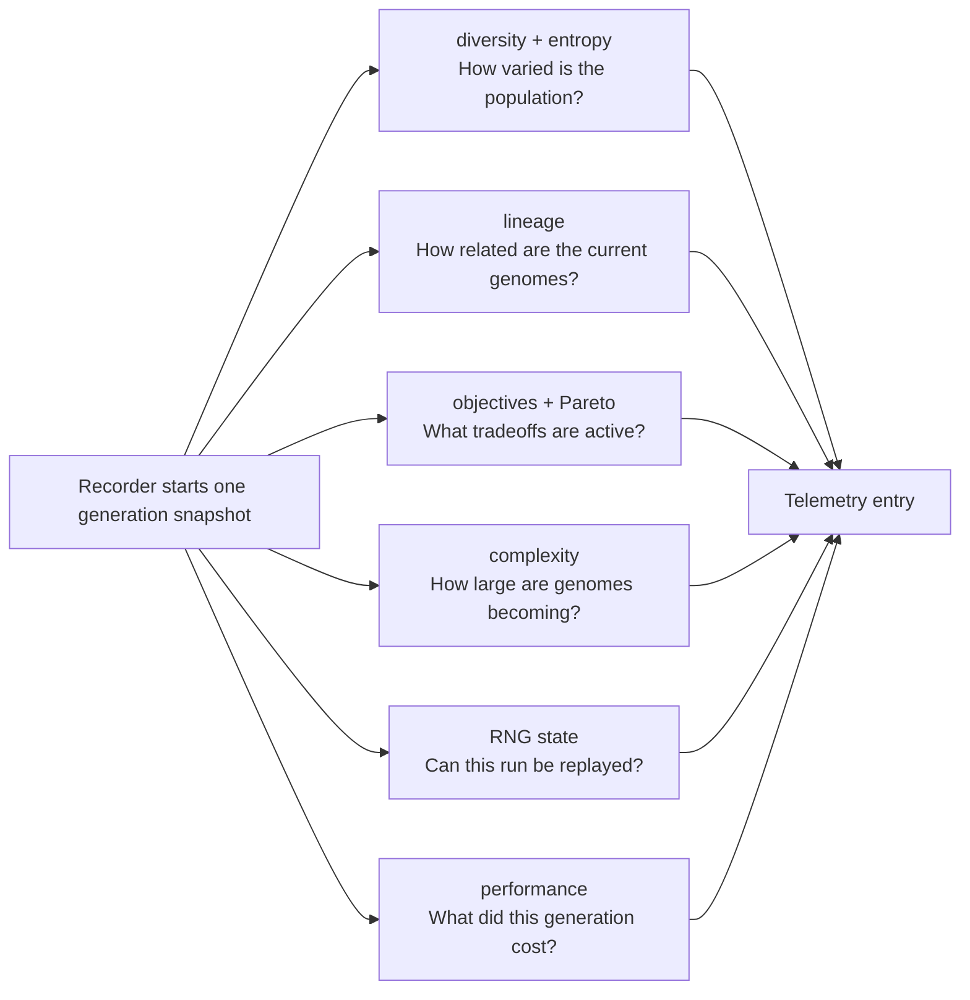

# neat/telemetry/metrics

Metric-building helpers for the telemetry recorder pipeline.

This chapter is where raw controller state becomes interpretable telemetry.
The recorder owns the question, "build one entry for this generation," but
the metrics subtree owns the harder follow-up question: "what evidence should
go into that entry so a human can understand how the run is behaving?"

Read the metrics family as six teaching-oriented layers:
- diversity and entropy helpers estimate how structurally varied the current
  population still is
- lineage helpers summarize ancestry depth, inbreeding, and ancestor
  uniqueness so genealogical pressure is visible
- objective helpers explain what the multi-objective controller is tracking,
  which objectives changed, and how the Pareto frontier is evolving
- complexity helpers turn node and connection growth into explicit telemetry
- RNG helpers expose reproducibility state when a run needs deterministic replay
- performance helpers attach evaluation and evolution timings so telemetry can
  explain computational cost as well as search behavior

The key pedagogical boundary is that these helpers compute and attach values,
but they do not decide when an entry is recorded or how it is stored. That is
why they live below `recorder/` and beside `runtime/`: the recorder orchestrates,
runtime persists safely, and metrics explains the generation.

A good way to read this chapter is:
1. start with the diversity and lineage helpers to understand population health
2. continue to objective and complexity helpers to understand search pressure
3. finish with RNG and performance helpers to understand reproducibility and cost



If the recorder chapter explains telemetry as a pipeline, this chapter explains
telemetry as evidence. It is the place to read when the question is not
"how was the entry recorded?" but "why do these numbers exist, and what do
they reveal about the search?"

## neat/telemetry/metrics/telemetry.metrics.ts

### applyComplexityStatsMonoObjective

```ts
applyComplexityStatsMonoObjective(
  telemetryContext: { _lastMeanNodes?: number | undefined; _lastMeanConns?: number | undefined; },
  telemetryOptions: NeatOptions & TelemetryDiversityOptions,
  populationSnapshot: GenomeDetailed[],
  entry: TelemetryEntryRecord,
): void
```

Attach complexity statistics for mono-objective runs using the same aggregation pipeline so dashboards stay comparable across optimization modes and long-run audits.

Parameters:
- `telemetryContext` - Neat-like context with population state.
- `telemetryOptions` - Options controlling complexity telemetry.
- `populationSnapshot` - Snapshot of the current population used for complexity stats.
- `entry` - Telemetry entry to update.

### applyComplexityStatsMultiObjective

```ts
applyComplexityStatsMultiObjective(
  telemetryContext: { _lastMeanNodes?: number | undefined; _lastMeanConns?: number | undefined; },
  telemetryOptions: NeatOptions & TelemetryDiversityOptions,
  population: GenomeDetailed[],
  entry: TelemetryEntryRecord,
): void
```

Attach complexity statistics for multi-objective runs by deriving counts, enabled ratios, and growth signals before writing a single normalized entry block.

Parameters:
- `telemetryContext` - Neat-like context with population state.
- `telemetryOptions` - Options controlling complexity telemetry.
- `population` - Population snapshot.
- `entry` - Telemetry entry to update.

### applyFastModeDefaults

```ts
applyFastModeDefaults(
  telemetryContext: { _fastModeTuned?: boolean | undefined; },
  telemetryOptions: NeatOptions & TelemetryDiversityOptions,
): void
```

Apply fast-mode tuning to diversity sampling and novelty defaults so expensive telemetry paths remain bounded when users explicitly favor speed-oriented evaluation.

Parameters:
- `telemetryContext` - Context object storing fast-mode tuning flag.
- `telemetryOptions` - Options with diversity and novelty settings.

### applyHypervolumeTelemetry

```ts
applyHypervolumeTelemetry(
  telemetryOptions: NeatOptions & TelemetryDiversityOptions,
  hyperVolumeProxy: number,
  entry: TelemetryEntryRecord,
): void
```

Attach a rounded hypervolume scalar when requested so telemetry consumers can track Pareto quality trends without recalculating expensive frontier aggregates.

Parameters:
- `telemetryOptions` - Options controlling telemetry fields.
- `hyperVolumeProxy` - Hypervolume proxy value.
- `entry` - Telemetry entry to update.

### applyLineageStatsMonoObjective

```ts
applyLineageStatsMonoObjective(
  telemetryContext: { _lineageEnabled?: boolean | undefined; _getRNG?: (() => () => number) | undefined; _lastMeanDepth?: number | undefined; _prevInbreedingCount?: number | undefined; },
  populationSnapshot: GenomeDetailed[],
  entry: TelemetryEntryRecord,
): void
```

Apply lineage stats for mono-objective mode using sampled ancestors so single-score runs still report ancestry diversity pressure transparently across long experiments.

Parameters:
- `telemetryContext` - Neat-like context with lineage settings.
- `populationSnapshot` - Snapshot of the current population used for lineage stats.
- `entry` - Telemetry entry to update.

### applyLineageStatsMultiObjective

```ts
applyLineageStatsMultiObjective(
  telemetryContext: { _lineageEnabled?: boolean | undefined; _getRNG?: (() => () => number) | undefined; _lastMeanDepth?: number | undefined; _prevInbreedingCount?: number | undefined; },
  population: GenomeDetailed[],
  entry: TelemetryEntryRecord,
): void
```

Apply lineage stats for multi-objective mode using ancestor uniqueness so entries capture genealogy health alongside Pareto progress signals across generations.

Parameters:
- `telemetryContext` - Neat-like context with lineage settings.
- `population` - Population snapshot.
- `entry` - Telemetry entry to update.

### applyObjectiveAges

```ts
applyObjectiveAges(
  telemetryContext: { _objectiveAges?: Map<string, number> | undefined; },
  entry: TelemetryEntryRecord,
): void
```

Apply objective age snapshots to the entry so analysts can distinguish mature objectives from newly introduced optimization signals over long runs.

Parameters:
- `telemetryContext` - Neat-like context with objective ages.
- `entry` - Telemetry entry to update.

### applyObjectiveEvents

```ts
applyObjectiveEvents(
  telemetryContext: { _pendingObjectiveAdds?: string[] | undefined; _pendingObjectiveRemoves?: string[] | undefined; _objectiveEvents?: ObjectiveEvent[] | undefined; },
  entry: TelemetryEntryRecord,
  generation: number,
): void
```

Apply and flush objective lifecycle events so each telemetry entry records adds and removals exactly once at the generation boundary.

Parameters:
- `telemetryContext` - Neat-like context holding objective events.
- `entry` - Telemetry entry to update.
- `generation` - Generation index for event records.

### applyObjectiveImportance

```ts
applyObjectiveImportance(
  telemetryContext: { _lastObjImportance?: ObjImportance | undefined; },
  entry: TelemetryEntryRecord,
): void
```

Apply the most recent objective-importance snapshot so telemetry entries preserve objective spread evidence computed earlier in the evolutionary pass history.

Parameters:
- `telemetryContext` - Neat-like context with objective importance.
- `entry` - Telemetry entry to update.

### applyObjectivesSnapshot

```ts
applyObjectivesSnapshot(
  telemetryContext: { _getObjectives?: (() => { key: string; }[]) | undefined; },
  entry: TelemetryEntryRecord,
): void
```

Apply the active objectives list snapshot using objective keys only so entries remain compact while still exposing current optimization scope.

Parameters:
- `telemetryContext` - Neat-like context with objective provider.
- `entry` - Telemetry entry to update.

### applyPerformanceStats

```ts
applyPerformanceStats(
  telemetryContext: { _lastEvalDuration?: number | undefined; _lastEvolveDuration?: number | undefined; },
  telemetryOptions: NeatOptions & TelemetryDiversityOptions,
  entry: TelemetryEntryRecord,
): void
```

Attach performance stats when configured so each telemetry entry reports evaluation and evolution cost alongside structural and objective outcomes per generation.

Parameters:
- `telemetryContext` - Neat-like context with performance data.
- `telemetryOptions` - Options controlling performance telemetry.
- `entry` - Telemetry entry to update.

### applyRngState

```ts
applyRngState(
  telemetryContext: { _rngState?: unknown; },
  telemetryOptions: NeatOptions & TelemetryDiversityOptions,
  entry: TelemetryEntryRecord,
): void
```

Attach RNG state when configured so telemetry exports preserve replay evidence needed to reproduce stochastic decisions in later forensic runs.

Parameters:
- `telemetryContext` - Neat-like context with RNG state.
- `telemetryOptions` - Options controlling RNG telemetry.
- `entry` - Telemetry entry to update.

### applySpeciesAllocation

```ts
applySpeciesAllocation(
  telemetryContext: { _lastOffspringAlloc?: SpeciesAlloc[] | undefined; },
  entry: TelemetryEntryRecord,
): void
```

Apply the per-species offspring allocation snapshot so downstream dashboards can correlate selection pressure with later diversity and fitness changes reliably.

Parameters:
- `telemetryContext` - Neat-like context with allocation snapshot.
- `entry` - Telemetry entry to update.

### buildComplexityEntry

```ts
buildComplexityEntry(
  telemetryOptions: NeatOptions & TelemetryDiversityOptions,
  meanCounts: { meanNodes: number; meanConns: number; },
  maxCounts: { maxNodes: number; maxConns: number; },
  meanEnabledRatio: number,
  growthValues: { growthNodes: number; growthConns: number; },
): { meanNodes: number; meanConns: number; maxNodes: number; maxConns: number; meanEnabledRatio: number; growthNodes: number; growthConns: number; budgetMaxNodes: number; budgetMaxConns: number; }
```

Build the complexity telemetry payload for the current generation, combining rounded aggregates and budget ceilings into one recorder-ready evidence packet.

Parameters:
- `telemetryOptions` - Options controlling complexity telemetry.
- `meanCounts` - Mean node/connection counts.
- `maxCounts` - Max node/connection counts.
- `meanEnabledRatio` - Mean enabled ratio.
- `growthValues` - Growth deltas.

Returns: Complexity entry payload.

### buildDegreeHistogram

```ts
buildDegreeHistogram(
  counts: Record<number, number>,
): Record<number, number>
```

Build a histogram of degree frequencies from a degree-count table so downstream entropy computation receives normalized structural distribution evidence for trend analysis.

Parameters:
- `counts` - Map geneId -> degree count.

Returns: Map degree -> number of nodes with that degree.

### buildLineageContext

```ts
buildLineageContext(
  context: { _getRNG?: (() => () => number) | undefined; },
  populationSnapshot: GenomeDetailed[],
): NeatLineageContext
```

Build a lineage helper context for ancestor operations so ancestry utilities share population and RNG state through one explicit boundary object.

Parameters:
- `context` - Neat-like context with RNG helpers.
- `populationSnapshot` - Population snapshot.

Returns: Lineage helper context.

### buildLineageEntry

```ts
buildLineageEntry(
  context: { _prevInbreedingCount?: number | undefined; },
  bestGenomeSnapshot: GenomeDetailed,
  meanDepthValue: number,
  ancestorUniquenessScore: number,
): { parents: number[]; depthBest: number; meanDepth: number; inbreeding: number; ancestorUniq: number; }
```

Build the lineage entry payload so recorder output stores parent identifiers, depth metrics, and inbreeding context in one normalized shape.

Parameters:
- `context` - Neat-like context with lineage info.
- `bestGenomeSnapshot` - Best genome snapshot.
- `meanDepthValue` - Mean lineage depth.
- `ancestorUniquenessScore` - Ancestor uniqueness score.

Returns: Lineage entry payload.

### collectDepths

```ts
collectDepths(
  populationSnapshot: GenomeDetailed[],
): number[]
```

Collect depth values for the current population so lineage summaries can be derived consistently from one deterministic per-genome mapping pass.

Parameters:
- `populationSnapshot` - Population snapshot.

Returns: Array of depth values (defaults to 0).

### collectPopulationCounts

```ts
collectPopulationCounts(
  populationSnapshot: GenomeDetailed[],
): { nodeCounts: number[]; connectionCounts: number[]; }
```

Collect node and connection counts for the current population snapshot so telemetry can report structural scale trends with deterministic, generation-aligned diagnostics context.

Parameters:
- `populationSnapshot` - Population snapshot.

Returns: Node and connection counts arrays.

### computeAncestorUniquenessSampled

```ts
computeAncestorUniquenessSampled(
  context: { _getRNG?: (() => () => number) | undefined; },
  populationSnapshot: GenomeDetailed[],
): number
```

Compute ancestor uniqueness using sampled Jaccard distance so recorder output reflects how distinct elite ancestry remains across the population over time.

Parameters:
- `context` - Neat-like context with RNG helpers.
- `populationSnapshot` - Population snapshot.

Returns: Rounded ancestor uniqueness score.

### computeAndStoreGrowthValues

```ts
computeAndStoreGrowthValues(
  context: { _lastMeanNodes?: number | undefined; _lastMeanConns?: number | undefined; },
  meanCounts: { meanNodes: number; meanConns: number; },
): { growthNodes: number; growthConns: number; }
```

Compute generation-over-generation growth deltas and persist latest means on the telemetry context so future entries can report directional structural drift.

Parameters:
- `context` - Neat-like context with previous mean values.
- `meanCounts` - Current mean node/connection counts.

Returns: Growth values for nodes and connections.

### computeCompatibilityStats

```ts
computeCompatibilityStats(
  genomes: TelemetryGenome[],
  size: number,
  pairSampleCount: number,
  rngFactoryFn: () => () => number,
  compatibilityDistance: ((a: TelemetryGenome, b: TelemetryGenome) => number) | undefined,
): { meanCompat: number; varCompat: number; }
```

Compute pairwise compatibility statistics via sampling so telemetry can estimate structural divergence without paying full quadratic population comparison cost per generation.

Parameters:
- `genomes` - Population snapshot.
- `size` - Population size.
- `pairSampleCount` - Number of pairs to sample.
- `rngFactoryFn` - RNG factory returning a uniform random function.
- `compatibilityDistance` - Optional compatibility distance function.

Returns: Mean and variance of sampled compatibilities.

### computeDegreeCounts

```ts
computeDegreeCounts(
  entropyGraph: { nodes: { geneId: number; }[]; connections: { from: { geneId: number; }; to: { geneId: number; }; enabled: boolean; }[]; },
): Record<number, number>
```

Compute per-node degree counts for enabled connections so entropy metrics reflect active topology rather than dormant edges during current-generation telemetry analysis.

Parameters:
- `entropyGraph` - Genome-like graph object.

Returns: Map geneId -> degree count.

### computeEnabledRatios

```ts
computeEnabledRatios(
  populationSnapshot: GenomeDetailed[],
): number[]
```

Compute enabled-connection ratios for each genome so telemetry can separate dormant structure from actively contributing edges when analyzing search efficiency.

Parameters:
- `populationSnapshot` - Population snapshot.

Returns: Array of enabled ratios.

### computeEntropyFromHistogram

```ts
computeEntropyFromHistogram(
  histogram: Record<number, number>,
  totalNodes: number,
): number
```

Compute entropy from a degree-frequency histogram so telemetry captures structure dispersion as a stable scalar comparable across generations and runs.

Parameters:
- `histogram` - Map degree -> number of nodes.
- `totalNodes` - Total node count used to normalize into probabilities.

Returns: Entropy value (non-negative).

### computeEntropyStats

```ts
computeEntropyStats(
  genomes: TelemetryGenome[],
  structuralEntropyFn: (genome: TelemetryGenome) => number,
): { meanEntropy: number; varEntropy: number; }
```

Compute structural entropy mean and variance across the population so recorder output captures both central tendency and dispersion of topology complexity.

Parameters:
- `genomes` - Population snapshot.
- `structuralEntropyFn` - Function to compute entropy for a genome.

Returns: Mean and variance of entropy values.

### computeGraphletEntropy

```ts
computeGraphletEntropy(
  genomes: TelemetryGenome[],
  size: number,
  graphletSampleCount: number,
  rngFactoryFn: () => () => number,
): number
```

Sample graphlet motifs and compute entropy over their edge counts so local pattern diversity remains observable without full motif enumeration.

Parameters:
- `genomes` - Population snapshot.
- `size` - Population size.
- `graphletSampleCount` - Number of graphlets to sample.
- `rngFactoryFn` - RNG factory returning a uniform random function.

Returns: Graphlet entropy value.

### computeHyperVolumeProxy

```ts
computeHyperVolumeProxy(
  telemetryOptions: NeatOptions & TelemetryDiversityOptions,
  population: GenomeDetailed[],
): number
```

Compute a hypervolume-like proxy for the active Pareto frontier so telemetry captures objective tradeoff quality with a stable, generation-comparable scalar.

Parameters:
- `telemetryOptions` - Options controlling complexity metric.
- `population` - Population snapshot.

Returns: Hypervolume proxy value.

### computeLineageStats

```ts
computeLineageStats(
  lineageEnabled: boolean,
  genomes: TelemetryGenome[],
  size: number,
  pairSampleCount: number,
  rngFactoryFn: () => () => number,
): { lineageMeanDepth: number; lineageMeanPairDist: number; }
```

Compute lineage depth and pairwise depth-distance statistics so telemetry can expose ancestry spread and genealogical divergence for the current generation.

Parameters:
- `lineageEnabled` - Whether lineage metrics are enabled.
- `genomes` - Population snapshot.
- `size` - Population size.
- `pairSampleCount` - Number of pairs to sample.
- `rngFactoryFn` - RNG factory returning a uniform random function.

Returns: Lineage mean depth and pairwise distance.

### computeMaxCounts

```ts
computeMaxCounts(
  counts: { nodeCounts: number[]; connectionCounts: number[]; },
): { maxNodes: number; maxConns: number; }
```

Compute maximum node and connection counts across the same population snapshot so telemetry highlights peak structural complexity pressure in the active generation.

Parameters:
- `counts` - Node and connection counts arrays.

Returns: Max node and connection counts.

### computeMeanCounts

```ts
computeMeanCounts(
  counts: { nodeCounts: number[]; connectionCounts: number[]; },
): { meanNodes: number; meanConns: number; }
```

Compute mean node and connection counts from per-genome structural totals so recorder entries can summarize average topology growth without storing every raw sample.

Parameters:
- `counts` - Node and connection counts arrays.

Returns: Mean node and connection counts.

### computeMeanDepth

```ts
computeMeanDepth(
  depthValues: number[],
): number
```

Compute the mean depth from a depth list so telemetry can expose ancestry maturity with one stable, noise-reduced scalar for trend charts.

Parameters:
- `depthValues` - Depth values to average.

Returns: Mean depth value.

### computeMeanEnabledRatio

```ts
computeMeanEnabledRatio(
  enabledRatios: number[],
): number
```

Compute the mean enabled-connection ratio across genomes so the entry captures overall connection activity density rather than only raw edge counts.

Parameters:
- `enabledRatios` - Enabled ratios per genome.

Returns: Mean enabled ratio.

### computeOperatorStatsSnapshot

```ts
computeOperatorStatsSnapshot(
  operatorStats: OperatorStatsMap | undefined,
): { op: string; succ: number; att: number; }[]
```

Snapshot operator statistics into a telemetry-friendly array so generation reports can compare mutation effectiveness without exposing internal map structures or internals.

Parameters:
- `operatorStats` - Operator stats map (opName -> success/attempts).

Returns: Operator stats snapshot array.

### computePairJaccardDistance

```ts
computePairJaccardDistance(
  context: { _getRNG?: (() => () => number) | undefined; },
  populationSnapshot: GenomeDetailed[],
  firstIndex: number,
  secondIndex: number,
): number | undefined
```

Compute Jaccard distance between ancestor sets for one sampled pair so uniqueness estimates remain interpretable and mathematically grounded during diagnostics.

Parameters:
- `context` - Neat-like context for lineage helpers.
- `populationSnapshot` - Population snapshot.
- `firstIndex` - First genome index.
- `secondIndex` - Second genome index.

Returns: Jaccard distance or undefined when both sets are empty.

### computeParetoFrontSizes

```ts
computeParetoFrontSizes(
  population: GenomeDetailed[],
): number[]
```

Compute sizes of the earliest Pareto fronts so recorder outputs can show frontier stratification pressure and rank distribution at this generation.

Parameters:
- `population` - Population snapshot.

Returns: Array of front sizes (rank 0..4).

### countAncestorIntersection

```ts
countAncestorIntersection(
  ancestorsA: Set<number>,
  ancestorsB: Set<number>,
): number
```

Count the size of an ancestor intersection so Jaccard distance computation can reuse a clear and testable set-overlap primitive helper.

Parameters:
- `ancestorsA` - First ancestor set.
- `ancestorsB` - Second ancestor set.

Returns: Intersection count.

### countEnabledEdges

```ts
countEnabledEdges(
  genome: TelemetryGenome,
  selectedNodes: NodeLike[],
): number
```

Count enabled edges between selected nodes in one genome so graphlet buckets map directly to active local wiring patterns during motif sampling.

Parameters:
- `genome` - Genome with connections to inspect.
- `selectedNodes` - Nodes forming the graphlet sample.

Returns: Edge count capped at 3.

### getCachedEntropy

```ts
getCachedEntropy(
  generation: number | undefined,
  entropyGraph: Record<string, unknown>,
): number | undefined
```

Read a cached entropy value when it exists for the current generation so repeated telemetry calculations can skip redundant structural entropy recomputation safely.

Parameters:
- `generation` - Current generation number.
- `entropyGraph` - Genome-like graph object.

Returns: Cached entropy number, or undefined when not available.

### getTelemetryCoreSnapshot

```ts
getTelemetryCoreSnapshot(
  sourceEntry: Record<string, unknown>,
  fields: TelemetryCoreFields,
): Partial<Record<string, unknown>>
```

Build a snapshot of core telemetry fields from one entry so later selection filtering can preserve required recorder invariants without mutating source state.

Parameters:
- `sourceEntry` - Source telemetry object.
- `fields` - Core telemetry field keys to preserve.

Returns: Shallow snapshot of core fields that exist on the entry.

### isLineageEligible

```ts
isLineageEligible(
  context: { _lineageEnabled?: boolean | undefined; },
  populationSnapshot: GenomeDetailed[],
): boolean
```

Check whether lineage metrics should be computed for this snapshot so helper calls can short-circuit before any ancestry sampling work.

Parameters:
- `context` - Neat-like context with lineage flag.
- `populationSnapshot` - Population snapshot to validate.

Returns: True when lineage stats should be computed.

### mergeTelemetryCoreFields

```ts
mergeTelemetryCoreFields(
  sourceEntry: Record<string, unknown>,
  coreSnapshot: Partial<Record<string, unknown>>,
): Record<string, unknown>
```

Re-attach core fields to the filtered entry so selection logic never removes mandatory telemetry anchors needed by downstream consumers and audits.

Parameters:
- `sourceEntry` - Filtered telemetry entry to update.
- `coreSnapshot` - Snapshot of core fields to ensure presence.

Returns: The same entry reference with core fields restored.

### pickDistinctIndices

```ts
pickDistinctIndices(
  upperBound: number,
  count: number,
  rng: () => number,
): number[]
```

Pick a fixed number of distinct random indices so motif and pair samplers remain reproducible and avoid accidental duplicate selections.

Parameters:
- `upperBound` - Exclusive upper bound for random indices.
- `count` - Number of distinct indices to pick.
- `rng` - RNG function returning values in [0,1).

Returns: Array of distinct indices.

### pickDistinctPairIndices

```ts
pickDistinctPairIndices(
  context: { _getRNG?: (() => () => number) | undefined; },
  populationSize: number,
): { firstIndex: number; secondIndex: number; }
```

Pick two distinct indices using the context RNG so pairwise lineage sampling remains deterministic under seeded controller configurations and replay workflows.

Parameters:
- `context` - Neat-like context with RNG factory.
- `populationSize` - Population size for index bounds.

Returns: Pair of distinct indices.

### readOperatorStats

```ts
readOperatorStats(
  operatorStats: OperatorStatsMap | undefined,
): { name: string; success: number; attempts: number; }[]
```

Convert operator stats map into the public accessor shape so dashboards and external tooling receive stable, serialization-friendly field names across releases.

Parameters:
- `operatorStats` - Operator stats map stored on the host.

Returns: Public operator summaries for dashboards and tests.

### safelyApplyTelemetrySelect

```ts
safelyApplyTelemetrySelect(
  telemetryContext: TContext,
  telemetryEntry: TelemetryEntry,
  applyTelemetrySelectFn: (this: TContext, entry: Record<string, unknown>) => Record<string, unknown>,
): void
```

Apply telemetry selection while swallowing selection errors so non-critical projection failures cannot block generation-level telemetry recording in production runs reliably.

Parameters:
- `telemetryContext` - Neat-like context with telemetry selection.
- `telemetryEntry` - Entry to filter in place.
- `applyTelemetrySelectFn` - Selection helper to invoke.

### setCachedEntropy

```ts
setCachedEntropy(
  generation: number | undefined,
  entropyGraph: Record<string, unknown>,
  entropyValue: number,
): void
```

Cache an entropy value for the current generation on the graph object so repeated metric builders can reuse deterministic results without recalculation.

Parameters:
- `generation` - Current generation number.
- `entropyGraph` - Genome-like graph object.
- `entropyValue` - Entropy value to cache.

### stripUnselectedTelemetryKeys

```ts
stripUnselectedTelemetryKeys(
  sourceEntry: Record<string, unknown>,
  selection: Set<string>,
  fields: TelemetryCoreFields,
): Record<string, unknown>
```

Remove non-core keys that are not whitelisted by the selection set so telemetry payloads stay compact while preserving recorder-required fields.

Parameters:
- `sourceEntry` - Telemetry entry being filtered.
- `selection` - Whitelist of additional telemetry keys.
- `fields` - Core telemetry field keys that must be preserved.

Returns: The same entry reference after filtering.

## neat/telemetry/metrics/telemetry.metrics.rng.ts

### applyRngState

```ts
applyRngState(
  telemetryContext: { _rngState?: unknown; },
  telemetryOptions: NeatOptions & TelemetryDiversityOptions,
  entry: TelemetryEntryRecord,
): void
```

Attach RNG state when configured so telemetry exports preserve replay evidence needed to reproduce stochastic decisions in later forensic runs.

Parameters:
- `telemetryContext` - Neat-like context with RNG state.
- `telemetryOptions` - Options controlling RNG telemetry.
- `entry` - Telemetry entry to update.

## neat/telemetry/metrics/telemetry.metrics.entropy.ts

### buildDegreeHistogram

```ts
buildDegreeHistogram(
  counts: Record<number, number>,
): Record<number, number>
```

Build a histogram of degree frequencies from a degree-count table so downstream entropy computation receives normalized structural distribution evidence for trend analysis.

Parameters:
- `counts` - Map geneId -> degree count.

Returns: Map degree -> number of nodes with that degree.

### computeDegreeCounts

```ts
computeDegreeCounts(
  entropyGraph: { nodes: { geneId: number; }[]; connections: { from: { geneId: number; }; to: { geneId: number; }; enabled: boolean; }[]; },
): Record<number, number>
```

Compute per-node degree counts for enabled connections so entropy metrics reflect active topology rather than dormant edges during current-generation telemetry analysis.

Parameters:
- `entropyGraph` - Genome-like graph object.

Returns: Map geneId -> degree count.

### computeEntropyFromHistogram

```ts
computeEntropyFromHistogram(
  histogram: Record<number, number>,
  totalNodes: number,
): number
```

Compute entropy from a degree-frequency histogram so telemetry captures structure dispersion as a stable scalar comparable across generations and runs.

Parameters:
- `histogram` - Map degree -> number of nodes.
- `totalNodes` - Total node count used to normalize into probabilities.

Returns: Entropy value (non-negative).

### getCachedEntropy

```ts
getCachedEntropy(
  generation: number | undefined,
  entropyGraph: Record<string, unknown>,
): number | undefined
```

Read a cached entropy value when it exists for the current generation so repeated telemetry calculations can skip redundant structural entropy recomputation safely.

Parameters:
- `generation` - Current generation number.
- `entropyGraph` - Genome-like graph object.

Returns: Cached entropy number, or undefined when not available.

### setCachedEntropy

```ts
setCachedEntropy(
  generation: number | undefined,
  entropyGraph: Record<string, unknown>,
  entropyValue: number,
): void
```

Cache an entropy value for the current generation on the graph object so repeated metric builders can reuse deterministic results without recalculation.

Parameters:
- `generation` - Current generation number.
- `entropyGraph` - Genome-like graph object.
- `entropyValue` - Entropy value to cache.

## neat/telemetry/metrics/telemetry.metrics.lineage.ts

### applyLineageStatsMonoObjective

```ts
applyLineageStatsMonoObjective(
  telemetryContext: { _lineageEnabled?: boolean | undefined; _getRNG?: (() => () => number) | undefined; _lastMeanDepth?: number | undefined; _prevInbreedingCount?: number | undefined; },
  populationSnapshot: GenomeDetailed[],
  entry: TelemetryEntryRecord,
): void
```

Apply lineage stats for mono-objective mode using sampled ancestors so single-score runs still report ancestry diversity pressure transparently across long experiments.

Parameters:
- `telemetryContext` - Neat-like context with lineage settings.
- `populationSnapshot` - Snapshot of the current population used for lineage stats.
- `entry` - Telemetry entry to update.

### applyLineageStatsMultiObjective

```ts
applyLineageStatsMultiObjective(
  telemetryContext: { _lineageEnabled?: boolean | undefined; _getRNG?: (() => () => number) | undefined; _lastMeanDepth?: number | undefined; _prevInbreedingCount?: number | undefined; },
  population: GenomeDetailed[],
  entry: TelemetryEntryRecord,
): void
```

Apply lineage stats for multi-objective mode using ancestor uniqueness so entries capture genealogy health alongside Pareto progress signals across generations.

Parameters:
- `telemetryContext` - Neat-like context with lineage settings.
- `population` - Population snapshot.
- `entry` - Telemetry entry to update.

### buildLineageContext

```ts
buildLineageContext(
  context: { _getRNG?: (() => () => number) | undefined; },
  populationSnapshot: GenomeDetailed[],
): NeatLineageContext
```

Build a lineage helper context for ancestor operations so ancestry utilities share population and RNG state through one explicit boundary object.

Parameters:
- `context` - Neat-like context with RNG helpers.
- `populationSnapshot` - Population snapshot.

Returns: Lineage helper context.

### buildLineageEntry

```ts
buildLineageEntry(
  context: { _prevInbreedingCount?: number | undefined; },
  bestGenomeSnapshot: GenomeDetailed,
  meanDepthValue: number,
  ancestorUniquenessScore: number,
): { parents: number[]; depthBest: number; meanDepth: number; inbreeding: number; ancestorUniq: number; }
```

Build the lineage entry payload so recorder output stores parent identifiers, depth metrics, and inbreeding context in one normalized shape.

Parameters:
- `context` - Neat-like context with lineage info.
- `bestGenomeSnapshot` - Best genome snapshot.
- `meanDepthValue` - Mean lineage depth.
- `ancestorUniquenessScore` - Ancestor uniqueness score.

Returns: Lineage entry payload.

### collectDepths

```ts
collectDepths(
  populationSnapshot: GenomeDetailed[],
): number[]
```

Collect depth values for the current population so lineage summaries can be derived consistently from one deterministic per-genome mapping pass.

Parameters:
- `populationSnapshot` - Population snapshot.

Returns: Array of depth values (defaults to 0).

### computeAncestorUniquenessSampled

```ts
computeAncestorUniquenessSampled(
  context: { _getRNG?: (() => () => number) | undefined; },
  populationSnapshot: GenomeDetailed[],
): number
```

Compute ancestor uniqueness using sampled Jaccard distance so recorder output reflects how distinct elite ancestry remains across the population over time.

Parameters:
- `context` - Neat-like context with RNG helpers.
- `populationSnapshot` - Population snapshot.

Returns: Rounded ancestor uniqueness score.

### computeLineageStats

```ts
computeLineageStats(
  lineageEnabled: boolean,
  genomes: TelemetryGenome[],
  size: number,
  pairSampleCount: number,
  rngFactoryFn: () => () => number,
): { lineageMeanDepth: number; lineageMeanPairDist: number; }
```

Compute lineage depth and pairwise depth-distance statistics so telemetry can expose ancestry spread and genealogical divergence for the current generation.

Parameters:
- `lineageEnabled` - Whether lineage metrics are enabled.
- `genomes` - Population snapshot.
- `size` - Population size.
- `pairSampleCount` - Number of pairs to sample.
- `rngFactoryFn` - RNG factory returning a uniform random function.

Returns: Lineage mean depth and pairwise distance.

### computeMeanDepth

```ts
computeMeanDepth(
  depthValues: number[],
): number
```

Compute the mean depth from a depth list so telemetry can expose ancestry maturity with one stable, noise-reduced scalar for trend charts.

Parameters:
- `depthValues` - Depth values to average.

Returns: Mean depth value.

### computePairJaccardDistance

```ts
computePairJaccardDistance(
  context: { _getRNG?: (() => () => number) | undefined; },
  populationSnapshot: GenomeDetailed[],
  firstIndex: number,
  secondIndex: number,
): number | undefined
```

Compute Jaccard distance between ancestor sets for one sampled pair so uniqueness estimates remain interpretable and mathematically grounded during diagnostics.

Parameters:
- `context` - Neat-like context for lineage helpers.
- `populationSnapshot` - Population snapshot.
- `firstIndex` - First genome index.
- `secondIndex` - Second genome index.

Returns: Jaccard distance or undefined when both sets are empty.

### countAncestorIntersection

```ts
countAncestorIntersection(
  ancestorsA: Set<number>,
  ancestorsB: Set<number>,
): number
```

Count the size of an ancestor intersection so Jaccard distance computation can reuse a clear and testable set-overlap primitive helper.

Parameters:
- `ancestorsA` - First ancestor set.
- `ancestorsB` - Second ancestor set.

Returns: Intersection count.

### createMathRandomFactory

```ts
createMathRandomFactory(): () => number
```

Create a default RNG factory backed by Math.random.

Returns: RNG factory returning Math.random.

### isLineageEligible

```ts
isLineageEligible(
  context: { _lineageEnabled?: boolean | undefined; },
  populationSnapshot: GenomeDetailed[],
): boolean
```

Check whether lineage metrics should be computed for this snapshot so helper calls can short-circuit before any ancestry sampling work.

Parameters:
- `context` - Neat-like context with lineage flag.
- `populationSnapshot` - Population snapshot to validate.

Returns: True when lineage stats should be computed.

### pickDistinctPairIndices

```ts
pickDistinctPairIndices(
  context: { _getRNG?: (() => () => number) | undefined; },
  populationSize: number,
): { firstIndex: number; secondIndex: number; }
```

Pick two distinct indices using the context RNG so pairwise lineage sampling remains deterministic under seeded controller configurations and replay workflows.

Parameters:
- `context` - Neat-like context with RNG factory.
- `populationSize` - Population size for index bounds.

Returns: Pair of distinct indices.

### resolveLineageRngFactory

```ts
resolveLineageRngFactory(
  providedRngFactory: (() => () => number) | undefined,
): () => () => number
```

Resolve the RNG factory used by lineage helpers.

Parameters:
- `providedRngFactory` - Optional caller-provided RNG factory.

Returns: Caller RNG factory or the Math.random fallback.

## neat/telemetry/metrics/telemetry.metrics.operator.ts

### computeOperatorStatsSnapshot

```ts
computeOperatorStatsSnapshot(
  operatorStats: OperatorStatsMap | undefined,
): { op: string; succ: number; att: number; }[]
```

Snapshot operator statistics into a telemetry-friendly array so generation reports can compare mutation effectiveness without exposing internal map structures or internals.

Parameters:
- `operatorStats` - Operator stats map (opName -> success/attempts).

Returns: Operator stats snapshot array.

### readOperatorStats

```ts
readOperatorStats(
  operatorStats: OperatorStatsMap | undefined,
): { name: string; success: number; attempts: number; }[]
```

Convert operator stats map into the public accessor shape so dashboards and external tooling receive stable, serialization-friendly field names across releases.

Parameters:
- `operatorStats` - Operator stats map stored on the host.

Returns: Public operator summaries for dashboards and tests.

## neat/telemetry/metrics/telemetry.metrics.diversity.ts

### applyFastModeDefaults

```ts
applyFastModeDefaults(
  telemetryContext: { _fastModeTuned?: boolean | undefined; },
  telemetryOptions: NeatOptions & TelemetryDiversityOptions,
): void
```

Apply fast-mode tuning to diversity sampling and novelty defaults so expensive telemetry paths remain bounded when users explicitly favor speed-oriented evaluation.

Parameters:
- `telemetryContext` - Context object storing fast-mode tuning flag.
- `telemetryOptions` - Options with diversity and novelty settings.

### computeCompatibilityStats

```ts
computeCompatibilityStats(
  genomes: TelemetryGenome[],
  size: number,
  pairSampleCount: number,
  rngFactoryFn: () => () => number,
  compatibilityDistance: ((a: TelemetryGenome, b: TelemetryGenome) => number) | undefined,
): { meanCompat: number; varCompat: number; }
```

Compute pairwise compatibility statistics via sampling so telemetry can estimate structural divergence without paying full quadratic population comparison cost per generation.

Parameters:
- `genomes` - Population snapshot.
- `size` - Population size.
- `pairSampleCount` - Number of pairs to sample.
- `rngFactoryFn` - RNG factory returning a uniform random function.
- `compatibilityDistance` - Optional compatibility distance function.

Returns: Mean and variance of sampled compatibilities.

### computeEntropyStats

```ts
computeEntropyStats(
  genomes: TelemetryGenome[],
  structuralEntropyFn: (genome: TelemetryGenome) => number,
): { meanEntropy: number; varEntropy: number; }
```

Compute structural entropy mean and variance across the population so recorder output captures both central tendency and dispersion of topology complexity.

Parameters:
- `genomes` - Population snapshot.
- `structuralEntropyFn` - Function to compute entropy for a genome.

Returns: Mean and variance of entropy values.

### computeGraphletEntropy

```ts
computeGraphletEntropy(
  genomes: TelemetryGenome[],
  size: number,
  graphletSampleCount: number,
  rngFactoryFn: () => () => number,
): number
```

Sample graphlet motifs and compute entropy over their edge counts so local pattern diversity remains observable without full motif enumeration.

Parameters:
- `genomes` - Population snapshot.
- `size` - Population size.
- `graphletSampleCount` - Number of graphlets to sample.
- `rngFactoryFn` - RNG factory returning a uniform random function.

Returns: Graphlet entropy value.

### countEnabledEdges

```ts
countEnabledEdges(
  genome: TelemetryGenome,
  selectedNodes: NodeLike[],
): number
```

Count enabled edges between selected nodes in one genome so graphlet buckets map directly to active local wiring patterns during motif sampling.

Parameters:
- `genome` - Genome with connections to inspect.
- `selectedNodes` - Nodes forming the graphlet sample.

Returns: Edge count capped at 3.

### pickDistinctIndices

```ts
pickDistinctIndices(
  upperBound: number,
  count: number,
  rng: () => number,
): number[]
```

Pick a fixed number of distinct random indices so motif and pair samplers remain reproducible and avoid accidental duplicate selections.

Parameters:
- `upperBound` - Exclusive upper bound for random indices.
- `count` - Number of distinct indices to pick.
- `rng` - RNG function returning values in [0,1).

Returns: Array of distinct indices.

## neat/telemetry/metrics/telemetry.metrics.selection.ts

### getTelemetryCoreSnapshot

```ts
getTelemetryCoreSnapshot(
  sourceEntry: Record<string, unknown>,
  fields: TelemetryCoreFields,
): Partial<Record<string, unknown>>
```

Build a snapshot of core telemetry fields from one entry so later selection filtering can preserve required recorder invariants without mutating source state.

Parameters:
- `sourceEntry` - Source telemetry object.
- `fields` - Core telemetry field keys to preserve.

Returns: Shallow snapshot of core fields that exist on the entry.

### mergeTelemetryCoreFields

```ts
mergeTelemetryCoreFields(
  sourceEntry: Record<string, unknown>,
  coreSnapshot: Partial<Record<string, unknown>>,
): Record<string, unknown>
```

Re-attach core fields to the filtered entry so selection logic never removes mandatory telemetry anchors needed by downstream consumers and audits.

Parameters:
- `sourceEntry` - Filtered telemetry entry to update.
- `coreSnapshot` - Snapshot of core fields to ensure presence.

Returns: The same entry reference with core fields restored.

### safelyApplyTelemetrySelect

```ts
safelyApplyTelemetrySelect(
  telemetryContext: TContext,
  telemetryEntry: TelemetryEntry,
  applyTelemetrySelectFn: (this: TContext, entry: Record<string, unknown>) => Record<string, unknown>,
): void
```

Apply telemetry selection while swallowing selection errors so non-critical projection failures cannot block generation-level telemetry recording in production runs reliably.

Parameters:
- `telemetryContext` - Neat-like context with telemetry selection.
- `telemetryEntry` - Entry to filter in place.
- `applyTelemetrySelectFn` - Selection helper to invoke.

### stripUnselectedTelemetryKeys

```ts
stripUnselectedTelemetryKeys(
  sourceEntry: Record<string, unknown>,
  selection: Set<string>,
  fields: TelemetryCoreFields,
): Record<string, unknown>
```

Remove non-core keys that are not whitelisted by the selection set so telemetry payloads stay compact while preserving recorder-required fields.

Parameters:
- `sourceEntry` - Telemetry entry being filtered.
- `selection` - Whitelist of additional telemetry keys.
- `fields` - Core telemetry field keys that must be preserved.

Returns: The same entry reference after filtering.

## neat/telemetry/metrics/telemetry.metrics.complexity.ts

### applyComplexityStatsMonoObjective

```ts
applyComplexityStatsMonoObjective(
  telemetryContext: { _lastMeanNodes?: number | undefined; _lastMeanConns?: number | undefined; },
  telemetryOptions: NeatOptions & TelemetryDiversityOptions,
  populationSnapshot: GenomeDetailed[],
  entry: TelemetryEntryRecord,
): void
```

Attach complexity statistics for mono-objective runs using the same aggregation pipeline so dashboards stay comparable across optimization modes and long-run audits.

Parameters:
- `telemetryContext` - Neat-like context with population state.
- `telemetryOptions` - Options controlling complexity telemetry.
- `populationSnapshot` - Snapshot of the current population used for complexity stats.
- `entry` - Telemetry entry to update.

### applyComplexityStatsMultiObjective

```ts
applyComplexityStatsMultiObjective(
  telemetryContext: { _lastMeanNodes?: number | undefined; _lastMeanConns?: number | undefined; },
  telemetryOptions: NeatOptions & TelemetryDiversityOptions,
  population: GenomeDetailed[],
  entry: TelemetryEntryRecord,
): void
```

Attach complexity statistics for multi-objective runs by deriving counts, enabled ratios, and growth signals before writing a single normalized entry block.

Parameters:
- `telemetryContext` - Neat-like context with population state.
- `telemetryOptions` - Options controlling complexity telemetry.
- `population` - Population snapshot.
- `entry` - Telemetry entry to update.

### buildComplexityEntry

```ts
buildComplexityEntry(
  telemetryOptions: NeatOptions & TelemetryDiversityOptions,
  meanCounts: { meanNodes: number; meanConns: number; },
  maxCounts: { maxNodes: number; maxConns: number; },
  meanEnabledRatio: number,
  growthValues: { growthNodes: number; growthConns: number; },
): { meanNodes: number; meanConns: number; maxNodes: number; maxConns: number; meanEnabledRatio: number; growthNodes: number; growthConns: number; budgetMaxNodes: number; budgetMaxConns: number; }
```

Build the complexity telemetry payload for the current generation, combining rounded aggregates and budget ceilings into one recorder-ready evidence packet.

Parameters:
- `telemetryOptions` - Options controlling complexity telemetry.
- `meanCounts` - Mean node/connection counts.
- `maxCounts` - Max node/connection counts.
- `meanEnabledRatio` - Mean enabled ratio.
- `growthValues` - Growth deltas.

Returns: Complexity entry payload.

### collectPopulationCounts

```ts
collectPopulationCounts(
  populationSnapshot: GenomeDetailed[],
): { nodeCounts: number[]; connectionCounts: number[]; }
```

Collect node and connection counts for the current population snapshot so telemetry can report structural scale trends with deterministic, generation-aligned diagnostics context.

Parameters:
- `populationSnapshot` - Population snapshot.

Returns: Node and connection counts arrays.

### computeAndStoreGrowthValues

```ts
computeAndStoreGrowthValues(
  context: { _lastMeanNodes?: number | undefined; _lastMeanConns?: number | undefined; },
  meanCounts: { meanNodes: number; meanConns: number; },
): { growthNodes: number; growthConns: number; }
```

Compute generation-over-generation growth deltas and persist latest means on the telemetry context so future entries can report directional structural drift.

Parameters:
- `context` - Neat-like context with previous mean values.
- `meanCounts` - Current mean node/connection counts.

Returns: Growth values for nodes and connections.

### computeEnabledRatios

```ts
computeEnabledRatios(
  populationSnapshot: GenomeDetailed[],
): number[]
```

Compute enabled-connection ratios for each genome so telemetry can separate dormant structure from actively contributing edges when analyzing search efficiency.

Parameters:
- `populationSnapshot` - Population snapshot.

Returns: Array of enabled ratios.

### computeMaxCounts

```ts
computeMaxCounts(
  counts: { nodeCounts: number[]; connectionCounts: number[]; },
): { maxNodes: number; maxConns: number; }
```

Compute maximum node and connection counts across the same population snapshot so telemetry highlights peak structural complexity pressure in the active generation.

Parameters:
- `counts` - Node and connection counts arrays.

Returns: Max node and connection counts.

### computeMeanCounts

```ts
computeMeanCounts(
  counts: { nodeCounts: number[]; connectionCounts: number[]; },
): { meanNodes: number; meanConns: number; }
```

Compute mean node and connection counts from per-genome structural totals so recorder entries can summarize average topology growth without storing every raw sample.

Parameters:
- `counts` - Node and connection counts arrays.

Returns: Mean node and connection counts.

### computeMeanEnabledRatio

```ts
computeMeanEnabledRatio(
  enabledRatios: number[],
): number
```

Compute the mean enabled-connection ratio across genomes so the entry captures overall connection activity density rather than only raw edge counts.

Parameters:
- `enabledRatios` - Enabled ratios per genome.

Returns: Mean enabled ratio.

## neat/telemetry/metrics/telemetry.metrics.objectives.ts

### applyHypervolumeTelemetry

```ts
applyHypervolumeTelemetry(
  telemetryOptions: NeatOptions & TelemetryDiversityOptions,
  hyperVolumeProxy: number,
  entry: TelemetryEntryRecord,
): void
```

Attach a rounded hypervolume scalar when requested so telemetry consumers can track Pareto quality trends without recalculating expensive frontier aggregates.

Parameters:
- `telemetryOptions` - Options controlling telemetry fields.
- `hyperVolumeProxy` - Hypervolume proxy value.
- `entry` - Telemetry entry to update.

### applyObjectiveAges

```ts
applyObjectiveAges(
  telemetryContext: { _objectiveAges?: Map<string, number> | undefined; },
  entry: TelemetryEntryRecord,
): void
```

Apply objective age snapshots to the entry so analysts can distinguish mature objectives from newly introduced optimization signals over long runs.

Parameters:
- `telemetryContext` - Neat-like context with objective ages.
- `entry` - Telemetry entry to update.

### applyObjectiveEvents

```ts
applyObjectiveEvents(
  telemetryContext: { _pendingObjectiveAdds?: string[] | undefined; _pendingObjectiveRemoves?: string[] | undefined; _objectiveEvents?: ObjectiveEvent[] | undefined; },
  entry: TelemetryEntryRecord,
  generation: number,
): void
```

Apply and flush objective lifecycle events so each telemetry entry records adds and removals exactly once at the generation boundary.

Parameters:
- `telemetryContext` - Neat-like context holding objective events.
- `entry` - Telemetry entry to update.
- `generation` - Generation index for event records.

### applyObjectiveImportance

```ts
applyObjectiveImportance(
  telemetryContext: { _lastObjImportance?: ObjImportance | undefined; },
  entry: TelemetryEntryRecord,
): void
```

Apply the most recent objective-importance snapshot so telemetry entries preserve objective spread evidence computed earlier in the evolutionary pass history.

Parameters:
- `telemetryContext` - Neat-like context with objective importance.
- `entry` - Telemetry entry to update.

### applyObjectivesSnapshot

```ts
applyObjectivesSnapshot(
  telemetryContext: { _getObjectives?: (() => { key: string; }[]) | undefined; },
  entry: TelemetryEntryRecord,
): void
```

Apply the active objectives list snapshot using objective keys only so entries remain compact while still exposing current optimization scope.

Parameters:
- `telemetryContext` - Neat-like context with objective provider.
- `entry` - Telemetry entry to update.

### applySpeciesAllocation

```ts
applySpeciesAllocation(
  telemetryContext: { _lastOffspringAlloc?: SpeciesAlloc[] | undefined; },
  entry: TelemetryEntryRecord,
): void
```

Apply the per-species offspring allocation snapshot so downstream dashboards can correlate selection pressure with later diversity and fitness changes reliably.

Parameters:
- `telemetryContext` - Neat-like context with allocation snapshot.
- `entry` - Telemetry entry to update.

### computeHyperVolumeProxy

```ts
computeHyperVolumeProxy(
  telemetryOptions: NeatOptions & TelemetryDiversityOptions,
  population: GenomeDetailed[],
): number
```

Compute a hypervolume-like proxy for the active Pareto frontier so telemetry captures objective tradeoff quality with a stable, generation-comparable scalar.

Parameters:
- `telemetryOptions` - Options controlling complexity metric.
- `population` - Population snapshot.

Returns: Hypervolume proxy value.

### computeParetoFrontSizes

```ts
computeParetoFrontSizes(
  population: GenomeDetailed[],
): number[]
```

Compute sizes of the earliest Pareto fronts so recorder outputs can show frontier stratification pressure and rank distribution at this generation.

Parameters:
- `population` - Population snapshot.

Returns: Array of front sizes (rank 0..4).

## neat/telemetry/metrics/telemetry.metrics.performance.ts

### applyPerformanceStats

```ts
applyPerformanceStats(
  telemetryContext: { _lastEvalDuration?: number | undefined; _lastEvolveDuration?: number | undefined; },
  telemetryOptions: NeatOptions & TelemetryDiversityOptions,
  entry: TelemetryEntryRecord,
): void
```

Attach performance stats when configured so each telemetry entry reports evaluation and evolution cost alongside structural and objective outcomes per generation.

Parameters:
- `telemetryContext` - Neat-like context with performance data.
- `telemetryOptions` - Options controlling performance telemetry.
- `entry` - Telemetry entry to update.
