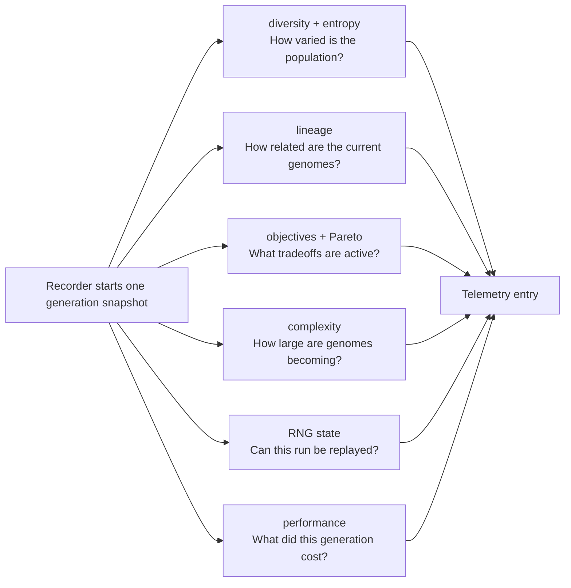

# neat/telemetry/metrics

Metric-building helpers for the telemetry recorder pipeline.

This chapter is where raw controller state becomes interpretable telemetry.
The recorder owns the question, "build one entry for this generation," but
the metrics subtree owns the harder follow-up question: "what evidence should
go into that entry so a human can understand how the run is behaving?"

Read the metrics family as six teaching-oriented layers:
- diversity and entropy helpers estimate how structurally varied the current
  population still is
- lineage helpers summarize ancestry depth, inbreeding, and ancestor
  uniqueness so genealogical pressure is visible
- objective helpers explain what the multi-objective controller is tracking,
  which objectives changed, and how the Pareto frontier is evolving
- complexity helpers turn node and connection growth into explicit telemetry
- RNG helpers expose reproducibility state when a run needs deterministic replay
- performance helpers attach evaluation and evolution timings so telemetry can
  explain computational cost as well as search behavior

The key pedagogical boundary is that these helpers compute and attach values,
but they do not decide when an entry is recorded or how it is stored. That is
why they live below `recorder/` and beside `runtime/`: the recorder orchestrates,
runtime persists safely, and metrics explains the generation.

A good way to read this chapter is:
1. start with the diversity and lineage helpers to understand population health
2. continue to objective and complexity helpers to understand search pressure
3. finish with RNG and performance helpers to understand reproducibility and cost



If the recorder chapter explains telemetry as a pipeline, this chapter explains
telemetry as evidence. It is the place to read when the question is not
"how was the entry recorded?" but "why do these numbers exist, and what do
they reveal about the search?"

## neat/telemetry/metrics/telemetry.metrics.ts

### getCachedEntropy

```ts
getCachedEntropy(
  generation: number | undefined,
  entropyGraph: Record<string, unknown>,
): number | undefined
```

Read a cached entropy value if it exists and belongs to the current
generation.

Parameters:
- `generation` - - Current generation number.
- `entropyGraph` - - Genome-like graph object.

Returns: Cached entropy number, or undefined when not available.

### computeDegreeCounts

```ts
computeDegreeCounts(
  entropyGraph: { nodes: { geneId: number; }[]; connections: { from: { geneId: number; }; to: { geneId: number; }; enabled: boolean; }[]; },
): Record<number, number>
```

Compute per-node degree counts for enabled connections.

Parameters:
- `entropyGraph` - - Genome-like graph object.

Returns: Map geneId -> degree count.

### buildDegreeHistogram

```ts
buildDegreeHistogram(
  counts: Record<number, number>,
): Record<number, number>
```

Build a histogram of degree frequencies from a degree-count table.

Parameters:
- `counts` - - Map geneId -> degree count.

Returns: Map degree -> number of nodes with that degree.

### computeEntropyFromHistogram

```ts
computeEntropyFromHistogram(
  histogram: Record<number, number>,
  totalNodes: number,
): number
```

Compute entropy from a degree-frequency histogram.

Parameters:
- `histogram` - - Map degree -> number of nodes.
- `totalNodes` - - Total node count used to normalize into probabilities.

Returns: Entropy value (non-negative).

### setCachedEntropy

```ts
setCachedEntropy(
  generation: number | undefined,
  entropyGraph: Record<string, unknown>,
  entropyValue: number,
): void
```

Cache an entropy value for the current generation on the graph object.

Parameters:
- `generation` - - Current generation number.
- `entropyGraph` - - Genome-like graph object.
- `entropyValue` - - Entropy value to cache.

### getTelemetryCoreSnapshot

```ts
getTelemetryCoreSnapshot(
  sourceEntry: Record<string, unknown>,
  fields: TelemetryCoreFields,
): Partial<Record<string, unknown>>
```

Build a snapshot of the core telemetry fields present on the entry; does
not mutate the source entry.

Parameters:
- `sourceEntry` - - Source telemetry object.
- `fields` - - Core telemetry field keys to preserve.

Returns: Shallow snapshot of core fields that exist on the entry.

### stripUnselectedTelemetryKeys

```ts
stripUnselectedTelemetryKeys(
  sourceEntry: Record<string, unknown>,
  selection: Set<string>,
  fields: TelemetryCoreFields,
): Record<string, unknown>
```

Remove non-core keys that are not whitelisted by the selection set.
Mutates the provided entry in-place for efficiency.

Parameters:
- `sourceEntry` - - Telemetry entry being filtered.
- `selection` - - Whitelist of additional telemetry keys.
- `fields` - - Core telemetry field keys that must be preserved.

Returns: The same entry reference after filtering.

### mergeTelemetryCoreFields

```ts
mergeTelemetryCoreFields(
  sourceEntry: Record<string, unknown>,
  coreSnapshot: Partial<Record<string, unknown>>,
): Record<string, unknown>
```

Re-attach core fields to the filtered entry.
Mutates the entry so the caller keeps the original reference.

Parameters:
- `sourceEntry` - - Filtered telemetry entry to update.
- `coreSnapshot` - - Snapshot of core fields to ensure presence.

Returns: The same entry reference with core fields restored.

### safelyApplyTelemetrySelect

```ts
safelyApplyTelemetrySelect(
  telemetryContext: TContext,
  telemetryEntry: TelemetryEntry,
  applyTelemetrySelectFn: (this: TContext, entry: Record<string, unknown>) => Record<string, unknown>,
): void
```

Apply telemetry selection while swallowing any selection errors.

Parameters:
- `telemetryContext` - - Neat-like context with telemetry selection.
- `telemetryEntry` - - Entry to filter in place.
- `applyTelemetrySelectFn` - - Selection helper to invoke.

### applyFastModeDefaults

```ts
applyFastModeDefaults(
  telemetryContext: { _fastModeTuned?: boolean | undefined; },
  telemetryOptions: NeatOptions & TelemetryDiversityOptions,
): void
```

Apply fast-mode tuning to diversity sampling and novelty defaults.

Parameters:
- `telemetryContext` - - Context object storing fast-mode tuning flag.
- `telemetryOptions` - - Options with diversity and novelty settings.

### computeCompatibilityStats

```ts
computeCompatibilityStats(
  genomes: TelemetryGenome[],
  size: number,
  pairSampleCount: number,
  rngFactoryFn: () => () => number,
  compatibilityDistance: ((a: TelemetryGenome, b: TelemetryGenome) => number) | undefined,
): { meanCompat: number; varCompat: number; }
```

Compute pairwise compatibility statistics via sampling.

Parameters:
- `genomes` - - Population snapshot.
- `size` - - Population size.
- `pairSampleCount` - - Number of pairs to sample.
- `rngFactoryFn` - - RNG factory returning a uniform random function.
- `compatibilityDistance` - - Optional compatibility distance function.

Returns: Mean and variance of sampled compatibilities.

### computeEntropyStats

```ts
computeEntropyStats(
  genomes: TelemetryGenome[],
  structuralEntropyFn: (genome: TelemetryGenome) => number,
): { meanEntropy: number; varEntropy: number; }
```

Compute structural entropy mean and variance across the population.

Parameters:
- `genomes` - - Population snapshot.
- `structuralEntropyFn` - - Function to compute entropy for a genome.

Returns: Mean and variance of entropy values.

### computeGraphletEntropy

```ts
computeGraphletEntropy(
  genomes: TelemetryGenome[],
  size: number,
  graphletSampleCount: number,
  rngFactoryFn: () => () => number,
): number
```

Sample graphlet motifs and compute entropy over their edge counts.

Parameters:
- `genomes` - - Population snapshot.
- `size` - - Population size.
- `graphletSampleCount` - - Number of graphlets to sample.
- `rngFactoryFn` - - RNG factory returning a uniform random function.

Returns: Graphlet entropy value.

### pickDistinctIndices

```ts
pickDistinctIndices(
  upperBound: number,
  count: number,
  rng: () => number,
): number[]
```

Pick a fixed number of distinct random indices.

Parameters:
- `upperBound` - - Exclusive upper bound for random indices.
- `count` - - Number of distinct indices to pick.
- `rng` - - RNG function returning values in [0,1).

Returns: Array of distinct indices.

### countEnabledEdges

```ts
countEnabledEdges(
  genome: TelemetryGenome,
  selectedNodes: NodeLike[],
): number
```

Count enabled edges between the selected nodes in a genome.

Parameters:
- `genome` - - Genome with connections to inspect.
- `selectedNodes` - - Nodes forming the graphlet sample.

Returns: Edge count capped at 3.

### computeOperatorStatsSnapshot

```ts
computeOperatorStatsSnapshot(
  operatorStats: OperatorStatsMap | undefined,
): { op: string; succ: number; att: number; }[]
```

Snapshot operator statistics into a telemetry-friendly array.

Parameters:
- `operatorStats` - - Operator stats map (opName -> success/attempts).

Returns: Operator stats snapshot array.

### readOperatorStats

```ts
readOperatorStats(
  operatorStats: OperatorStatsMap | undefined,
): { name: string; success: number; attempts: number; }[]
```

Convert operator stats map into the public accessor shape.

Parameters:
- `operatorStats` - - Operator stats map stored on the host.

Returns: Public operator summaries for dashboards and tests.

### computeHyperVolumeProxy

```ts
computeHyperVolumeProxy(
  telemetryOptions: NeatOptions & TelemetryDiversityOptions,
  population: GenomeDetailed[],
): number
```

Compute a hypervolume-like proxy for the Pareto front.

Parameters:
- `telemetryOptions` - - Options controlling complexity metric.
- `population` - - Population snapshot.

Returns: Hypervolume proxy value.

### computeParetoFrontSizes

```ts
computeParetoFrontSizes(
  population: GenomeDetailed[],
): number[]
```

Compute sizes of early Pareto fronts.

Parameters:
- `population` - - Population snapshot.

Returns: Array of front sizes (rank 0..4).

### applyObjectiveImportance

```ts
applyObjectiveImportance(
  telemetryContext: { _lastObjImportance?: ObjImportance | undefined; },
  entry: TelemetryEntryRecord,
): void
```

Apply the most recent objective importance snapshot.

Parameters:
- `telemetryContext` - - Neat-like context with objective importance.
- `entry` - - Telemetry entry to update.

### applyObjectiveAges

```ts
applyObjectiveAges(
  telemetryContext: { _objectiveAges?: Map<string, number> | undefined; },
  entry: TelemetryEntryRecord,
): void
```

Apply objective age snapshots to the entry.

Parameters:
- `telemetryContext` - - Neat-like context with objective ages.
- `entry` - - Telemetry entry to update.

### applyObjectiveEvents

```ts
applyObjectiveEvents(
  telemetryContext: { _pendingObjectiveAdds?: string[] | undefined; _pendingObjectiveRemoves?: string[] | undefined; _objectiveEvents?: ObjectiveEvent[] | undefined; },
  entry: TelemetryEntryRecord,
  generation: number,
): void
```

Apply and flush objective lifecycle events.

Parameters:
- `telemetryContext` - - Neat-like context holding objective events.
- `entry` - - Telemetry entry to update.
- `generation` - - Generation index for event records.

### applySpeciesAllocation

```ts
applySpeciesAllocation(
  telemetryContext: { _lastOffspringAlloc?: SpeciesAlloc[] | undefined; },
  entry: TelemetryEntryRecord,
): void
```

Apply per-species offspring allocation snapshot.

Parameters:
- `telemetryContext` - - Neat-like context with allocation snapshot.
- `entry` - - Telemetry entry to update.

### applyObjectivesSnapshot

```ts
applyObjectivesSnapshot(
  telemetryContext: { _getObjectives?: (() => { key: string; }[]) | undefined; },
  entry: TelemetryEntryRecord,
): void
```

Apply objectives list snapshot (keys only).

Parameters:
- `telemetryContext` - - Neat-like context with objective provider.
- `entry` - - Telemetry entry to update.

### applyHypervolumeTelemetry

```ts
applyHypervolumeTelemetry(
  telemetryOptions: NeatOptions & TelemetryDiversityOptions,
  hyperVolumeProxy: number,
  entry: TelemetryEntryRecord,
): void
```

Attach hypervolume scalar when requested.

Parameters:
- `telemetryOptions` - - Options controlling telemetry fields.
- `hyperVolumeProxy` - - Hypervolume proxy value.
- `entry` - - Telemetry entry to update.

### applyRngState

```ts
applyRngState(
  telemetryContext: { _rngState?: unknown; },
  telemetryOptions: NeatOptions & TelemetryDiversityOptions,
  entry: TelemetryEntryRecord,
): void
```

Attach RNG state when configured.

Parameters:
- `telemetryContext` - - Neat-like context with RNG state.
- `telemetryOptions` - - Options controlling RNG telemetry.
- `entry` - - Telemetry entry to update.

### computeLineageStats

```ts
computeLineageStats(
  lineageEnabled: boolean,
  genomes: TelemetryGenome[],
  size: number,
  pairSampleCount: number,
  rngFactoryFn: () => () => number,
): { lineageMeanDepth: number; lineageMeanPairDist: number; }
```

Compute lineage depth and pairwise depth-distance statistics.

Parameters:
- `lineageEnabled` - - Whether lineage metrics are enabled.
- `genomes` - - Population snapshot.
- `size` - - Population size.
- `pairSampleCount` - - Number of pairs to sample.
- `rngFactoryFn` - - RNG factory returning a uniform random function.

Returns: Lineage mean depth and pairwise distance.

### applyLineageStatsMultiObjective

```ts
applyLineageStatsMultiObjective(
  telemetryContext: { _lineageEnabled?: boolean | undefined; _getRNG?: (() => () => number) | undefined; _lastMeanDepth?: number | undefined; _prevInbreedingCount?: number | undefined; },
  population: GenomeDetailed[],
  entry: TelemetryEntryRecord,
): void
```

Apply lineage stats for multi-objective mode using ancestor uniqueness.

Parameters:
- `telemetryContext` - - Neat-like context with lineage settings.
- `population` - - Population snapshot.
- `entry` - - Telemetry entry to update.

### applyLineageStatsMonoObjective

```ts
applyLineageStatsMonoObjective(
  telemetryContext: { _lineageEnabled?: boolean | undefined; _getRNG?: (() => () => number) | undefined; _lastMeanDepth?: number | undefined; _prevInbreedingCount?: number | undefined; },
  populationSnapshot: GenomeDetailed[],
  entry: TelemetryEntryRecord,
): void
```

Apply lineage stats for mono-objective mode using sampled ancestors.

Parameters:
- `telemetryContext` - - Neat-like context with lineage settings.
- `population` - - Population snapshot.
- `entry` - - Telemetry entry to update.

### isLineageEligible

```ts
isLineageEligible(
  context: { _lineageEnabled?: boolean | undefined; },
  populationSnapshot: GenomeDetailed[],
): boolean
```

Check whether lineage metrics should be computed.

Parameters:
- `context` - - Neat-like context with lineage flag.
- `populationSnapshot` - - Population snapshot to validate.

Returns: True when lineage stats should be computed.

### collectDepths

```ts
collectDepths(
  populationSnapshot: GenomeDetailed[],
): number[]
```

Collect depth values for the current population.

Parameters:
- `populationSnapshot` - - Population snapshot.

Returns: Array of depth values (defaults to 0).

### computeMeanDepth

```ts
computeMeanDepth(
  depthValues: number[],
): number
```

Compute the mean depth from a depth list.

Parameters:
- `depthValues` - - Depth values to average.

Returns: Mean depth value.

### computeAncestorUniquenessSampled

```ts
computeAncestorUniquenessSampled(
  context: { _getRNG?: (() => () => number) | undefined; },
  populationSnapshot: GenomeDetailed[],
): number
```

Compute ancestor uniqueness using sampled Jaccard distance.

Parameters:
- `context` - - Neat-like context with RNG helpers.
- `populationSnapshot` - - Population snapshot.

Returns: Rounded ancestor uniqueness score.

### pickDistinctPairIndices

```ts
pickDistinctPairIndices(
  context: { _getRNG?: (() => () => number) | undefined; },
  populationSize: number,
): { firstIndex: number; secondIndex: number; }
```

Pick two distinct indices using the context RNG.

Parameters:
- `context` - - Neat-like context with RNG factory.
- `populationSize` - - Population size for index bounds.

Returns: Pair of distinct indices.

### computePairJaccardDistance

```ts
computePairJaccardDistance(
  context: { _getRNG?: (() => () => number) | undefined; },
  populationSnapshot: GenomeDetailed[],
  firstIndex: number,
  secondIndex: number,
): number | undefined
```

Compute Jaccard distance between ancestor sets for a pair.

Parameters:
- `context` - - Neat-like context for lineage helpers.
- `populationSnapshot` - - Population snapshot.
- `firstIndex` - - First genome index.
- `secondIndex` - - Second genome index.

Returns: Jaccard distance or undefined when both sets are empty.

### buildLineageContext

```ts
buildLineageContext(
  context: { _getRNG?: (() => () => number) | undefined; },
  populationSnapshot: GenomeDetailed[],
): NeatLineageContext
```

Build a lineage helper context for ancestor operations.

Parameters:
- `context` - - Neat-like context with RNG helpers.
- `populationSnapshot` - - Population snapshot.

Returns: Lineage helper context.

### countAncestorIntersection

```ts
countAncestorIntersection(
  ancestorsA: Set<number>,
  ancestorsB: Set<number>,
): number
```

Count the size of an ancestor intersection.

Parameters:
- `ancestorsA` - - First ancestor set.
- `ancestorsB` - - Second ancestor set.

Returns: Intersection count.

### buildLineageEntry

```ts
buildLineageEntry(
  context: { _prevInbreedingCount?: number | undefined; },
  bestGenomeSnapshot: GenomeDetailed,
  meanDepthValue: number,
  ancestorUniquenessScore: number,
): { parents: number[]; depthBest: number; meanDepth: number; inbreeding: number; ancestorUniq: number; }
```

Build the lineage entry payload.

Parameters:
- `context` - - Neat-like context with lineage info.
- `bestGenomeSnapshot` - - Best genome snapshot.
- `meanDepthValue` - - Mean lineage depth.
- `ancestorUniquenessScore` - - Ancestor uniqueness score.

Returns: Lineage entry payload.

### collectPopulationCounts

```ts
collectPopulationCounts(
  populationSnapshot: GenomeDetailed[],
): { nodeCounts: number[]; connectionCounts: number[]; }
```

Collect node and connection counts for the population.

Parameters:
- `populationSnapshot` - - Population snapshot.

Returns: Node and connection counts arrays.

### computeMeanCounts

```ts
computeMeanCounts(
  counts: { nodeCounts: number[]; connectionCounts: number[]; },
): { meanNodes: number; meanConns: number; }
```

Compute mean node and connection counts.

Parameters:
- `counts` - - Node and connection counts arrays.

Returns: Mean node and connection counts.

### computeMaxCounts

```ts
computeMaxCounts(
  counts: { nodeCounts: number[]; connectionCounts: number[]; },
): { maxNodes: number; maxConns: number; }
```

Compute max node and connection counts.

Parameters:
- `counts` - - Node and connection counts arrays.

Returns: Max node and connection counts.

### computeEnabledRatios

```ts
computeEnabledRatios(
  populationSnapshot: GenomeDetailed[],
): number[]
```

Compute enabled ratios per genome.

Parameters:
- `populationSnapshot` - - Population snapshot.

Returns: Array of enabled ratios.

### computeMeanEnabledRatio

```ts
computeMeanEnabledRatio(
  enabledRatios: number[],
): number
```

Compute mean of enabled ratios.

Parameters:
- `enabledRatios` - - Enabled ratios per genome.

Returns: Mean enabled ratio.

### computeAndStoreGrowthValues

```ts
computeAndStoreGrowthValues(
  context: { _lastMeanNodes?: number | undefined; _lastMeanConns?: number | undefined; },
  meanCounts: { meanNodes: number; meanConns: number; },
): { growthNodes: number; growthConns: number; }
```

Compute growth values and store the latest means on the context.

Parameters:
- `context` - - Neat-like context with previous mean values.
- `meanCounts` - - Current mean node/connection counts.

Returns: Growth values for nodes and connections.

### buildComplexityEntry

```ts
buildComplexityEntry(
  telemetryOptions: NeatOptions & TelemetryDiversityOptions,
  meanCounts: { meanNodes: number; meanConns: number; },
  maxCounts: { maxNodes: number; maxConns: number; },
  meanEnabledRatio: number,
  growthValues: { growthNodes: number; growthConns: number; },
): { meanNodes: number; meanConns: number; maxNodes: number; maxConns: number; meanEnabledRatio: number; growthNodes: number; growthConns: number; budgetMaxNodes: number; budgetMaxConns: number; }
```

Build the complexity entry payload for multi-objective mode.

Parameters:
- `telemetryOptions` - - Options controlling complexity telemetry.
- `meanCounts` - - Mean node/connection counts.
- `maxCounts` - - Max node/connection counts.
- `meanEnabledRatio` - - Mean enabled ratio.
- `growthValues` - - Growth deltas.

Returns: Complexity entry payload.

### applyComplexityStatsMultiObjective

```ts
applyComplexityStatsMultiObjective(
  telemetryContext: { _lastMeanNodes?: number | undefined; _lastMeanConns?: number | undefined; },
  telemetryOptions: NeatOptions & TelemetryDiversityOptions,
  population: GenomeDetailed[],
  entry: TelemetryEntryRecord,
): void
```

Attach complexity stats for multi-objective mode.

Parameters:
- `telemetryContext` - - Neat-like context with population state.
- `telemetryOptions` - - Options controlling complexity telemetry.
- `population` - - Population snapshot.
- `entry` - - Telemetry entry to update.

### applyComplexityStatsMonoObjective

```ts
applyComplexityStatsMonoObjective(
  telemetryContext: { _lastMeanNodes?: number | undefined; _lastMeanConns?: number | undefined; },
  telemetryOptions: NeatOptions & TelemetryDiversityOptions,
  populationSnapshot: GenomeDetailed[],
  entry: TelemetryEntryRecord,
): void
```

Attach complexity stats for mono-objective mode.

Parameters:
- `telemetryContext` - - Neat-like context with population state.
- `telemetryOptions` - - Options controlling complexity telemetry.
- `entry` - - Telemetry entry to update.

### applyPerformanceStats

```ts
applyPerformanceStats(
  telemetryContext: { _lastEvalDuration?: number | undefined; _lastEvolveDuration?: number | undefined; },
  telemetryOptions: NeatOptions & TelemetryDiversityOptions,
  entry: TelemetryEntryRecord,
): void
```

Attach performance stats when configured.

Parameters:
- `telemetryContext` - - Neat-like context with performance data.
- `telemetryOptions` - - Options controlling performance telemetry.
- `entry` - - Telemetry entry to update.

## neat/telemetry/metrics/telemetry.metrics.rng.ts

### applyRngState

```ts
applyRngState(
  telemetryContext: { _rngState?: unknown; },
  telemetryOptions: NeatOptions & TelemetryDiversityOptions,
  entry: TelemetryEntryRecord,
): void
```

Attach RNG state when configured.

Parameters:
- `telemetryContext` - - Neat-like context with RNG state.
- `telemetryOptions` - - Options controlling RNG telemetry.
- `entry` - - Telemetry entry to update.

## neat/telemetry/metrics/telemetry.metrics.entropy.ts

### getCachedEntropy

```ts
getCachedEntropy(
  generation: number | undefined,
  entropyGraph: Record<string, unknown>,
): number | undefined
```

Read a cached entropy value if it exists and belongs to the current
generation.

Parameters:
- `generation` - - Current generation number.
- `entropyGraph` - - Genome-like graph object.

Returns: Cached entropy number, or undefined when not available.

### computeDegreeCounts

```ts
computeDegreeCounts(
  entropyGraph: { nodes: { geneId: number; }[]; connections: { from: { geneId: number; }; to: { geneId: number; }; enabled: boolean; }[]; },
): Record<number, number>
```

Compute per-node degree counts for enabled connections.

Parameters:
- `entropyGraph` - - Genome-like graph object.

Returns: Map geneId -> degree count.

### buildDegreeHistogram

```ts
buildDegreeHistogram(
  counts: Record<number, number>,
): Record<number, number>
```

Build a histogram of degree frequencies from a degree-count table.

Parameters:
- `counts` - - Map geneId -> degree count.

Returns: Map degree -> number of nodes with that degree.

### computeEntropyFromHistogram

```ts
computeEntropyFromHistogram(
  histogram: Record<number, number>,
  totalNodes: number,
): number
```

Compute entropy from a degree-frequency histogram.

Parameters:
- `histogram` - - Map degree -> number of nodes.
- `totalNodes` - - Total node count used to normalize into probabilities.

Returns: Entropy value (non-negative).

### setCachedEntropy

```ts
setCachedEntropy(
  generation: number | undefined,
  entropyGraph: Record<string, unknown>,
  entropyValue: number,
): void
```

Cache an entropy value for the current generation on the graph object.

Parameters:
- `generation` - - Current generation number.
- `entropyGraph` - - Genome-like graph object.
- `entropyValue` - - Entropy value to cache.

## neat/telemetry/metrics/telemetry.metrics.lineage.ts

### computeLineageStats

```ts
computeLineageStats(
  lineageEnabled: boolean,
  genomes: TelemetryGenome[],
  size: number,
  pairSampleCount: number,
  rngFactoryFn: () => () => number,
): { lineageMeanDepth: number; lineageMeanPairDist: number; }
```

Compute lineage depth and pairwise depth-distance statistics.

Parameters:
- `lineageEnabled` - - Whether lineage metrics are enabled.
- `genomes` - - Population snapshot.
- `size` - - Population size.
- `pairSampleCount` - - Number of pairs to sample.
- `rngFactoryFn` - - RNG factory returning a uniform random function.

Returns: Lineage mean depth and pairwise distance.

### applyLineageStatsMultiObjective

```ts
applyLineageStatsMultiObjective(
  telemetryContext: { _lineageEnabled?: boolean | undefined; _getRNG?: (() => () => number) | undefined; _lastMeanDepth?: number | undefined; _prevInbreedingCount?: number | undefined; },
  population: GenomeDetailed[],
  entry: TelemetryEntryRecord,
): void
```

Apply lineage stats for multi-objective mode using ancestor uniqueness.

Parameters:
- `telemetryContext` - - Neat-like context with lineage settings.
- `population` - - Population snapshot.
- `entry` - - Telemetry entry to update.

### applyLineageStatsMonoObjective

```ts
applyLineageStatsMonoObjective(
  telemetryContext: { _lineageEnabled?: boolean | undefined; _getRNG?: (() => () => number) | undefined; _lastMeanDepth?: number | undefined; _prevInbreedingCount?: number | undefined; },
  populationSnapshot: GenomeDetailed[],
  entry: TelemetryEntryRecord,
): void
```

Apply lineage stats for mono-objective mode using sampled ancestors.

Parameters:
- `telemetryContext` - - Neat-like context with lineage settings.
- `population` - - Population snapshot.
- `entry` - - Telemetry entry to update.

### isLineageEligible

```ts
isLineageEligible(
  context: { _lineageEnabled?: boolean | undefined; },
  populationSnapshot: GenomeDetailed[],
): boolean
```

Check whether lineage metrics should be computed.

Parameters:
- `context` - - Neat-like context with lineage flag.
- `populationSnapshot` - - Population snapshot to validate.

Returns: True when lineage stats should be computed.

### collectDepths

```ts
collectDepths(
  populationSnapshot: GenomeDetailed[],
): number[]
```

Collect depth values for the current population.

Parameters:
- `populationSnapshot` - - Population snapshot.

Returns: Array of depth values (defaults to 0).

### computeMeanDepth

```ts
computeMeanDepth(
  depthValues: number[],
): number
```

Compute the mean depth from a depth list.

Parameters:
- `depthValues` - - Depth values to average.

Returns: Mean depth value.

### computeAncestorUniquenessSampled

```ts
computeAncestorUniquenessSampled(
  context: { _getRNG?: (() => () => number) | undefined; },
  populationSnapshot: GenomeDetailed[],
): number
```

Compute ancestor uniqueness using sampled Jaccard distance.

Parameters:
- `context` - - Neat-like context with RNG helpers.
- `populationSnapshot` - - Population snapshot.

Returns: Rounded ancestor uniqueness score.

### pickDistinctPairIndices

```ts
pickDistinctPairIndices(
  context: { _getRNG?: (() => () => number) | undefined; },
  populationSize: number,
): { firstIndex: number; secondIndex: number; }
```

Pick two distinct indices using the context RNG.

Parameters:
- `context` - - Neat-like context with RNG factory.
- `populationSize` - - Population size for index bounds.

Returns: Pair of distinct indices.

### computePairJaccardDistance

```ts
computePairJaccardDistance(
  context: { _getRNG?: (() => () => number) | undefined; },
  populationSnapshot: GenomeDetailed[],
  firstIndex: number,
  secondIndex: number,
): number | undefined
```

Compute Jaccard distance between ancestor sets for a pair.

Parameters:
- `context` - - Neat-like context for lineage helpers.
- `populationSnapshot` - - Population snapshot.
- `firstIndex` - - First genome index.
- `secondIndex` - - Second genome index.

Returns: Jaccard distance or undefined when both sets are empty.

### buildLineageContext

```ts
buildLineageContext(
  context: { _getRNG?: (() => () => number) | undefined; },
  populationSnapshot: GenomeDetailed[],
): NeatLineageContext
```

Build a lineage helper context for ancestor operations.

Parameters:
- `context` - - Neat-like context with RNG helpers.
- `populationSnapshot` - - Population snapshot.

Returns: Lineage helper context.

### countAncestorIntersection

```ts
countAncestorIntersection(
  ancestorsA: Set<number>,
  ancestorsB: Set<number>,
): number
```

Count the size of an ancestor intersection.

Parameters:
- `ancestorsA` - - First ancestor set.
- `ancestorsB` - - Second ancestor set.

Returns: Intersection count.

### buildLineageEntry

```ts
buildLineageEntry(
  context: { _prevInbreedingCount?: number | undefined; },
  bestGenomeSnapshot: GenomeDetailed,
  meanDepthValue: number,
  ancestorUniquenessScore: number,
): { parents: number[]; depthBest: number; meanDepth: number; inbreeding: number; ancestorUniq: number; }
```

Build the lineage entry payload.

Parameters:
- `context` - - Neat-like context with lineage info.
- `bestGenomeSnapshot` - - Best genome snapshot.
- `meanDepthValue` - - Mean lineage depth.
- `ancestorUniquenessScore` - - Ancestor uniqueness score.

Returns: Lineage entry payload.

## neat/telemetry/metrics/telemetry.metrics.operator.ts

### computeOperatorStatsSnapshot

```ts
computeOperatorStatsSnapshot(
  operatorStats: OperatorStatsMap | undefined,
): { op: string; succ: number; att: number; }[]
```

Snapshot operator statistics into a telemetry-friendly array.

Parameters:
- `operatorStats` - - Operator stats map (opName -> success/attempts).

Returns: Operator stats snapshot array.

### readOperatorStats

```ts
readOperatorStats(
  operatorStats: OperatorStatsMap | undefined,
): { name: string; success: number; attempts: number; }[]
```

Convert operator stats map into the public accessor shape.

Parameters:
- `operatorStats` - - Operator stats map stored on the host.

Returns: Public operator summaries for dashboards and tests.

## neat/telemetry/metrics/telemetry.metrics.diversity.ts

### applyFastModeDefaults

```ts
applyFastModeDefaults(
  telemetryContext: { _fastModeTuned?: boolean | undefined; },
  telemetryOptions: NeatOptions & TelemetryDiversityOptions,
): void
```

Apply fast-mode tuning to diversity sampling and novelty defaults.

Parameters:
- `telemetryContext` - - Context object storing fast-mode tuning flag.
- `telemetryOptions` - - Options with diversity and novelty settings.

### computeCompatibilityStats

```ts
computeCompatibilityStats(
  genomes: TelemetryGenome[],
  size: number,
  pairSampleCount: number,
  rngFactoryFn: () => () => number,
  compatibilityDistance: ((a: TelemetryGenome, b: TelemetryGenome) => number) | undefined,
): { meanCompat: number; varCompat: number; }
```

Compute pairwise compatibility statistics via sampling.

Parameters:
- `genomes` - - Population snapshot.
- `size` - - Population size.
- `pairSampleCount` - - Number of pairs to sample.
- `rngFactoryFn` - - RNG factory returning a uniform random function.
- `compatibilityDistance` - - Optional compatibility distance function.

Returns: Mean and variance of sampled compatibilities.

### computeEntropyStats

```ts
computeEntropyStats(
  genomes: TelemetryGenome[],
  structuralEntropyFn: (genome: TelemetryGenome) => number,
): { meanEntropy: number; varEntropy: number; }
```

Compute structural entropy mean and variance across the population.

Parameters:
- `genomes` - - Population snapshot.
- `structuralEntropyFn` - - Function to compute entropy for a genome.

Returns: Mean and variance of entropy values.

### computeGraphletEntropy

```ts
computeGraphletEntropy(
  genomes: TelemetryGenome[],
  size: number,
  graphletSampleCount: number,
  rngFactoryFn: () => () => number,
): number
```

Sample graphlet motifs and compute entropy over their edge counts.

Parameters:
- `genomes` - - Population snapshot.
- `size` - - Population size.
- `graphletSampleCount` - - Number of graphlets to sample.
- `rngFactoryFn` - - RNG factory returning a uniform random function.

Returns: Graphlet entropy value.

### pickDistinctIndices

```ts
pickDistinctIndices(
  upperBound: number,
  count: number,
  rng: () => number,
): number[]
```

Pick a fixed number of distinct random indices.

Parameters:
- `upperBound` - - Exclusive upper bound for random indices.
- `count` - - Number of distinct indices to pick.
- `rng` - - RNG function returning values in [0,1).

Returns: Array of distinct indices.

### countEnabledEdges

```ts
countEnabledEdges(
  genome: TelemetryGenome,
  selectedNodes: NodeLike[],
): number
```

Count enabled edges between the selected nodes in a genome.

Parameters:
- `genome` - - Genome with connections to inspect.
- `selectedNodes` - - Nodes forming the graphlet sample.

Returns: Edge count capped at 3.

## neat/telemetry/metrics/telemetry.metrics.selection.ts

### getTelemetryCoreSnapshot

```ts
getTelemetryCoreSnapshot(
  sourceEntry: Record<string, unknown>,
  fields: TelemetryCoreFields,
): Partial<Record<string, unknown>>
```

Build a snapshot of the core telemetry fields present on the entry; does
not mutate the source entry.

Parameters:
- `sourceEntry` - - Source telemetry object.
- `fields` - - Core telemetry field keys to preserve.

Returns: Shallow snapshot of core fields that exist on the entry.

### stripUnselectedTelemetryKeys

```ts
stripUnselectedTelemetryKeys(
  sourceEntry: Record<string, unknown>,
  selection: Set<string>,
  fields: TelemetryCoreFields,
): Record<string, unknown>
```

Remove non-core keys that are not whitelisted by the selection set.
Mutates the provided entry in-place for efficiency.

Parameters:
- `sourceEntry` - - Telemetry entry being filtered.
- `selection` - - Whitelist of additional telemetry keys.
- `fields` - - Core telemetry field keys that must be preserved.

Returns: The same entry reference after filtering.

### mergeTelemetryCoreFields

```ts
mergeTelemetryCoreFields(
  sourceEntry: Record<string, unknown>,
  coreSnapshot: Partial<Record<string, unknown>>,
): Record<string, unknown>
```

Re-attach core fields to the filtered entry.
Mutates the entry so the caller keeps the original reference.

Parameters:
- `sourceEntry` - - Filtered telemetry entry to update.
- `coreSnapshot` - - Snapshot of core fields to ensure presence.

Returns: The same entry reference with core fields restored.

### safelyApplyTelemetrySelect

```ts
safelyApplyTelemetrySelect(
  telemetryContext: TContext,
  telemetryEntry: TelemetryEntry,
  applyTelemetrySelectFn: (this: TContext, entry: Record<string, unknown>) => Record<string, unknown>,
): void
```

Apply telemetry selection while swallowing any selection errors.

Parameters:
- `telemetryContext` - - Neat-like context with telemetry selection.
- `telemetryEntry` - - Entry to filter in place.
- `applyTelemetrySelectFn` - - Selection helper to invoke.

## neat/telemetry/metrics/telemetry.metrics.complexity.ts

### collectPopulationCounts

```ts
collectPopulationCounts(
  populationSnapshot: GenomeDetailed[],
): { nodeCounts: number[]; connectionCounts: number[]; }
```

Collect node and connection counts for the population.

Parameters:
- `populationSnapshot` - - Population snapshot.

Returns: Node and connection counts arrays.

### computeMeanCounts

```ts
computeMeanCounts(
  counts: { nodeCounts: number[]; connectionCounts: number[]; },
): { meanNodes: number; meanConns: number; }
```

Compute mean node and connection counts.

Parameters:
- `counts` - - Node and connection counts arrays.

Returns: Mean node and connection counts.

### computeMaxCounts

```ts
computeMaxCounts(
  counts: { nodeCounts: number[]; connectionCounts: number[]; },
): { maxNodes: number; maxConns: number; }
```

Compute max node and connection counts.

Parameters:
- `counts` - - Node and connection counts arrays.

Returns: Max node and connection counts.

### computeEnabledRatios

```ts
computeEnabledRatios(
  populationSnapshot: GenomeDetailed[],
): number[]
```

Compute enabled ratios per genome.

Parameters:
- `populationSnapshot` - - Population snapshot.

Returns: Array of enabled ratios.

### computeMeanEnabledRatio

```ts
computeMeanEnabledRatio(
  enabledRatios: number[],
): number
```

Compute mean of enabled ratios.

Parameters:
- `enabledRatios` - - Enabled ratios per genome.

Returns: Mean enabled ratio.

### computeAndStoreGrowthValues

```ts
computeAndStoreGrowthValues(
  context: { _lastMeanNodes?: number | undefined; _lastMeanConns?: number | undefined; },
  meanCounts: { meanNodes: number; meanConns: number; },
): { growthNodes: number; growthConns: number; }
```

Compute growth values and store the latest means on the context.

Parameters:
- `context` - - Neat-like context with previous mean values.
- `meanCounts` - - Current mean node/connection counts.

Returns: Growth values for nodes and connections.

### buildComplexityEntry

```ts
buildComplexityEntry(
  telemetryOptions: NeatOptions & TelemetryDiversityOptions,
  meanCounts: { meanNodes: number; meanConns: number; },
  maxCounts: { maxNodes: number; maxConns: number; },
  meanEnabledRatio: number,
  growthValues: { growthNodes: number; growthConns: number; },
): { meanNodes: number; meanConns: number; maxNodes: number; maxConns: number; meanEnabledRatio: number; growthNodes: number; growthConns: number; budgetMaxNodes: number; budgetMaxConns: number; }
```

Build the complexity entry payload for multi-objective mode.

Parameters:
- `telemetryOptions` - - Options controlling complexity telemetry.
- `meanCounts` - - Mean node/connection counts.
- `maxCounts` - - Max node/connection counts.
- `meanEnabledRatio` - - Mean enabled ratio.
- `growthValues` - - Growth deltas.

Returns: Complexity entry payload.

### applyComplexityStatsMultiObjective

```ts
applyComplexityStatsMultiObjective(
  telemetryContext: { _lastMeanNodes?: number | undefined; _lastMeanConns?: number | undefined; },
  telemetryOptions: NeatOptions & TelemetryDiversityOptions,
  population: GenomeDetailed[],
  entry: TelemetryEntryRecord,
): void
```

Attach complexity stats for multi-objective mode.

Parameters:
- `telemetryContext` - - Neat-like context with population state.
- `telemetryOptions` - - Options controlling complexity telemetry.
- `population` - - Population snapshot.
- `entry` - - Telemetry entry to update.

### applyComplexityStatsMonoObjective

```ts
applyComplexityStatsMonoObjective(
  telemetryContext: { _lastMeanNodes?: number | undefined; _lastMeanConns?: number | undefined; },
  telemetryOptions: NeatOptions & TelemetryDiversityOptions,
  populationSnapshot: GenomeDetailed[],
  entry: TelemetryEntryRecord,
): void
```

Attach complexity stats for mono-objective mode.

Parameters:
- `telemetryContext` - - Neat-like context with population state.
- `telemetryOptions` - - Options controlling complexity telemetry.
- `entry` - - Telemetry entry to update.

## neat/telemetry/metrics/telemetry.metrics.objectives.ts

### computeHyperVolumeProxy

```ts
computeHyperVolumeProxy(
  telemetryOptions: NeatOptions & TelemetryDiversityOptions,
  population: GenomeDetailed[],
): number
```

Compute a hypervolume-like proxy for the Pareto front.

Parameters:
- `telemetryOptions` - - Options controlling complexity metric.
- `population` - - Population snapshot.

Returns: Hypervolume proxy value.

### computeParetoFrontSizes

```ts
computeParetoFrontSizes(
  population: GenomeDetailed[],
): number[]
```

Compute sizes of early Pareto fronts.

Parameters:
- `population` - - Population snapshot.

Returns: Array of front sizes (rank 0..4).

### applyObjectiveImportance

```ts
applyObjectiveImportance(
  telemetryContext: { _lastObjImportance?: ObjImportance | undefined; },
  entry: TelemetryEntryRecord,
): void
```

Apply the most recent objective importance snapshot.

Parameters:
- `telemetryContext` - - Neat-like context with objective importance.
- `entry` - - Telemetry entry to update.

### applyObjectiveAges

```ts
applyObjectiveAges(
  telemetryContext: { _objectiveAges?: Map<string, number> | undefined; },
  entry: TelemetryEntryRecord,
): void
```

Apply objective age snapshots to the entry.

Parameters:
- `telemetryContext` - - Neat-like context with objective ages.
- `entry` - - Telemetry entry to update.

### applyObjectiveEvents

```ts
applyObjectiveEvents(
  telemetryContext: { _pendingObjectiveAdds?: string[] | undefined; _pendingObjectiveRemoves?: string[] | undefined; _objectiveEvents?: ObjectiveEvent[] | undefined; },
  entry: TelemetryEntryRecord,
  generation: number,
): void
```

Apply and flush objective lifecycle events.

Parameters:
- `telemetryContext` - - Neat-like context holding objective events.
- `entry` - - Telemetry entry to update.
- `generation` - - Generation index for event records.

### applySpeciesAllocation

```ts
applySpeciesAllocation(
  telemetryContext: { _lastOffspringAlloc?: SpeciesAlloc[] | undefined; },
  entry: TelemetryEntryRecord,
): void
```

Apply per-species offspring allocation snapshot.

Parameters:
- `telemetryContext` - - Neat-like context with allocation snapshot.
- `entry` - - Telemetry entry to update.

### applyObjectivesSnapshot

```ts
applyObjectivesSnapshot(
  telemetryContext: { _getObjectives?: (() => { key: string; }[]) | undefined; },
  entry: TelemetryEntryRecord,
): void
```

Apply objectives list snapshot (keys only).

Parameters:
- `telemetryContext` - - Neat-like context with objective provider.
- `entry` - - Telemetry entry to update.

### applyHypervolumeTelemetry

```ts
applyHypervolumeTelemetry(
  telemetryOptions: NeatOptions & TelemetryDiversityOptions,
  hyperVolumeProxy: number,
  entry: TelemetryEntryRecord,
): void
```

Attach hypervolume scalar when requested.

Parameters:
- `telemetryOptions` - - Options controlling telemetry fields.
- `hyperVolumeProxy` - - Hypervolume proxy value.
- `entry` - - Telemetry entry to update.

## neat/telemetry/metrics/telemetry.metrics.performance.ts

### applyPerformanceStats

```ts
applyPerformanceStats(
  telemetryContext: { _lastEvalDuration?: number | undefined; _lastEvolveDuration?: number | undefined; },
  telemetryOptions: NeatOptions & TelemetryDiversityOptions,
  entry: TelemetryEntryRecord,
): void
```

Attach performance stats when configured.

Parameters:
- `telemetryContext` - - Neat-like context with performance data.
- `telemetryOptions` - - Options controlling performance telemetry.
- `entry` - - Telemetry entry to update.
