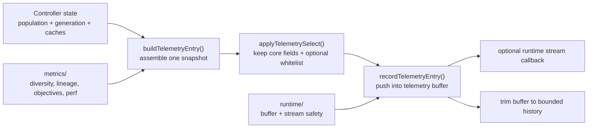

# neat/telemetry/recorder

Telemetry recorder orchestration for generation snapshots.

This chapter is the write-heavy heart of telemetry. If the facade explains
how readers inspect telemetry after it exists, the recorder explains how one
generation snapshot comes into existence in the first place.

The recorder owns the end-to-end write path:
- start from the current generation, fittest genome, and cached controller state
- build one telemetry entry that summarizes what just happened
- optionally filter that entry down to a caller-selected surface
- persist the result to the in-memory buffer and stream it out when configured

The neighboring chapters keep this boundary clean:
- `metrics/` computes the evidence attached to the entry
- `runtime/` handles safe buffer initialization, callback streaming, and trimming
- `facade/` exposes the recorded history back to `Neat` callers later

Read this chapter when you want to answer questions such as:
- what exactly gets captured at the end of one generation?
- where do multi-objective and mono-objective telemetry paths diverge?
- when does telemetry selection happen relative to buffering and streaming?
- how does the library keep telemetry useful without letting diagnostics destabilize evolution?



A useful reading order is:
1. `buildTelemetryEntry()` to understand the overall snapshot shape
2. `recordTelemetryEntry()` to understand the write path and safety rules
3. `applyTelemetrySelect()` to understand how callers can narrow the surface
4. `computeDiversityStats()` and `structuralEntropy()` for the heaviest derived signals

## neat/telemetry/recorder/telemetry.recorder.ts

### applySharedTelemetrySnapshots

```ts
applySharedTelemetrySnapshots(
  telemetryContext: TelemetryContext,
  telemetryOptions: TelemetryBuildOptions,
  generation: number,
  entry: TelemetryMutableEntry,
): void
```

Attach objective, species, and RNG snapshots shared by both telemetry modes.

Parameters:
- `telemetryContext` - Neat-like context with cached telemetry state.
- `telemetryOptions` - Options controlling telemetry behavior.
- `generation` - Generation index for this snapshot.
- `entry` - Mutable telemetry entry.

Returns: Nothing.

### applyTelemetrySelect

```ts
applyTelemetrySelect(
  entry: Record<string, unknown>,
): Record<string, unknown>
```

Apply a telemetry selection whitelist to a telemetry entry.

This helper inspects a per-instance Set of telemetry keys stored at
`this._telemetrySelect`. If present, only keys included in the set are
retained on the produced entry. Core fields (generation, best score and
species count) are always preserved.

Parameters:
- `entry` - Raw telemetry object to be filtered in-place.

Returns: The filtered telemetry object (same reference as input).

Example:

```ts
// keep only 'gen', 'best', 'species' and 'diversity' fields
neat._telemetrySelect = new Set(['diversity']);
applyTelemetrySelect.call(neat, entry);
```

### buildMonoObjectiveEntry

```ts
buildMonoObjectiveEntry(
  telemetryContext: TelemetryContext,
  telemetryOptions: TelemetryBuildOptions,
  generation: number,
  fittestGenome: Record<string, unknown>,
): TelemetryEntry
```

Build a telemetry entry for mono-objective mode.

Parameters:
- `telemetryContext` - Neat-like context with population state.
- `telemetryOptions` - Options controlling telemetry behavior.
- `generation` - Generation index for this snapshot.
- `fittestGenome` - Fittest genome record with score.

Returns: Telemetry entry object for mono mode.

### buildMultiObjectiveEntry

```ts
buildMultiObjectiveEntry(
  telemetryContext: TelemetryContext,
  telemetryOptions: TelemetryBuildOptions,
  generation: number,
  fittestGenome: Record<string, unknown>,
): TelemetryEntry
```

Build a telemetry entry for multi-objective mode.

Parameters:
- `telemetryContext` - Neat-like context with population state.
- `telemetryOptions` - Options controlling telemetry behavior.
- `generation` - Generation index for this snapshot.
- `fittestGenome` - Fittest genome record with score.

Returns: Telemetry entry object for MO mode.

### buildTelemetryEntry

```ts
buildTelemetryEntry(
  fittest: Record<string, unknown>,
): TelemetryEntry
```

Build a comprehensive telemetry entry for the current generation.

This is the recorder's main orchestration surface. It gathers one coherent
explanation of the current generation by combining immediate state
(`generation`, `best`, `species`) with whichever optional evidence blocks the
controller has enabled: diversity, lineage, objective activity, Pareto-front
summaries, complexity growth, RNG state, and performance timing.

This function intentionally mirrors the legacy in-loop telemetry construction
to preserve behavior relied upon by tests and consumers.

Parameters:
- `fittest` - The currently fittest genome (used to report `best` score).

Returns: A TelemetryEntry object suitable for recording/streaming.

Example:

```ts
// build a telemetry snapshot for the current generation
const snapshot = neat.buildTelemetryEntry(neat.population[0]);
neat.recordTelemetryEntry(snapshot);
```

The function has two internal paths:
- multi-objective mode adds Pareto-front and hypervolume-oriented signals
- mono-objective mode keeps the payload smaller while preserving the same core fields

### computeDiversityStats

```ts
computeDiversityStats(): void
```

Compute several diversity statistics used by telemetry reporting.

This helper is where the recorder prepares one of its most important cached
evidence blocks: structural variety. Instead of treating diversity as a
single opaque score, it combines several approximations so later telemetry
can report compatibility spread, entropy, graphlet variety, and lineage depth.

This helper is intentionally conservative at runtime. When `fastMode` is
enabled it tunes sampling defaults downward so telemetry stays informative
without turning every generation into a quadratic metrics pass.

Example:

```ts
// compute and store diversity stats onto the neat instance
neat.options.diversityMetrics = { enabled: true };
neat.computeDiversityStats();
console.log(neat._diversityStats.meanCompat);
```

### createGenerationTelemetryBase

```ts
createGenerationTelemetryBase(
  telemetryContext: TelemetryContext,
  generation: number,
  fittestGenome: Record<string, unknown>,
): TelemetryEntry
```

Create the common telemetry base for one generation snapshot.

Parameters:
- `telemetryContext` - Neat-like context with species state.
- `generation` - Generation index for this snapshot.
- `fittestGenome` - Fittest genome record with score.

Returns: Strict baseline telemetry entry.

### createMonoObjectiveTelemetryEntry

```ts
createMonoObjectiveTelemetryEntry(
  telemetryContext: TelemetryContext,
  generation: number,
  fittestGenome: Record<string, unknown>,
  operatorStatsSnapshot: { op: string; succ: number; att: number; }[],
): TelemetryMutableEntry
```

Create the initial mono-objective telemetry payload before optional expansions are attached.

Parameters:
- `telemetryContext` - Neat-like context with species state.
- `generation` - Generation index for this snapshot.
- `fittestGenome` - Fittest genome record with score.
- `operatorStatsSnapshot` - Operator statistics snapshot.

Returns: Mutable telemetry entry.

### createMultiObjectiveTelemetryEntry

```ts
createMultiObjectiveTelemetryEntry(
  telemetryContext: TelemetryContext,
  generation: number,
  fittestGenome: Record<string, unknown>,
  hyperVolumeProxy: number,
  paretoFrontSizes: number[],
  operatorStatsSnapshot: { op: string; succ: number; att: number; }[],
): TelemetryMutableEntry
```

Create the initial multi-objective telemetry payload before optional expansions are attached.

Parameters:
- `telemetryContext` - Neat-like context with species state.
- `generation` - Generation index for this snapshot.
- `fittestGenome` - Fittest genome record with score.
- `hyperVolumeProxy` - Hypervolume proxy value.
- `paretoFrontSizes` - Pareto front size summary.
- `operatorStatsSnapshot` - Operator statistics snapshot.

Returns: Mutable telemetry entry.

### createTelemetryEntryBase

```ts
createTelemetryEntryBase(
  generationIndex: number,
  bestScore: number,
  speciesCount: number,
): TelemetryEntry
```

Create a strict baseline telemetry entry with required fields populated.

This helper centralizes defaults so downstream telemetry producers can
extend the entry while keeping the strict `TelemetryEntry` contract.

Parameters:
- `generationIndex` - Generation index for the telemetry snapshot.
- `bestScore` - Best fitness value observed in the generation.
- `speciesCount` - Number of extant species.

Returns: A strict telemetry entry with required fields populated.

### recordTelemetryEntry

```ts
recordTelemetryEntry(
  entry: TelemetryEntry,
): void
```

Record a telemetry entry into the instance buffer and optionally stream it.

This is the recorder's "commit" step. By the time this function runs, the
entry has already been assembled. The job here is to make recording safe and
predictable: honor field selection, keep the history buffer initialized,
optionally notify observers, and cap memory growth.

Write order:
1. apply telemetry selection without breaking the evolution loop
2. append the entry to the in-memory history buffer
3. stream the entry when the host opts into runtime callbacks
4. trim history to a bounded window

Parameters:
- `entry` - Telemetry entry to record.

Returns: Nothing. The entry is persisted by side effect on the host.

Example:

```ts
// record a simple telemetry entry from inside the evolve loop
neat.recordTelemetryEntry({ gen: neat.generation, best: neat.population[0].score });
```

### resolveFittestScore

```ts
resolveFittestScore(
  fittestGenome: Record<string, unknown>,
): number
```

Resolve the best score from the current fittest genome snapshot.

Parameters:
- `fittestGenome` - Fittest genome record with optional score.

Returns: Best score value.

### resolveTelemetryBuildOptions

```ts
resolveTelemetryBuildOptions(
  telemetryContext: TelemetryContext,
): TelemetryBuildOptions
```

Resolve telemetry build options from the current recorder context.

Parameters:
- `telemetryContext` - Neat-like context with telemetry settings.

Returns: Telemetry build options.

### resolveTelemetryPopulation

```ts
resolveTelemetryPopulation(
  telemetryContext: TelemetryContext,
): GenomeDetailed[]
```

Resolve the current population snapshot used by telemetry builders.

Parameters:
- `telemetryContext` - Neat-like context with population state.

Returns: Population snapshot.

### structuralEntropy

```ts
structuralEntropy(
  graph: { [key: string]: unknown; nodes: { geneId: number; }[]; connections: { from: { geneId: number; }; to: { geneId: number; }; enabled: boolean; }[]; },
): number
```

Lightweight proxy for structural entropy based on degree-distribution.

This function computes an approximate entropy of a graph topology by
counting node degrees and computing the entropy of the degree histogram.
The result is cached on the graph object for the current generation in
`_entropyVal` to avoid repeated expensive recomputation.

Parameters:
- `graph` - A genome-like object with `nodes` and `connections` arrays.

Returns: A non-negative number approximating structural entropy.

Example:

```ts
const H = structuralEntropy.call(neat, genome);
console.log(`Structure entropy: ${H.toFixed(3)}`);
```

### TelemetryContext

Context view used within telemetry helpers to access optional internal
fields with descriptive names rather than repeated inline casts.
