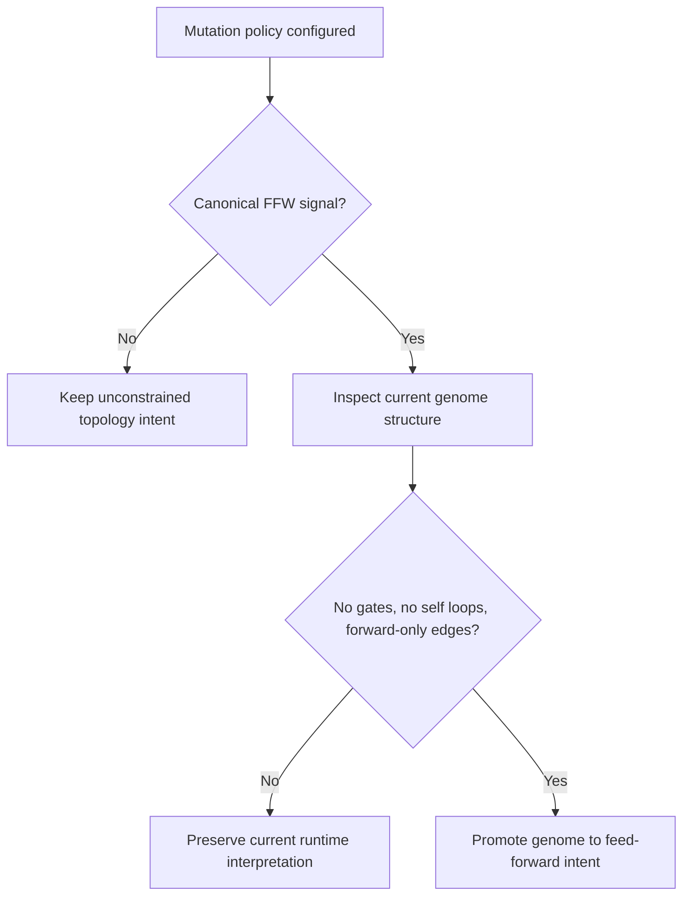

# neat/topology-intent

Shared feed-forward topology-intent policy for NEAT population entry points.

This chapter keeps the feed-forward promotion contract in one small shared
boundary because both pool bootstrapping and next-population provenance need
to answer the same question: when does a genome already satisfy the stricter
feed-forward runtime assumptions exposed by the public mutation policy?

That question is easy to blur in evolutionary code. A mutation policy can
request feed-forward behavior, but a concrete genome may still contain gates,
self-connections, or backward edges that make a strict feed-forward runtime
label misleading. This boundary exists so the controller does not confuse
"the user asked for feed-forward search pressure" with "this exact graph is
already safe to treat as feed-forward right now."

Read this as a policy bridge, not as a graph-rewrite chapter. Mutation
configuration can communicate feed-forward intent, but that intent should only
become a runtime topology contract when an actual genome already satisfies the
stricter structural rules. This boundary keeps those two questions together:
does the active mutation policy request feed-forward behavior, and is the
candidate genome already safe to promote without changing its meaning?

Read this chapter in three passes:

1. start with `usesFeedForwardMutationPolicy()` when you want to know how the
   controller recognizes the canonical public signal,
2. continue to `isGenomeEligibleForFeedForwardIntentPromotion()` when you want
   the structural safety test,
3. finish with `promoteGenomeToFeedForwardIntentWhenEligible()` when you want
   the exact point where policy becomes runtime contract.

The helpers form one short decision flow:

1. `usesFeedForwardMutationPolicy()` recognizes the canonical public signal.
2. `isGenomeEligibleForFeedForwardIntentPromotion()` checks whether the
   current graph is already ordered like a feed-forward network.
3. `promoteGenomeToFeedForwardIntentWhenEligible()` applies the public runtime
   contract only when both earlier checks agree.



The historical idea behind this boundary is conservative labeling. NEAT-style
search often experiments with topology, and the safest controller behavior is
to promote a stricter runtime interpretation only when the graph already earns
it. That keeps initialization and provenance code honest: they can respect
feed-forward user intent without silently rewriting recurrent meaning.

Move back to `mutation/` when you want the broader operator-policy story,
`init/` when you want constructor-time pool setup, and `helpers/` when you
want the provenance and population-entry flows that reuse this bridge.

Example:
```ts
const shouldPromote = usesFeedForwardMutationPolicy(neat.options.mutation);
promoteGenomeToFeedForwardIntentWhenEligible(genome, shouldPromote);
```

## neat/topology-intent/neat.topology-intent.ts

### isGenomeEligibleForFeedForwardIntentPromotion

```ts
isGenomeEligibleForFeedForwardIntentPromotion(
  genome: TopologyIntentGenome,
): boolean
```

Check whether a genome can safely adopt feed-forward topology intent.

Eligibility is intentionally conservative: the graph must already be free of
gates and self-connections, and every normal connection must follow the
current node ordering. This keeps the helper focused on preserving an
already-feed-forward structure instead of rewriting arbitrary graphs into a
different interpretation.

The helper therefore answers a structural-preservation question, not a graph
repair question. A `false` result does not mean the genome is invalid. It
means only that this bridge should not relabel it as feed-forward yet.

This distinction is the chapter's core invariant. The helper is intentionally
willing to say "not yet" to valid genomes, because false positives would be
worse than conservative misses at this boundary.

Parameters:
- `genome` - Genome candidate.

Returns: True when the genome can safely adopt feed-forward intent.

### matchesCanonicalFeedForwardPool

```ts
matchesCanonicalFeedForwardPool(
  configuredPool: TopologyIntentMutationMethod[],
  canonicalPool: TopologyIntentMutationMethod[],
): boolean
```

Check whether a configured mutation pool matches the canonical FFW pool.

This helper exists so callers can recognize the feed-forward mutation policy
even after options have been flattened, copied, or wrapped by legacy code.
The comparison deliberately stays order-sensitive because the canonical pool
is treated as one explicit public signal rather than as a fuzzy set of
approximately similar operators.
That strictness is a feature: it keeps the topology-intent story predictable
for readers and users instead of letting near-matches silently acquire a
stronger runtime meaning than they asked for.

Parameters:
- `configuredPool` - Mutation pool configured on the NEAT instance.
- `canonicalPool` - Canonical feed-forward mutation pool.

Returns: True when both pools align by operator name and order.

### promoteGenomeToFeedForwardIntentWhenEligible

```ts
promoteGenomeToFeedForwardIntentWhenEligible(
  genome: TopologyIntentGenome,
  shouldPromote: boolean,
): void
```

Promote a genome to feed-forward topology intent when the structure is eligible.

The promotion is intentionally conservative. The helper only switches the
runtime contract when the current graph is already ordered like a pure
feed-forward network, which avoids changing the meaning of recurrent or
gated seed genomes during bootstrapping and provenance insertion.

Read this as the handoff point between policy and runtime contract. The
caller has already decided that feed-forward intent is desired; this helper
makes sure that intent is only written onto genomes that already behave like
feed-forward networks under the current node ordering.

This makes the helper especially important during bootstrap and provenance
flows. Those code paths often need to preserve user intent across imported or
cloned genomes, but they should not quietly reinterpret a graph that still
contains recurrent features.

Parameters:
- `genome` - Genome candidate being inserted into a population.
- `shouldPromote` - Whether the active NEAT options request feed-forward semantics.

Returns: Nothing.

Example:

```ts
const shouldPromote = usesFeedForwardMutationPolicy(neat.options.mutation);
promoteGenomeToFeedForwardIntentWhenEligible(candidateGenome, shouldPromote);
```

### TopologyIntentGenome

Minimal genome surface required to promote feed-forward intent safely.

This contract stays deliberately small because the bridge is not trying to
own general graph validation. It only needs the current node order, directed
connections, recurrent-only collections such as gates and self-connections,
and the public topology-intent setter exposed by `Network`.

In other words, this contract captures just enough structure to answer the
chapter's one real question: "would a feed-forward runtime label preserve the
current graph's meaning, or would it over-promise?"

### TopologyIntentMutationMethod

Minimal mutation descriptor used by topology-intent helpers.

The bridge only needs one stable piece of information from a mutation entry:
its public name. That keeps the topology-intent checks aligned with the
canonical feed-forward pool without importing the full mutation subsystem.
Keeping the contract this small also makes the chapter's main teaching point
easier to see: topology intent recognition is a public-policy comparison, not
a second mutation-engine implementation.

### usesFeedForwardMutationPolicy

```ts
usesFeedForwardMutationPolicy(
  mutationConfig: unknown,
): boolean
```

Determine whether the configured mutation policy communicates feed-forward intent.

Accepts the canonical mutation pool reference, the legacy single-item array
wrapper, or a flattened pool that exactly matches the canonical feed-forward
operator order. The comparison stays strict on purpose so the controller does
not silently reinterpret custom mutation pools as feed-forward mode.

In practice this helper answers the policy question only. It does not inspect
a concrete genome, and it does not attempt runtime promotion by itself.
That separation is important because a caller may request feed-forward
mutation semantics while still holding seed genomes whose current graphs are
recurrent, gated, or otherwise not yet eligible for the stricter runtime
contract.

Treat this as the chapter's public signal decoder. It translates several
legacy and canonical configuration shapes into one yes-or-no answer that the
rest of the controller can reuse consistently.

Parameters:
- `mutationConfig` - Configured mutation option.

Returns: True when the option expresses canonical feed-forward intent.

Example:

```ts
const shouldPromote = usesFeedForwardMutationPolicy(neat.options.mutation);
if (!shouldPromote) {
  console.log('keep unconstrained topology intent');
}
```
