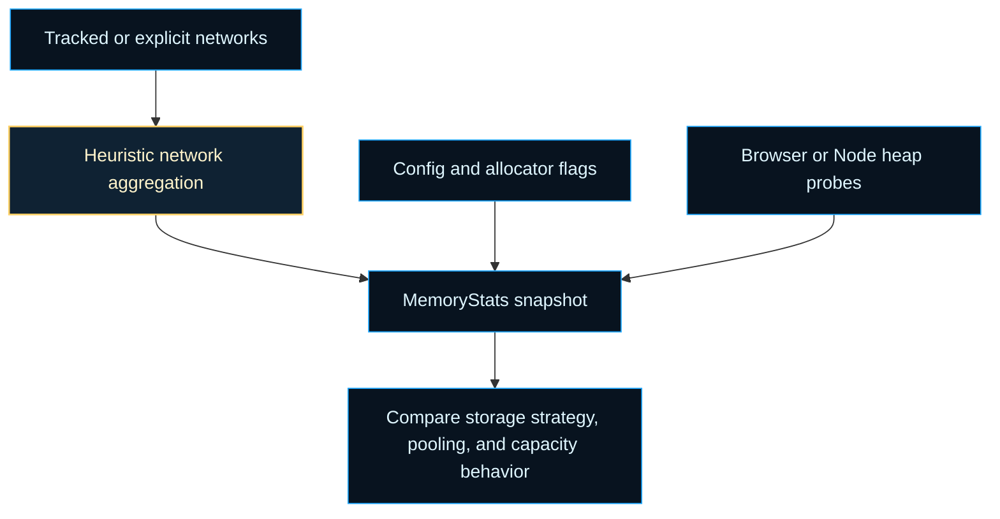
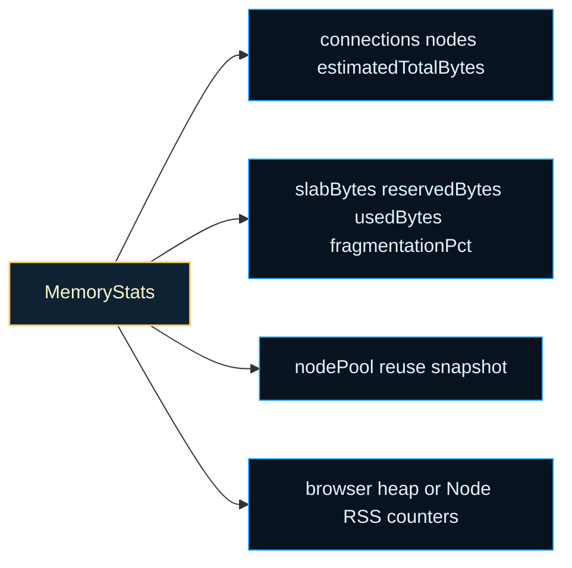
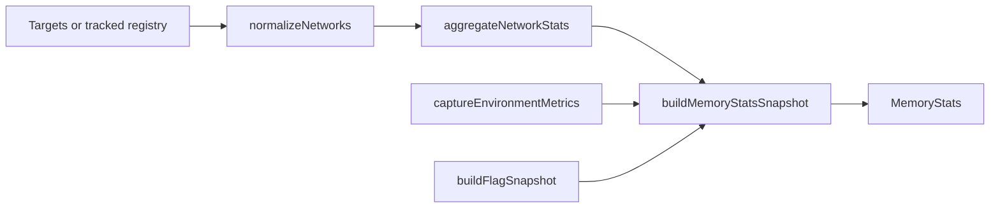

# utils

Memory instrumentation chapter for slab, pool, and heap comparisons.

This chapter exists for one practical learning problem: memory behavior is
one of the easiest parts of an evolutionary system to feel, but one of the
hardest parts to explain from raw runtime objects alone. Networks grow,
slabs reserve capacity ahead of immediate need, pools trade fresh allocation
pressure for reuse, and the JavaScript engine adds object overhead that is
difficult to see directly from the outside.

Instead of pretending to be a precise profiler, this boundary offers a fast,
educational snapshot. The goal is to make design choices visible enough that
readers can compare runs and ask better questions: did slab-backed storage
reduce object-heavy overhead, is pooling shifting pressure away from fresh
allocations, how much reserved typed-array capacity is currently unused, and
are browser or Node heap readings moving in the same direction as the
library-specific heuristics?

The most important design choice is scope. `memoryStats()` is not trying to
replace a full heap profiler. It is trying to put library-shaped numbers next
to runtime-shaped numbers so a reader can compare architecture decisions with
less guesswork. The result is intentionally strongest at trend questions such
as "did the slab version get leaner?" or "did pooling reduce fresh pressure?"
rather than forensic questions about one exact byte count.

A useful mental model is to treat the snapshot as four cooperating layers.
The network layer counts connections, nodes, and estimated totals. The slab
layer explains reserved versus used typed-array capacity. The pool layer
exposes reuse infrastructure. The environment layer shows the coarser browser
or Node counters surrounding the library's own heuristics.

The environment metrics are intentionally coarser than the network heuristics.
See MDN,
[Performance.memory](https://developer.mozilla.org/en-US/docs/Web/API/Performance/memory),
and the Node.js docs,
[process.memoryUsage()](https://nodejs.org/api/process.html#processmemoryusage),
for the runtime-level counters this chapter folds alongside its own snapshot.
They are useful context, but they do not know the difference between live
network structure, reserved slab capacity, and reusable pools the way this
module does.

Read the chapter in three passes:

1. {@link memoryStats} for the top-level snapshot and registry behavior.
2. {@link MemoryStats} when you want to interpret the resulting sections.
3. `memory.utils.ts` when you want the aggregation, environment probing, and
   slab-accounting mechanics behind the snapshot.





Example: register one network once, then capture snapshots later without
threading the target through every call.

```ts
registerTrackedNetwork(network);
const snapshot = memoryStats();

console.log(snapshot.estimatedTotalBytes);
console.log(snapshot.slabs.fragmentationPct);
```

Example: compare two explicit network sets when you want the memory story to
stay local to one experiment.

```ts
const baselineSnapshot = memoryStats([baselineNetwork]);
const pooledSnapshot = memoryStats([pooledNetwork]);

console.log(baselineSnapshot.estimatedTotalBytes);
console.log(pooledSnapshot.slabs.pooledFraction);
```

## utils/memory.ts

### memoryStats

```ts
memoryStats(
  targetNetworks: NetworkView | NetworkView[] | undefined,
): MemoryStats
```

Capture heuristic memory statistics for one or more networks with a snapshot of active config flags.

This is the main educational entrypoint for the utils chapter. It resolves
which networks to inspect, safely samples allocator and environment signals,
then folds those pieces into one comparable snapshot.

The result is intentionally good at trend questions rather than forensic
accuracy. Use it to compare configurations, validate that pooling or slabs
changed the memory story in the expected direction, or teach why reserved and
used bytes can diverge even when the active connection count stays stable.

Parameters:
- `targetNetworks` - Optional single network or array. If omitted, uses registered networks.

Returns: MemoryStats heuristic snapshot.

Example:

```ts
registerTrackedNetwork(network);
const snapshot = memoryStats();

console.log(snapshot.estimatedTotalBytes, snapshot.slabs.fragmentationPct);
```

### MemoryStats

Detailed statistics describing the current estimated memory footprint of
tracked networks plus supporting pools.

Important: All byte counts here are *estimates*. JavaScript engine object
overhead varies; once slab (Structure of Arrays) storage dominates, these
estimates get closer to real usage. Treat values as relative metrics for
comparing configurations (e.g. before / after enabling pooling) rather than
exact allocations.

The payload is easiest to read as four cooperating layers:

- `connections`, `nodes`, and `estimatedTotalBytes` summarize the tracked
  network footprint itself,
- `slabs` explains how much typed-array storage exists and how much of the
  reserved connection capacity is currently used,
- `pools` shows whether reusable allocation infrastructure is active,
- `env` exposes the coarser browser or Node memory readings that surround the
  heuristic network view.

### NetworkView

Minimal view of a network used for memory heuristics. Only properties
accessed by this module are declared. This keeps coupling light while
enabling typed local variables instead of loose catch-all types everywhere.

### registerTrackedNetwork

```ts
registerTrackedNetwork(
  network: NetworkView | null | undefined,
): void
```

Register a network for inclusion in future `memoryStats()` calls made
without explicit parameters.

Duplicate registrations are ignored; insertion order is preserved which is
useful for deterministic test snapshots.
This makes the registry convenient for demos and repeated observations: code
can opt into tracking once, then ask for snapshots later without threading a
network list through every call site.

Parameters:
- `network` - Network instance (loose shape, validated at runtime).

Returns: void

### resetMemoryTracking

```ts
resetMemoryTracking(): void
```

Clear the internal list of networks tracked by `memoryStats()` when no
explicit networks are provided. This does NOT free memory; it only
removes references held by the registry.

Use this when a teaching example, benchmark, or test wants a fresh registry
boundary before capturing the next snapshot.

Returns: void

### SlabAllocStats

Minimal slab allocator stats shape used here. The real shape may
include additional fields; we only rely on fresh/pooled counts.

### unregisterTrackedNetwork

```ts
unregisterTrackedNetwork(
  network: NetworkView,
): void
```

Remove a previously registered network from the tracking registry.
No-op if the network is not currently registered.

Use this when the chapter's tracked set should follow the active lifetime of
a network instead of accumulating historical references.

Parameters:
- `network` - Network instance to remove.

Returns: void

## utils/safeStructuredClone.ts

Deep-clone a value with a native structuredClone fast path and a JSON fallback.

Use this helper when the runtime baseline may expose `structuredClone`, but a
plain-data fallback is still required for older or constrained environments.

Behavior of the JSON fallback path:
- **Throws** on circular references and `BigInt` values (JSON serialization error).
- **Lossy** for `undefined`, functions, and symbols — these are silently
  dropped or coerced to `null` by `JSON.stringify`, so callers should not
  rely on strict value preservation through the fallback path.

Example:

```ts
const cloned = safeStructuredClone({ nested: { count: 1 } });
```

### safeStructuredClone

```ts
safeStructuredClone(
  value: T,
): T
```

Deep-clone a value with a native structuredClone fast path and a JSON fallback.

Use this helper when the runtime baseline may expose `structuredClone`, but a
plain-data fallback is still required for older or constrained environments.

Behavior of the JSON fallback path:
- **Throws** on circular references and `BigInt` values (JSON serialization error).
- **Lossy** for `undefined`, functions, and symbols — these are silently
  dropped or coerced to `null` by `JSON.stringify`, so callers should not
  rely on strict value preservation through the fallback path.

Parameters:
- `value` - Value to clone.

Returns: Deep-cloned value.

Example:

```ts
const cloned = safeStructuredClone({ nested: { count: 1 } });
```

## utils/memory.utils.ts

Helper mechanics behind the heuristic memory snapshot.

The root `memory.ts` chapter answers the user-facing question: "what does
the memory picture look like right now?" This file answers the quieter
mechanics question behind that snapshot: how do we turn loose runtime data
into a stable educational summary without pretending we have an exact heap
profiler?

The helpers fall into four families:

- normalization helpers decide which networks are in scope,
- aggregation helpers count nodes, connections, typed arrays, and reserved
  capacity,
- environment helpers safely read browser or Node memory metrics,
- snapshot builders assemble the final teaching-oriented payload.

Read this file when you want to understand why the memory chapter can stay
fast: each helper owns one narrow step, and the final snapshot is assembled
from precomputed parts rather than one giant reflective walk.



### accumulateCapacitySlices

```ts
accumulateCapacitySlices(
  accumulators: Accumulators,
  network: NetworkView,
): void
```

Track reserved vs used bytes based on connection capacity slices.

Parameters:
- `accumulators` - Running totals for the memory snapshot.
- `network` - Network exposing capacity metadata.

### accumulateSlabArrays

```ts
accumulateSlabArrays(
  accumulators: Accumulators,
  typedArrays: (Float32Array<ArrayBufferLike> | Float64Array<ArrayBufferLike> | Uint32Array<ArrayBufferLike> | Uint8Array<ArrayBufferLike> | Int32Array<ArrayBufferLike>)[],
): void
```

Sum slab-backed array counts and byte sizes into the accumulator.

Parameters:
- `accumulators` - Running totals for the memory snapshot.
- `typedArrays` - Connection-parallel arrays to measure.

### Accumulators

Running totals used while walking networks to summarize memory consumption.
Accumulates counts, slab byte totals, and reserved vs used capacity
snapshots. This is the file's working ledger before the public-facing
`MemoryStats` object is assembled.

### aggregateNetworkStats

```ts
aggregateNetworkStats(
  networksToSummarize: NetworkView[],
  heuristics: HeuristicBytes,
): Accumulators
```

Aggregate per-network counters and slab metrics into a single accumulator.

This is the file's main collection pass. It walks the chosen networks once,
records the object-heavy counts that remain visible from the outside, and
pairs them with slab and capacity hints when those newer storage paths are
present.

Parameters:
- `networksToSummarize` - Networks to include in the snapshot.
- `heuristics` - Heuristic byte weights for connections and nodes.

Returns: Accumulated summary of network metrics.

### buildFlagSnapshot

```ts
buildFlagSnapshot(
  configSnapshot: ConfigSnapshot,
  allocationStats: SlabAllocStats,
): { warnings: unknown; float32Mode: unknown; deterministicChainMode: unknown; enableGatingTraces: unknown; poolMaxPerBucket: number | null; poolPrewarmCount: number | null; enableNodePooling: boolean; allocStats: unknown; }
```

Build flag snapshot derived from config and allocator stats.

Flag snapshots explain *why* the memory picture may look the way it does by
capturing the small set of runtime options that materially alter pooling,
slab layout, and feature-gated storage paths.

Parameters:
- `configSnapshot` - Relevant configuration values.
- `allocationStats` - Allocator stats (nullable on failure).

Returns: Flags snapshot for MemoryStats.

### BuildMemoryStatsInput

Structured inputs required to assemble a MemoryStats snapshot in one pass.
Bundles precomputed accumulators, environment info, allocator stats, and
flags. This keeps the final snapshot builder declarative: collect first,
then fold into the public payload.

### buildMemoryStatsSnapshot

```ts
buildMemoryStatsSnapshot(
  input: BuildMemoryStatsInput,
): MemoryStats
```

Build the full MemoryStats snapshot from precomputed components.

This final fold is intentionally declarative: all measurement work has
already happened, so the builder can stay focused on turning those pieces
into a readable teaching payload.

Parameters:
- `input` - Structured inputs collected by the orchestrator.

Returns: Complete MemoryStats snapshot.

### buildSlabStats

```ts
buildSlabStats(
  accumulators: Accumulators,
  networksToSummarize: NetworkView[],
  allocationStats: SlabAllocStats,
): { slabBytes: number; slabArrayCount: number; fragmentationPct: number | null; reservedBytes: number | null; usedBytes: number | null; slabVersion: number | null; asyncBuilds: number; pooledFraction: number | null; }
```

Assemble slab-related statistics for the MemoryStats payload.

Parameters:
- `accumulators` - Running totals collected during aggregation.
- `networksToSummarize` - Networks included in the snapshot.
- `allocationStats` - Optional allocator stats for pooled fraction.

Returns: Structured slab metrics block.

### calculateFragmentation

```ts
calculateFragmentation(
  accumulators: Accumulators,
): number | null
```

Compute fragmentation percentage from reserved vs used connection bytes.

Parameters:
- `accumulators` - Running totals holding reserved and used bytes.

Returns: Fragmentation percent (0-100) or null when undefined.

### calculatePooledFraction

```ts
calculatePooledFraction(
  allocationStats: SlabAllocStats,
): number | null
```

Calculate pooled fraction from allocator stats with four-decimal precision.

Parameters:
- `allocationStats` - Allocator snapshot or null when unavailable.

Returns: Fraction of pooled allocations or null if indeterminate.

### captureEnvironmentMetrics

```ts
captureEnvironmentMetrics(): { isBrowser: boolean; usedJSHeapSize?: number | undefined; totalJSHeapSize?: number | undefined; jsHeapSizeLimit?: number | undefined; rss?: number | undefined; heapUsed?: number | undefined; heapTotal?: number | undefined; external?: number | undefined; }
```

Capture environment memory metrics from browser or Node when available.

The environment block complements the network-centric heuristics. It is not
specific enough to explain every connection or node, but it helps readers see
whether the broader runtime is moving in the same direction as the network
summary.

Returns: Environment metrics structure for the snapshot.

### captureVersionMetadata

```ts
captureVersionMetadata(
  accumulators: Accumulators,
  network: NetworkView,
): void
```

Capture slab metadata (version and async builds) once across all networks.

Parameters:
- `accumulators` - Running totals with metadata slots.
- `network` - Network providing slab metadata fields.

### collectConnectionTypedArrays

```ts
collectConnectionTypedArrays(
  network: NetworkView,
): (Float32Array<ArrayBufferLike> | Float64Array<ArrayBufferLike> | Uint32Array<ArrayBufferLike> | Uint8Array<ArrayBufferLike> | Int32Array<ArrayBufferLike>)[]
```

Gather all typed arrays that represent connection-parallel data on a network.

Parameters:
- `network` - Network providing connection state arrays.

Returns: Typed arrays aligned to connections.

### computeCounts

```ts
computeCounts(
  network: NetworkView,
): CountSnapshot
```

Capture simple counts for nodes and connections on a network view.

Parameters:
- `network` - Network being summarized.

Returns: Connection and node counts.

### ConfigSnapshot

Captured configuration knobs that influence memory usage and pooling behavior.
Keeps only the flags relevant to the memory snapshot to avoid leaking full
config. The goal is to explain the memory story, not to smuggle the entire
runtime configuration surface into a diagnostic payload.

### CONNECTION_OBJECT_BYTES

Estimated per-connection JS object footprint in bytes (includes metadata fields).
Used as a fallback when typed-array parallel data is unavailable.

### createEmptyAccumulators

```ts
createEmptyAccumulators(): Accumulators
```

Initialize a fresh accumulator snapshot for memory summaries.

Returns: Zeroed accumulators ready for aggregation.

### describeConnectionBytes

```ts
describeConnectionBytes(
  network: NetworkView,
): number
```

Determine bytes per connection using typed-array width or heuristic fallback.

Parameters:
- `network` - Network whose storage format drives the byte width.

Returns: Estimated bytes per connection entry.

### HEURISTIC_BYTES

Default heuristics mapping human-readable weights to their byte estimates.
Centralizes the fallback values so downstream summaries stay consistent.
Read this as the chapter's shared baseline for "object-heavy" accounting
when typed-array widths are unavailable or incomplete.

### HeuristicBytes

Heuristic byte weights used to approximate per-object overhead in the allocator.
These numbers represent typical JS object footprints, not exact runtime
measurements. They are teaching weights: stable enough to compare runs and
storage strategies even when the engine's true overhead is more complicated.

### NODE_OBJECT_BYTES

Estimated per-node JS object footprint in bytes, covering activation state and IDs.
This heuristic keeps node weight comparable to connection objects during summaries.

### normalizeNetworks

```ts
normalizeNetworks(
  targets: NetworkView | NetworkView[] | undefined,
  trackedNetworks: NetworkView[],
): NetworkView[]
```

Normalize provided targets to an array of networks, falling back to tracked registry.

This helper keeps the public entrypoint flexible without making later
aggregation code branch on every call path.

Parameters:
- `targets` - Optional single network or array.
- `trackedNetworks` - Internal registry of tracked networks.

Returns: Array of networks to summarize.

### safeGetSlabAllocationStats

```ts
safeGetSlabAllocationStats(
  getSlabAllocationStats: () => unknown,
): SlabAllocStats
```

Safely read slab allocation stats, guarding against provider errors.

Allocator telemetry is useful but optional. A failed probe should degrade the
snapshot gracefully instead of turning diagnostics into a source of runtime
failures.

Parameters:
- `getSlabAllocationStats` - Provider function returning allocator stats.

Returns: Slab allocation stats or null on failure.
