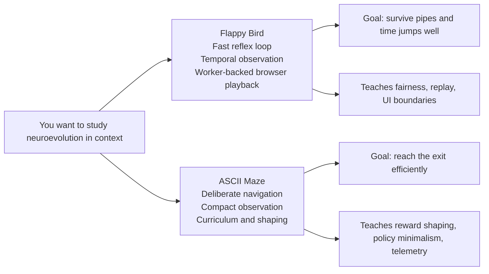
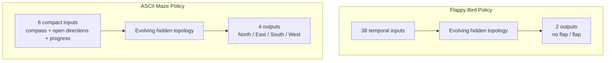

# Examples

These are not throwaway demos. They are small, opinionated neuroevolution laboratories.

The `test/examples` folder exists to show what NeatapticTS looks like when it leaves the comfort of tiny benchmark tasks and has to deal with real design questions: what the agent should observe, how fitness should be shaped, how evolution should be made fair, how browser playback should stay responsive, and how the resulting network should remain inspectable enough to teach from.

There are currently two flagship examples here:

- [flappy_bird](./flappy_bird) for a fast, reactive control problem with rich temporal observations and browser-worker playback.
- [asciiMaze](./asciiMaze) for a more deliberate navigation problem with compact inputs, reward shaping, curriculum transfer, and terminal/browser telemetry.

If the main library README is the front door, this folder is the arcade: two cabinets, two different kinds of thinking, same evolutionary engine underneath.

## Pick your cabinet

| If you want to learn about... | Start here | Why |
| --- | --- | --- |
| Browser-friendly neuroevolution as a system | [flappy_bird/README.md](./flappy_bird/README.md) | It is the clearest end-to-end architecture demo in the repo. |
| Reward shaping and compact policy design | [asciiMaze/README.md](./asciiMaze/README.md) | It shows how a small observation space can still support interesting behavior. |
| Live demos you can open in the browser | [flappy_bird/index.html](./flappy_bird/index.html) and [asciiMaze/index.html](./asciiMaze/index.html) | Both examples have browser surfaces, but they teach different engineering tradeoffs. |
| Runnable source before documentation | [flappy_bird](./flappy_bird) and [asciiMaze](./asciiMaze) | Both folders are structured as readable systems, not single demo files. |

## Two examples, two personalities

Both examples use evolving neural networks whose topology and weights can change over time. The difference is not the evolutionary family. The difference is the kind of intelligence pressure each environment applies.

## Network shapes at a glance

That contrast is the quickest way to understand the folder:

- Flappy Bird gives the network a wider sensor window and asks for a tiny action vocabulary.
- ASCII Maze gives the network a tiny sensor window and asks for a richer directional choice.

In other words, Flappy is about deciding *when* to act. ASCII Maze is about deciding *where* to go.

## Flappy Bird

[flappy_bird](./flappy_bird) is the better first stop if you want to see the repo at full strength.

The example is built around a Flappy-style control problem, but the real lesson is architectural: deterministic world stepping, shared-seed evaluation, worker-offloaded playback, and live network inspection all work together without collapsing into one impossible-to-read demo file.

What the policy sees:

- a temporal observation vector with 38 inputs,
- current and recent geometry around upcoming pipe gaps,
- short action-memory signals.

What the policy decides:

- two competing outputs: `no flap` and `flap`.

What this example is really for:

- learning how to reduce lucky-rollout bias,
- seeing how a browser demo can stay educational without owning simulation authority,
- understanding how to expose evolved networks for inspection instead of just replaying them as spectacle.

Best starting points:

- [flappy_bird/README.md](./flappy_bird/README.md)
- [flappy_bird/trainFlappyBird.ts](./flappy_bird/trainFlappyBird.ts)
- [flappy_bird/index.html](./flappy_bird/index.html)

## ASCII Maze

[asciiMaze](./asciiMaze) is the better first stop if you want to study policy design under tighter information budgets.

This example compresses the maze state into a six-value observation and asks the evolving network to choose among four directions. That makes the policy surface much smaller than Flappy Bird's, but the environment logic becomes more strategic: navigation, progress tracking, exploration incentives, and reward shaping matter a lot more.

What the policy sees:

- a 6-value input vector,
- a compass-style direction hint,
- local openness in the four cardinal directions,
- a progress signal.

What the policy decides:

- four movement outputs: North, East, South, West.

What this example is really for:

- learning how compact observations can still support useful behavior,
- studying reward shaping in sparse-goal environments,
- seeing curriculum transfer, telemetry, and optional refinement in one system.

Best starting points:

- [asciiMaze/README.md](./asciiMaze/README.md)
- [asciiMaze/evolutionEngine.ts](./asciiMaze/evolutionEngine.ts)
- [asciiMaze/index.html](./asciiMaze/index.html)

## What is different between them?

| Dimension | Flappy Bird | ASCII Maze |
| --- | --- | --- |
| Core challenge | Reflex control under changing geometry | Deliberate navigation toward a goal |
| Observation style | Broad temporal observation | Tight handcrafted state summary |
| Policy outputs | 2 action scores | 4 directional scores |
| Teaching emphasis | Evaluation fairness, worker playback, inspectable UI | Reward shaping, curriculum transfer, telemetry-rich evolution |
| Runtime flavor | Browser-heavy and replay-oriented | Console/browser hybrid and experiment-oriented |
| Best first question | How do I run NEAT in a responsive app? | How do I turn sparse navigation into learnable signals? |

The easiest mental shortcut is this:

- Flappy Bird is a fast control-systems lesson.
- ASCII Maze is a compact decision-making lesson.

Both are worth reading because together they show that "good neuroevolution example" does not mean one fixed template. The observation design, scoring design, runtime boundary, and visualization strategy all change with the problem.

## Recommended reading order

If you want the strongest guided path through this folder:

1. Read [flappy_bird/README.md](./flappy_bird/README.md) for the clearest full-system map.
2. Read [asciiMaze/README.md](./asciiMaze/README.md) for the compact-policy and shaping counterpoint.
3. Open the source entrypoints:
   - [flappy_bird/trainFlappyBird.ts](./flappy_bird/trainFlappyBird.ts)
   - [asciiMaze/evolutionEngine.ts](./asciiMaze/evolutionEngine.ts)
4. Open the browser hosts if you want to see the examples perform:
   - [flappy_bird/index.html](./flappy_bird/index.html)
   - [asciiMaze/index.html](./asciiMaze/index.html)

## Why this folder matters

Libraries are easy to admire in abstraction. They are harder to trust until you see them under pressure.

This folder is where NeatapticTS stops being a list of features and starts behaving like a toolkit with opinions. The examples show how the same library can support two very different styles of evolutionary problem-solving while still keeping the code readable, testable, and teachable.