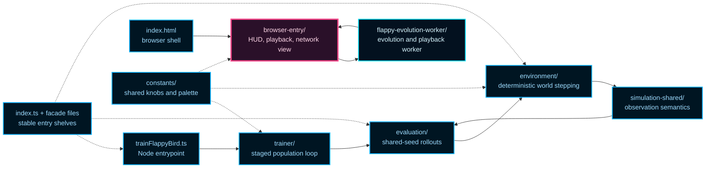

# Flappy Bird (NeatapticTS)

This folder is the repository's clearest end-to-end neuroevolution example.

It uses a Flappy Bird-style control problem to show how NeatapticTS is meant to feel in a real project: deterministic simulation, fairer policy evaluation, staged NEAT selection, worker-based playback, and live network inspection in the browser.

If you want one example that ties together training, replay, visualization, and engineering tradeoffs instead of showing them as isolated tricks, start here.

## Why This Example Exists

This is not just a game clone. It is a compact systems demo for the library.

It is designed to answer four practical questions:

1. How do you wire a NEAT population into a repeatable control problem?
2. How do you reduce luck so selection pressure tracks policy quality instead of lucky seeds?
3. How do you replay evolved behavior in the browser without moving simulation authority onto the main thread?
4. How do you make the evolved network inspectable enough to teach with, not just impressive enough to watch?

The current trainer answers those questions with shared-seed, multi-stage evaluation rather than one-rollout-per-genome scoring. That makes the example useful both as a runnable demo and as a reference architecture for browser-friendly neuroevolution workflows.

## Choose Your Reading Path

If your goal is different from the next reader's goal, the best reading order changes.

| If you want to... | Start here | Then read |
| --- | --- | --- |
| Run the demo fast | `trainFlappyBird.ts` or `index.html` | `trainer/README.md`, `browser-entry/README.md` |
| Understand the control problem | `environment/README.md` | `simulation-shared/README.md`, `evaluation/README.md` |
| Tune fitness or fairness | `evaluation/README.md` | `trainer/README.md` |
| Change browser playback or UI | `browser-entry/README.md` | `flappy-evolution-worker/README.md` |
| Understand the whole example as a system | this README | the module READMEs in the order listed near the end |

## Quick Start

### Run training

From the repo root:

```bash
npx ts-node test/examples/flappy_bird/trainFlappyBird.ts
```

You should see logs like:

- `gen=1 best=... pipes=... frames=...`

Training runs until you stop it with `Ctrl+C`.

### Run the browser demo

From the repo root:

```bash
npm run start:local-server
```

Then open:

- `http://localhost:8080/test/examples/flappy_bird/index.html`

Important note:

- the page loads bundles from `docs/assets`, so run `npm run docs` after code or documentation changes that affect the published example surface.

## Mental Model In 60 Seconds

Think of the example as five boundaries that cooperate without collapsing into one giant "game" file.

1. `environment/` owns the deterministic world and frame stepping.
2. `simulation-shared/` owns observation semantics that must stay consistent across training and playback.
3. `evaluation/` turns one network or a batch of shared seeds into selection-ready metrics.
4. `trainer/` decides how the population is ranked, mutated, and evolved over generations.
5. `browser-entry/` plus `flappy-evolution-worker/` turn the same evolutionary story into a responsive, inspectable browser experience.

The root files such as `index.ts`, `flappyEnvironment.ts`, and `flappyEvaluation.ts` are stable shelves for people who want the example's public entrypoints without learning the entire folder layout first.

## System Map

The main architectural idea is simple: keep simulation and evolution authoritative, keep the browser educational, and keep the worker boundary explicit.



Read the diagram left to right:

- the Node path evolves policies against the deterministic world,
- the browser path renders and explains results without stealing simulation authority,
- the worker keeps heavy simulation and playback preparation off the main thread,
- the facade files keep the example approachable from the outside.

## What Each Boundary Owns

### `environment/`: the world itself

This is the deterministic episode state and frame-step logic.

- bird state, pipe state, collision, and pass-credit live here,
- the environment can be understood without knowing anything about the browser,
- stepping is deterministic when seeded, which is what makes evaluation fairness possible later.

### `simulation-shared/`: the policy's view of the world

This layer keeps the observation story consistent.

That matters because the example has more than one runtime path. Training, browser playback, and helper utilities all need to agree on what the network is actually seeing. If observation semantics drift between those paths, debugging turns into guesswork.

### `evaluation/`: fairness and score shaping

Evaluation answers two different questions:

1. What happened in one episode?
2. How robust is this genome across a shared batch of deterministic seeds?

That second question is the important one for selection. The trainer is deliberately not built around a single lucky rollout.

### `trainer/`: population-level decisions

The trainer owns the outer evolutionary loop.

It resolves staged evaluation plans, applies mutation scheduling, evolves the population, and emits compact generation summaries. This is the layer that turns low-level rollouts into population-level progress.

### `browser-entry/` and `flappy-evolution-worker/`: explanation and replay

The browser side is intentionally split into a thin main-thread runtime and a worker-owned heavy path.

- the worker owns evolution, playback simulation, and packed snapshot transport,
- the browser owns rendering, HUD updates, and network visualization,
- the browser is educational and reactive, not the source of truth for evolution.

That split keeps the UI responsive and makes the message boundary teachable.

## Two Execution Stories

### Training story

1. `trainFlappyBird.ts` starts the trainer.
2. `trainer/` resolves the generation's rollout budget and mutation schedule.
3. `evaluation/` runs deterministic rollouts against shared seeds.
4. `environment/` advances the world frame by frame.
5. The trainer ranks genomes, logs the generation summary, and evolves again.

### Browser story

1. `index.html` loads the browser bundle.
2. `browser-entry/` creates the host UI and starts the worker channel.
3. `flappy-evolution-worker/` evolves or simulates playback off-thread.
4. The worker streams packed snapshots and generation summaries back.
5. `browser-entry/playback/` reconstructs frames and renders the living flock.
6. `browser-entry/network-view/` draws the currently interesting network for inspection.

## The Most Important Design Bets

Several design choices explain why this example is structured the way it is.

### Shared-seed evaluation instead of lucky-rollout selection

Every genome in a comparison set sees the same rollout seeds. That pushes selection pressure toward genuinely better behavior instead of isolated fortunate runs.

### Temporal observations instead of a single-frame snapshot

The policy sees a 38-input observation built from current, previous, and two-frames-ago feature slices plus short action memory. That gives a feed-forward network some local temporal context without requiring recurrent state.

### Simple action semantics

The policy outputs two scores: `no flap` and `flap`. A flap happens when `output[1] > output[0]`.

The simplicity is deliberate. It keeps the control problem focused on state quality and evaluation quality rather than on complicated action decoding.

### Decomposed fitness instead of a single opaque reward

Fitness combines survival, progress, dense shaping, and terminal shaping. That makes reward debugging much easier because a bad score has an explanation instead of being just one mysterious scalar.

### Browser inspection as a first-class teaching tool

The browser does not only replay a champion. It can render the whole generation population, show the current leader clearly, and expose connection sign, connection strength, disabled edges, and node bias in the network panel.

## Observation And Fitness Cheat Sheet

The observation vector focuses on control-relevant geometry rather than raw scene pixels.

The network sees signals about:

- bird vertical position and vertical velocity,
- distance and delta to the next gap,
- next-gap bounds,
- distance and delta to the second upcoming gap,
- clearance and urgency features,
- action-memory features that encode recent flap behavior.

Fitness then combines normalized channels with caps so one lucky dimension does not dominate selection:

- survival,
- pipe progress,
- dense shaping,
- terminal shaping.

Dense shaping still rewards practical flying behavior such as staying aligned to the next gap, approaching the next pipe productively, and preparing for the second upcoming gap.

## Folder Map

The folder is split by responsibility, not by one enormous "game" module.

- `browser-entry/`: main-thread browser runtime, HUD, playback renderer, viewport helpers, telemetry, and network visualization.
- `constants/`: shared visual, training, world, and playback constants.
- `environment/`: deterministic state, stepping, collision/progress rules, and environment-facing observation helpers.
- `evaluation/`: rollout execution, seed batching, and fitness aggregation.
- `flappy-evolution-worker/`: worker runtime for evolution, playback simulation, and snapshot transport.
- `simulation-shared/`: simulation-facing feature logic reused across environment, trainer, and browser paths.
- `trainer/`: Node-side orchestration, staged evaluation plans, mutation scheduling, and generation logging.
- `flappyEnvironment.ts`: convenience facade for treating the example as a control environment.
- `flappyEvaluation.ts`: convenience facade for treating the example as a policy-evaluation surface.
- `flappyEvolution.worker.ts`: tiny worker bundle entry.
- `trainFlappyBird.ts`: direct Node entrypoint for starting training.
- `index.html`: local browser shell.
- `index.ts`: example-level public shelf.
- `rng.ts`: deterministic random utilities shared across runtime paths.

## Recommended Reading Order

If you are new to the example, this sequence usually gives the cleanest ramp:

1. this README for the big-picture map,
2. `trainer/README.md` for the evolutionary loop,
3. `evaluation/README.md` for rollout fairness and score aggregation,
4. `environment/README.md` for deterministic world mechanics,
5. `browser-entry/README.md` for the browser runtime and visualization path,
6. `flappy-evolution-worker/README.md` for worker protocol and playback transport.

If you only care about one slice:

- training and fitness tuning: start with `trainer/` and `evaluation/`,
- environment changes or control-problem semantics: start with `environment/` and `simulation-shared/`,
- browser playback or UI work: start with `browser-entry/` and `flappy-evolution-worker/`.

## Background Reading

This example is self-explanatory enough to read from the code alone, but two external references are genuinely useful if you want the broader concepts behind the boundaries:

- Kenneth O. Stanley and Risto Miikkulainen, "Evolving Neural Networks through Augmenting Topologies," Evolutionary Computation 10(2), 2002: the canonical NEAT paper and the best conceptual backdrop for why topology and weights co-evolve.
- Wikipedia contributors, "Message passing," Wikipedia, The Free Encyclopedia: a compact mental model for why the browser and worker communicate through an explicit protocol instead of sharing runtime authority.

## Why This README Matters

This README is the tone-setter for the rest of the example.

The goal is not only to show that the library can evolve a bird controller. The goal is to show how NeatapticTS tries to balance algorithmic rigor, reproducibility, browser ergonomics, and teaching value inside one coherent example.

If you want a single folder that demonstrates the repository's broader direction for runnable, inspectable, educational examples, this is the one.
