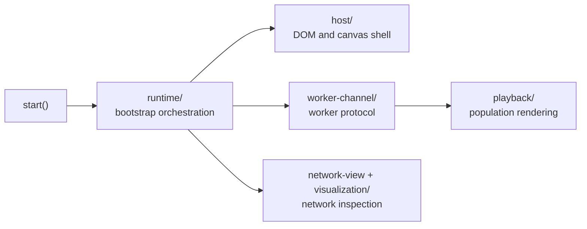
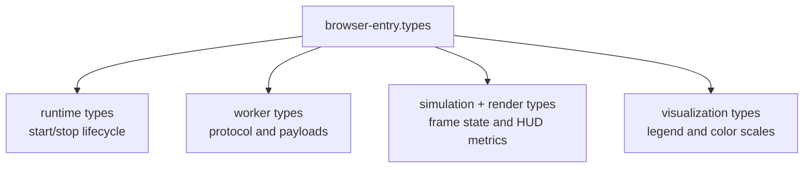

# browser-entry

Browser demo public entry for the Flappy Bird example.

This boundary is the hand-off point between library consumers and the demo's
browser runtime. Calling `start` boots the canvas UI, worker channel, HUD,
and playback loop without exposing all of that internal orchestration as part
of the public API.

In other words, this file is intentionally tiny because it acts like a clean
facade over a much larger interactive system.

Minimal browser start example:
```ts
import { start } from './browser-entry/browser-entry';

const handle = start();
// Later: handle.stop();
```

Startup path:


## browser-entry/browser-entry.types.ts

Aggregated public type surface for the Flappy Bird browser runtime.

The browser demo spans several concerns at once: worker messaging, playback
rendering, telemetry, viewport math, and network visualization. Re-exporting
the public contracts from one place gives readers a compact map of that
runtime without forcing them to know the internal folder layout first.

A practical reading order is:

- runtime types for lifecycle and top-level handles,
- worker types for protocol boundaries,
- simulation/render types for playback state,
- visualization types for the network panel.

Use this file when you want the browser runtime's public contract map. Use
the neighboring runtime, playback, host, worker-channel, and visualization
folders when you want the actual implementation story.

Browser runtime map:


### FlappyBirdRunHandle

Handle returned by `start` for controlling demo execution lifecycle.

### RuntimeWindow

Runtime window contract for the Flappy Bird browser demo.

The demo exposes a small debug-friendly surface on `window` so manual browser
experiments and docs examples can start the simulation without importing the
bundle as a module.

### FlappyStatsKey

Runtime stats table key union used across browser-entry helpers.

### FlappyStatsRowDescriptor

Declarative row descriptor for the runtime stats table.

Each row is described as data first so the HUD can be assembled in a stable,
testable order instead of being hand-written imperatively.

### FlappyStatsTableCells

Runtime lookup map of stat keys to writable value cells.

This acts like a small DOM index so the update loop can mutate the correct
cells directly without repeatedly querying the document.

### FlappyStatsCategoryColors

Color pair used for stats category key/value styling.

The HUD uses paired colors so labels and values stay visually grouped while
still separating categories such as current run, telemetry, and best-so-far.

### CreateFlappyStatsTableRowsInput

Input contract for declarative runtime stats table row builder.

The builder needs both the target table and a small policy surface that says
whether instrumentation rows should appear and how rows should be colored.

### SerializedNetwork

Loose JSON-compatible network payload used by worker messages.

### PopulationPipe

Renderable pipe state snapshot emitted by the playback worker.

This is the smallest pipe shape the browser renderer needs for one frame:
horizontal position plus the vertical corridor geometry.

### PopulationBird

Renderable bird state snapshot emitted by the playback worker.

The browser does not receive full neural state here. It only gets the fields
needed for presentation and HUD summaries, which keeps per-frame transport
light.

### PackedPlaybackPipeSnapshot

Packed typed-array payload for playback pipe snapshot transport.

Typed arrays keep frame payloads compact and predictable, which matters when
the worker is streaming many birds and pipes across animation frames.

### PackedPlaybackBirdSnapshot

Packed typed-array payload for playback bird snapshot transport.

This mirrors the pipe packing strategy so playback can move large population
snapshots with less allocation pressure than object-per-bird messages.

### EvolutionGenerationPayload

Worker payload describing evolved generation summary values.

This is the browser-facing summary of one completed NEAT generation: what
generation finished, how fit the best genome was, and optionally the best
network for visualization or playback.

### EvolutionGenerationReadyMessage

Worker message emitted when a generation has completed evolving.

### EvolutionWorkerErrorMessage

Worker message emitted for simulation/playback errors.

### EvolutionPlaybackStepSnapshot

Per-frame snapshot received from the worker playback channel.

A snapshot combines geometry, packed population state, and lightweight world
metadata so the browser can render a deterministic frame without rerunning
the simulation locally.

### EvolutionPlaybackStepMessage

Worker message carrying one playback step and aggregate markers.

Besides the frame snapshot itself, this message also carries summary values
used by the HUD so the browser can show performance and progress without
recomputing population-wide statistics on the main thread.

### EvolutionWorkerMessage

Union of all supported worker messages consumed by browser entry.

A closed union keeps the main-thread message handler explicit and easy to
audit when the protocol evolves.

### PlaybackFrameStats

Lightweight per-frame telemetry emitted to HUD update callback.

These values are the browser-friendly metrics shown in the live status panel:
how many birds remain, how far the leader has progressed, and how expensive
the current playback cadence is.

### BrowserPopulationBirdLike

Bird shape used by utility winner/leader resolver helpers.

### BrowserPopulationPipeLike

Pipe shape used by utility observation-vector helpers.

### BrowserDifficultyProfile

Difficulty profile consumed by simulation observation helpers.

This bundles the three variables that define how demanding a stretch of the
course is: corridor width, pipe speed, and spawn cadence.

### PopulationRenderState

Mutable render-state model consumed by the population frame renderer.

The playback layer incrementally updates this state as worker snapshots
arrive, which lets rendering stay deterministic without re-deriving world
history from scratch each frame.

### TrailPoint

Trail point used by playback trail rendering cache.

A trail point stores where one bird was at one frame so the UI can draw a
short motion history behind active agents.

### TrailState

Mutable trail cache keyed by bird index for frame rendering.

This cache exists purely for visualization ergonomics; it is not part of the
worker simulation state.

### RngLike

Minimal random source contract used by utility random helpers.

The narrow contract keeps deterministic spawn utilities portable across
browser and test contexts.

### RenderStandaloneTitleBoxInput

Input contract for standalone title frame rendering helper.

### RenderClosedOuterBoxInput

Input contract for outer frame rendering helper.

The outer frame is the decorative shell that visually separates the playable
world and telemetry panels from the rest of the page.

### ViewportInfo

Viewport transform values for world-to-canvas rendering.

These numbers answer the classic graphics question: how does one unit in the
simulated world map into the current canvas rectangle?

### TextFrameMetrics

Canvas text-grid metrics used for frame rendering layout helpers.

The frame renderer measures glyph and row geometry once, then uses that grid
to place ASCII-style UI elements consistently.

### NetworkVisualizationHandle

Draw callback contract for network architecture panel updates.

### ColorTier

Connection or bias tier used for color mapping ramps.

Visualization buckets continuous weights into legible color bands so humans
can scan sign and magnitude at a glance.

### ColorLegendRow

Legend row model for network visualization color legends.

Each row labels a numeric interval and the color used to render it.

### NetworkLegendLayout

Precomputed legend panel layout used by visualization renderer.

Layout is resolved up front so the draw path can stay focused on painting,
not recomputing geometry every frame.

### VisualNetworkConnectionLike

Lightweight connection shape used by network visualization drawing.

The renderer only needs connectivity, weight, and enabled state, not the full
training-time behavior of a connection object.

### VisualNetworkNodeLike

Lightweight node shape used by network visualization drawing.

This shape keeps the renderer independent from the concrete Network class
while still exposing the semantic fields that matter visually.

### PositionedNetworkNodeLike

Positioned node instance used by network visualization drawing.

Layout and rendering are split: first a node is assigned screen coordinates,
then the renderer paints it.

### NetworkNodeDimensionsLike

Pixel dimensions used for network-node rectangle rendering.

Keeping node box dimensions explicit makes legend and topology layout easier
to tune without hidden drawing constants.

## browser-entry/browser-entry.stats.types.ts

HUD and runtime stats contracts for the Flappy Bird browser demo.

The browser HUD is intentionally declarative: keys describe what should be
shown, and helper utilities map those keys to DOM rows and live values. That
keeps the status panel readable even as telemetry grows.

### FlappyStatsKey

Runtime stats table key union used across browser-entry helpers.

### FlappyStatsRowDescriptor

Declarative row descriptor for the runtime stats table.

Each row is described as data first so the HUD can be assembled in a stable,
testable order instead of being hand-written imperatively.

### FlappyStatsTableCells

Runtime lookup map of stat keys to writable value cells.

This acts like a small DOM index so the update loop can mutate the correct
cells directly without repeatedly querying the document.

### FlappyStatsCategoryColors

Color pair used for stats category key/value styling.

The HUD uses paired colors so labels and values stay visually grouped while
still separating categories such as current run, telemetry, and best-so-far.

### CreateFlappyStatsTableRowsInput

Input contract for declarative runtime stats table row builder.

The builder needs both the target table and a small policy surface that says
whether instrumentation rows should appear and how rows should be colored.

## browser-entry/browser-entry.render.types.ts

Canvas frame-layout contracts for the Flappy Bird browser demo.

These types support the demo's deliberately stylized text-frame chrome: title
boxes, outer borders, and viewport transforms that make the example feel more
like an instrument panel than a plain canvas game.

### RenderStandaloneTitleBoxInput

Input contract for standalone title frame rendering helper.

### RenderClosedOuterBoxInput

Input contract for outer frame rendering helper.

The outer frame is the decorative shell that visually separates the playable
world and telemetry panels from the rest of the page.

### ViewportInfo

Viewport transform values for world-to-canvas rendering.

These numbers answer the classic graphics question: how does one unit in the
simulated world map into the current canvas rectangle?

### TextFrameMetrics

Canvas text-grid metrics used for frame rendering layout helpers.

The frame renderer measures glyph and row geometry once, then uses that grid
to place ASCII-style UI elements consistently.

## browser-entry/browser-entry.worker.types.ts

Worker transport contracts for the Flappy Bird browser runtime.

The browser UI and the evolution worker communicate through a deliberately
explicit message protocol. The goal is educational as well as practical: it
makes it obvious which values are computed off-thread, which snapshots are
transferred frame-by-frame, and which events advance the demo state.

If you want background reading, the Wikipedia article on "message passing"
provides a useful conceptual frame for this boundary.

### SerializedNetwork

Loose JSON-compatible network payload used by worker messages.

### PopulationPipe

Renderable pipe state snapshot emitted by the playback worker.

This is the smallest pipe shape the browser renderer needs for one frame:
horizontal position plus the vertical corridor geometry.

### PopulationBird

Renderable bird state snapshot emitted by the playback worker.

The browser does not receive full neural state here. It only gets the fields
needed for presentation and HUD summaries, which keeps per-frame transport
light.

### PackedPlaybackPipeSnapshot

Packed typed-array payload for playback pipe snapshot transport.

Typed arrays keep frame payloads compact and predictable, which matters when
the worker is streaming many birds and pipes across animation frames.

### PackedPlaybackBirdSnapshot

Packed typed-array payload for playback bird snapshot transport.

This mirrors the pipe packing strategy so playback can move large population
snapshots with less allocation pressure than object-per-bird messages.

### EvolutionGenerationPayload

Worker payload describing evolved generation summary values.

This is the browser-facing summary of one completed NEAT generation: what
generation finished, how fit the best genome was, and optionally the best
network for visualization or playback.

### EvolutionGenerationReadyMessage

Worker message emitted when a generation has completed evolving.

### EvolutionWorkerErrorMessage

Worker message emitted for simulation/playback errors.

### EvolutionPlaybackStepSnapshot

Per-frame snapshot received from the worker playback channel.

A snapshot combines geometry, packed population state, and lightweight world
metadata so the browser can render a deterministic frame without rerunning
the simulation locally.

### EvolutionPlaybackStepMessage

Worker message carrying one playback step and aggregate markers.

Besides the frame snapshot itself, this message also carries summary values
used by the HUD so the browser can show performance and progress without
recomputing population-wide statistics on the main thread.

### EvolutionWorkerMessage

Union of all supported worker messages consumed by browser entry.

A closed union keeps the main-thread message handler explicit and easy to
audit when the protocol evolves.

### PlaybackFrameStats

Lightweight per-frame telemetry emitted to HUD update callback.

These values are the browser-friendly metrics shown in the live status panel:
how many birds remain, how far the leader has progressed, and how expensive
the current playback cadence is.

## browser-entry/browser-entry.runtime.types.ts

Public lifecycle contracts for the Flappy Bird browser runtime.

These types describe how the demo is started, stopped, and exposed on the
browser `window` object. They are intentionally small because callers should
control the demo at a high level without depending on private implementation
details.

### FlappyBirdRunHandle

Handle returned by `start` for controlling demo execution lifecycle.

### RuntimeWindow

Runtime window contract for the Flappy Bird browser demo.

The demo exposes a small debug-friendly surface on `window` so manual browser
experiments and docs examples can start the simulation without importing the
bundle as a module.

## browser-entry/browser-entry.simulation.types.ts

Simulation-facing browser contracts shared by playback helpers.

These types describe the minimum world state the browser needs while it is
reconstructing, rendering, or summarizing worker-produced frames.

### BrowserPopulationBirdLike

Bird shape used by utility winner/leader resolver helpers.

### BrowserPopulationPipeLike

Pipe shape used by utility observation-vector helpers.

### BrowserDifficultyProfile

Difficulty profile consumed by simulation observation helpers.

This bundles the three variables that define how demanding a stretch of the
course is: corridor width, pipe speed, and spawn cadence.

### PopulationRenderState

Mutable render-state model consumed by the population frame renderer.

The playback layer incrementally updates this state as worker snapshots
arrive, which lets rendering stay deterministic without re-deriving world
history from scratch each frame.

### TrailPoint

Trail point used by playback trail rendering cache.

A trail point stores where one bird was at one frame so the UI can draw a
short motion history behind active agents.

### TrailState

Mutable trail cache keyed by bird index for frame rendering.

This cache exists purely for visualization ergonomics; it is not part of the
worker simulation state.

### RngLike

Minimal random source contract used by utility random helpers.

The narrow contract keeps deterministic spawn utilities portable across
browser and test contexts.

## browser-entry/browser-entry.visualization.types.ts

Network-visualization contracts for the Flappy Bird browser demo.

One of the educational goals of the example is to let people watch evolved
controllers as structures, not just as scores. These types describe the
lightweight shapes used by the architecture panel so rendering logic can stay
decoupled from the full internal network implementation.

### NetworkVisualizationHandle

Draw callback contract for network architecture panel updates.

### ColorTier

Connection or bias tier used for color mapping ramps.

Visualization buckets continuous weights into legible color bands so humans
can scan sign and magnitude at a glance.

### ColorLegendRow

Legend row model for network visualization color legends.

Each row labels a numeric interval and the color used to render it.

### NetworkLegendLayout

Precomputed legend panel layout used by visualization renderer.

Layout is resolved up front so the draw path can stay focused on painting,
not recomputing geometry every frame.

### VisualNetworkConnectionLike

Lightweight connection shape used by network visualization drawing.

The renderer only needs connectivity, weight, and enabled state, not the full
training-time behavior of a connection object.

### VisualNetworkNodeLike

Lightweight node shape used by network visualization drawing.

This shape keeps the renderer independent from the concrete Network class
while still exposing the semantic fields that matter visually.

### PositionedNetworkNodeLike

Positioned node instance used by network visualization drawing.

Layout and rendering are split: first a node is assigned screen coordinates,
then the renderer paints it.

### NetworkNodeDimensionsLike

Pixel dimensions used for network-node rectangle rendering.

Keeping node box dimensions explicit makes legend and topology layout easier
to tune without hidden drawing constants.

## browser-entry/browser-entry.ts

### start

```ts
start(
  container: RuntimeContainerTarget,
): Promise<FlappyBirdRunHandle>
```

Starts the Flappy Bird NeatapticTS browser demo and returns lifecycle controls.

This function is intentionally orchestration-focused:
1) resolve runtime dependencies (DOM host, worker, host UI),
2) initialize worker and telemetry plumbing,
3) run the evolve -> playback -> HUD fold loop until stopped,
4) expose a small stop/isRunning/done handle for callers.

Parameters:
- `container` - - Element id or HTMLElement to host the demo.

Returns: Run handle for stop/state control.

Example:

```ts
const runHandle = await start('flappy-bird-output');
// later
runHandle.stop();
await runHandle.done;
```

### FlappyBirdRunHandle

Handle returned by `start` for controlling demo execution lifecycle.

## browser-entry/browser-entry.host.utils.ts

### createCanvasHostInternal

```ts
createCanvasHostInternal(
  containerElement: HTMLElement,
): CanvasHostResult
```

Builds the browser demo host tree and returns rendering handles.

The orchestration is deliberately step-shaped: clear old DOM, build layout,
create canvases, wire resize behavior, render placeholders, then return the
handles the runtime will mutate during execution.

Parameters:
- `containerElement` - - Root host container.

Returns: Canvas handles, stats cells and network render callback.

### updateStatsTableValues

```ts
updateStatsTableValues(
  statsValueByKey: Partial<Record<FlappyStatsKey, HTMLTableCellElement>>,
  partialValues: Partial<Record<FlappyStatsKey, string>>,
): void
```

Applies partial stat updates to the rendered stats table.

The runtime writes HUD values incrementally, so the host exposes a narrow
partial-update helper rather than requiring full table redraws.

Parameters:
- `statsValueByKey` - - Lookup of stat keys to value cells.
- `partialValues` - - Subset of values to write this tick.

Returns: Nothing.

## browser-entry/browser-entry.math.utils.ts

### clamp

```ts
clamp(
  value: number,
  min: number,
  max: number,
): number
```

Clamps a numeric value to the inclusive `[min, max]` interval.

Parameters:
- `value` - - Candidate value.
- `min` - - Inclusive lower bound.
- `max` - - Inclusive upper bound.

Returns: Clamped value.

### clamp01

```ts
clamp01(
  value: number,
): number
```

Clamps a numeric value to the inclusive `[0, 1]` interval.

Parameters:
- `value` - - Candidate value.

Returns: Value clamped between 0 and 1.

### interpolateValue

```ts
interpolateValue(
  startValue: number,
  endValue: number,
  progress: number,
): number
```

Linear interpolation helper.

Parameters:
- `startValue` - - Start value at progress `0`.
- `endValue` - - End value at progress `1`.
- `progress` - - Normalized interpolation progress.

Returns: Interpolated value.

### applyAlphaToHexColor

```ts
applyAlphaToHexColor(
  hexColor: string,
  alphaValue: number,
): string
```

Converts a six-digit hex color to rgba with the requested alpha.

Parameters:
- `hexColor` - - Color in `#RRGGBB` form.
- `alphaValue` - - Alpha value to apply.

Returns: rgba color string, or original value when not 6-digit hex.

## browser-entry/browser-entry.spawn.utils.ts

### sampleGapCenterY

```ts
sampleGapCenterY(
  rng: RngLike,
  worldHeightPx: number,
): number
```

Samples a random gap center y-position.

Parameters:
- `rng` - - Deterministic RNG.
- `worldHeightPx` - - World height used to derive valid gap-center bounds.

Returns: Sampled y-position.

### resolveNextSpawnGapCenterY

```ts
resolveNextSpawnGapCenterY(
  previousGapCenterYPx: number,
  rng: RngLike,
  worldHeightPx: number,
): number
```

Resolves next gap center with bounded per-pipe delta.

Parameters:
- `previousGapCenterYPx` - - Previous spawn gap center.
- `rng` - - Deterministic RNG.
- `worldHeightPx` - - World height used to clamp candidate gap centers.

Returns: Next gap center y-position.

### createBirdColor

```ts
createBirdColor(
  birdIndex: number,
  totalBirds: number,
): string
```

Resolves deterministic bird color from palette index.

Parameters:
- `birdIndex` - - Bird index in current population.
- `totalBirds` - - Population size.

Returns: Hex color string.

### resolveNextSpawnGapSize

```ts
resolveNextSpawnGapSize(
  previousSpawnGapPx: number | undefined,
  difficultyProfile: BrowserDifficultyProfile,
  rng: RngLike,
): number
```

Resolves next spawn gap size using progressive shrink and jitter.

Parameters:
- `previousSpawnGapPx` - - Previous spawn gap size.
- `difficultyProfile` - - Active difficulty profile.
- `rng` - - Deterministic RNG.

Returns: Next spawn gap size.

### resolveNextSpawnIntervalFrames

```ts
resolveNextSpawnIntervalFrames(
  previousSpawnIntervalFrames: number | undefined,
  difficultyProfile: BrowserDifficultyProfile,
): number
```

Resolves next spawn interval using progressive shrink.

Parameters:
- `previousSpawnIntervalFrames` - - Previous spawn interval.
- `difficultyProfile` - - Active difficulty profile.

Returns: Next spawn interval in frames.

### resolveGapCenterUpperBoundYPx

```ts
resolveGapCenterUpperBoundYPx(
  worldHeightPx: number,
): number
```

Resolves the exclusive upper bound used for gap-center sampling.

Educational note:
We cap dynamic viewport-derived bounds at the shared simulation maximum to
keep browser playback distribution aligned with trainer/evaluation defaults,
while still supporting smaller world heights.

Parameters:
- `worldHeightPx` - - Current world height.

Returns: Exclusive upper bound for `nextInt(minInclusive, maxExclusive)`.

## browser-entry/browser-entry.stats.utils.ts

### createFlappyStatsTableRows

```ts
createFlappyStatsTableRows(
  input: CreateFlappyStatsTableRowsInput,
): Partial<Record<FlappyStatsKey, HTMLTableCellElement>>
```

Builds stats table rows and returns value-cell lookup by key.

Parameters:
- `input` - - Table construction inputs.

Returns: Mapping from stat key to value cell.

### formatArchitectureStatsValue

```ts
formatArchitectureStatsValue(
  architectureValue: string,
): string
```

Splits architecture suffix onto a second line for readability in the stats table.

Parameters:
- `architectureValue` - - Full architecture label.

Returns: Line-broken label value.

## browser-entry/browser-entry.playback.utils.ts

Compatibility facade for the browser-entry playback boundary.

Older imports still reach playback through this file, while the real
implementation now lives in the dedicated playback folder. Keeping the facade
explicit preserves stable imports while letting the playback subsystem grow
into a clearer module boundary.

### animatePopulationEpisodeInternal

```ts
animatePopulationEpisodeInternal(
  canvas: HTMLCanvasElement,
  context: CanvasRenderingContext2D,
  evolutionWorker: Worker,
  onFrameStats: (stats: PlaybackFrameStats) => void,
  onChampionChanged: ((event: PlaybackChampionChangedEvent) => void) | undefined,
): Promise<PlaybackEpisodeSummary>
```

Internal playback orchestration entry retained for compatibility re-exports.

The implementation is shared with the public entry so legacy imports and the
newer folderized surface behave identically.

Parameters:
- `canvas` - - Target playback canvas.
- `context` - - Canvas 2D context.
- `evolutionWorker` - - Worker owning playback simulation state.
- `onFrameStats` - - Callback receiving per-frame playback telemetry.

Returns: Aggregate playback summary for the current episode.

## browser-entry/browser-entry.viewport.utils.ts

### resolveWorldViewport

```ts
resolveWorldViewport(
  canvas: HTMLCanvasElement,
): ViewportInfo
```

Resolves world viewport transformation based on canvas size.

Parameters:
- `canvas` - - Playback canvas.

Returns: Viewport scale and offsets.

### resolveVisibleWorldWidthPx

```ts
resolveVisibleWorldWidthPx(
  canvas: HTMLCanvasElement,
): number
```

Resolves visible world width represented by the current canvas.

Educational note:
The current viewport model uses a 1:1 mapping between canvas pixels and
world-space pixels, so visible width is the canvas width directly.

Parameters:
- `canvas` - - Playback canvas.

Returns: Visible width in world-space pixels.

### resolveVisibleWorldHeightPx

```ts
resolveVisibleWorldHeightPx(
  canvas: HTMLCanvasElement,
): number
```

Resolves visible world height represented by the current canvas.

Educational note:
The current viewport model uses a 1:1 mapping between canvas pixels and
world-space pixels, so visible height is the canvas height directly.

Parameters:
- `canvas` - - Playback canvas.

Returns: Visible height in world-space pixels.

### resolvePipeSpawnXPx

```ts
resolvePipeSpawnXPx(
  visibleWorldWidthPx: number,
): number
```

Resolves the world-space x spawn position for new pipes.

Parameters:
- `visibleWorldWidthPx` - - Current visible world width.

Returns: Spawn x-position.

## browser-entry/browser-entry.telemetry.utils.ts

### trimSamplesToWindow

```ts
trimSamplesToWindow(
  samples: number[],
  windowMs: number,
  nowMs: number,
): void
```

Trims timestamp samples to a sliding time window.

Parameters:
- `samples` - - Mutable timestamp buffer.
- `windowMs` - - Window width in milliseconds.
- `nowMs` - - Current timestamp.

Returns: Nothing.

### resolveHudUpdatesPerSecond

```ts
resolveHudUpdatesPerSecond(
  samples: number[],
): number
```

Resolves HUD updates per second from the latest sample window.

Parameters:
- `samples` - - HUD update timestamps.

Returns: Updates-per-second estimate.

### resolveEventsPerMinute

```ts
resolveEventsPerMinute(
  samples: number[],
): number
```

Resolves events per minute from the latest sample window.

Parameters:
- `samples` - - Event timestamps.

Returns: Events-per-minute estimate.

### createMinorGcObserver

```ts
createMinorGcObserver(
  minorGcTimestampsMs: number[],
): PerformanceObserver | undefined
```

Creates a PerformanceObserver that tracks minor GC events when supported.

Parameters:
- `minorGcTimestampsMs` - - Mutable minor-GC timestamp buffer.

Returns: Observer when supported; otherwise `undefined`.

## browser-entry/browser-entry.text-frame.utils.ts

### resolveTextFrameMetrics

```ts
resolveTextFrameMetrics(
  frameWidthPx: number,
  frameHeightPx: number,
  glyphWidthPx: number,
  rowHeightPx: number,
  minimumColumns: number,
): TextFrameMetrics
```

Resolves core text-frame metrics for glyph box rendering.

Parameters:
- `frameWidthPx` - - Frame width.
- `frameHeightPx` - - Frame height.
- `glyphWidthPx` - - Measured glyph width.
- `rowHeightPx` - - Glyph row height.
- `minimumColumns` - - Minimum column count.

Returns: Text frame metrics.

### buildOuterBoxLines

```ts
buildOuterBoxLines(
  centeredColumns: number,
  totalRows: number,
): string[]
```

Builds an ASCII outer frame with closed borders.

Parameters:
- `centeredColumns` - - Centered column count.
- `totalRows` - - Total row count.

Returns: Frame lines.

### buildCenteredTitleBoxLines

```ts
buildCenteredTitleBoxLines(
  centeredColumns: number,
  titleText: string,
): string[]
```

Builds an ASCII centered title box.

Parameters:
- `centeredColumns` - - Available centered column count.
- `titleText` - - Title text.

Returns: Three-row title box.

### renderStandaloneTitleBox

```ts
renderStandaloneTitleBox(
  input: RenderStandaloneTitleBoxInput,
): void
```

Renders only the centered title box.

Parameters:
- `input` - - Rendering input object.

Returns: Nothing.

### renderClosedOuterBox

```ts
renderClosedOuterBox(
  input: RenderClosedOuterBoxInput,
): void
```

Renders a complete closed outer glyph box.

Parameters:
- `input` - - Rendering input object.

Returns: Nothing.

### resolveGlyphWidthPx

```ts
resolveGlyphWidthPx(
  context: CanvasRenderingContext2D,
): number
```

Resolves a stable glyph width used for frame-column math.

Parameters:
- `context` - - Rendering context used to measure text.

Returns: Floored glyph width clamped to a minimum pixel value.

## browser-entry/browser-entry.observation.utils.ts

### resolveObservationVector

```ts
resolveObservationVector(
  birdYPx: number,
  velocityYPxPerFrame: number,
  pipes: BrowserPopulationPipeLike[],
  visibleWorldWidthPx: number,
  worldHeightPx: number,
  difficultyProfile: BrowserDifficultyProfile,
  activeSpawnIntervalFrames: number,
  observationMemoryState: SharedObservationMemoryState,
): { observationVector: number[]; observationFeatures: SharedObservationFeatures; }
```

Builds the normalized observation vector consumed by bird networks.

Parameters:
- `birdYPx` - - Bird y position.
- `velocityYPxPerFrame` - - Bird vertical velocity.
- `pipes` - - Current pipe list.
- `visibleWorldWidthPx` - - Current visible world width.
- `worldHeightPx` - - Current world height used for normalization and bounds.
- `difficultyProfile` - - Active difficulty profile.
- `activeSpawnIntervalFrames` - - Current spawn interval.
- `observationMemoryState` - - Temporal memory state for recurrent observation features.

Returns: Ordered normalized observation vector.

### commitObservationMemoryStep

```ts
commitObservationMemoryStep(
  observationMemoryState: SharedObservationMemoryState,
  observationFeatures: SharedObservationFeatures,
  shouldFlap: boolean,
): void
```

Commits one browser decision step into temporal memory.

Parameters:
- `observationMemoryState` - - Mutable memory state for one bird.
- `observationFeatures` - - Structured features used for this decision.
- `shouldFlap` - - Action selected by the policy.

Returns: Nothing.

### resolveUpcomingPipes

```ts
resolveUpcomingPipes(
  pipes: BrowserPopulationPipeLike[],
): [BrowserPopulationPipeLike | undefined, BrowserPopulationPipeLike | undefined]
```

Resolves the next two upcoming pipes in front of the bird.

Parameters:
- `pipes` - - Current pipe list.

Returns: Tuple of first and second upcoming pipes.

### resolveFlapDecision

```ts
resolveFlapDecision(
  rawOutputs: unknown,
): boolean
```

Resolves flap/no-flap decision from network outputs.

Parameters:
- `rawOutputs` - - Activation output payload.

Returns: True when flap should trigger.

### resolveAliveBirdCount

```ts
resolveAliveBirdCount(
  birds: BrowserPopulationBirdLike[],
): number
```

Counts birds that are still alive.

Parameters:
- `birds` - - Population birds.

Returns: Alive bird count.

### resolveLeaderPipesPassed

```ts
resolveLeaderPipesPassed(
  birds: BrowserPopulationBirdLike[],
): number
```

Resolves leading pipes-passed score in the population.

Parameters:
- `birds` - - Population birds.

Returns: Maximum pipes passed.

### resolveFramePrimaryWinnerIndex

```ts
resolveFramePrimaryWinnerIndex(
  birds: BrowserPopulationBirdLike[],
  includeAliveOnly: boolean,
): number
```

Resolves winner index for current frame.

Parameters:
- `birds` - - Population birds.
- `includeAliveOnly` - - When true, ignores dead birds.

Returns: Winner index, or `-1` when unavailable.

### hasAliveBirds

```ts
hasAliveBirds(
  birds: BrowserPopulationBirdLike[],
): boolean
```

Checks whether at least one bird remains alive.

Parameters:
- `birds` - - Population birds.

Returns: True when any bird is alive.

## browser-entry/browser-entry.network-view.utils.ts

Compatibility facade for browser-entry network-view helpers.

Legacy imports still use this file while the network-view subsystem is split
into smaller topology, layout, label, and drawing modules.

### drawNetworkVisualization

```ts
drawNetworkVisualization(
  context: CanvasRenderingContext2D,
  network: default | undefined,
  inputSize: number,
  outputSize: number,
): void
```

Draws a complete, layer-based visualization of the active network.

Conceptually, this is the main fold from network object to finished panel:
resolve scene state, compute layout, paint the graph, then paint overlays.

Parameters:
- `context` - - Canvas 2D drawing context.
- `network` - - Network to visualize.
- `inputSize` - - Input-layer size.
- `outputSize` - - Output-layer size.

Returns: Nothing.

Example:

```ts
drawNetworkVisualization(networkContext, bestNetwork, 38, 2);
```

### resolveNetworkArchitectureLabel

```ts
resolveNetworkArchitectureLabel(
  network: default | undefined,
  inputSize: number,
  outputSize: number,
): string
```

Resolves compact architecture label text for headers and HUD rows.

The label compresses the active network into a short human-readable summary:
input size, hidden-layer structure, output size, and graph size metadata.

Parameters:
- `network` - - Network to describe.
- `inputSize` - - Configured input size.
- `outputSize` - - Configured output size.

Returns: Readable architecture label.

### resolveNetworkVisualizationHeightPx

```ts
resolveNetworkVisualizationHeightPx(
  network: default | undefined,
  inputSize: number,
  outputSize: number,
): number
```

Resolves responsive visualization canvas height from network shape.

Dense or deeper networks need more vertical room to stay readable, so panel
height is driven by topology rather than fixed to a single constant.

Parameters:
- `network` - - Network to visualize.
- `inputSize` - - Input-layer size.
- `outputSize` - - Output-layer size.

Returns: Recommended height in pixels.

Example:

```ts
const recommendedHeightPx = resolveNetworkVisualizationHeightPx(network, 38, 2);
```

### resolveNetworkVisualizationLayers

```ts
resolveNetworkVisualizationLayers(
  network: default | undefined,
  inputSize: number,
  outputSize: number,
): VisualNetworkNodeLike[][]
```

Resolves layered node groups for network-view layout and rendering.

Educational note:
Layer grouping is a network-view concern because it drives sizing, node
placement, and architecture presentation. Visualization code can still reuse
the result, but this helper now lives with the module that owns layout.

The resolver prefers explicit layer metadata when it exists, then falls back
to a topology-derived depth estimate so even loosely structured networks can
still be drawn in an intelligible left-to-right order.

Parameters:
- `network` - - Runtime network instance.
- `inputSize` - - Input count fallback.
- `outputSize` - - Output count fallback.

Returns: Layered nodes for rendering.

## browser-entry/browser-entry.visualization.utils.ts

Compatibility facade for browser-entry network visualization helpers.

Legacy imports still flow through this file while the visualization subsystem
is organized into smaller, clearer modules under the dedicated folder.

### createLogDivergingColorTiers

```ts
createLogDivergingColorTiers(
  input: { maxAbsValue: number; centerBlueThreshold: number; negativePalette: readonly string[]; centerBluePalette: readonly string[]; positivePalette: readonly string[]; logarithmicSteepness: number; edgeStartAbsValue?: number | undefined; edgeTierCount?: number | undefined; },
): ColorTier[]
```

Builds logarithmic diverging color tiers with a center band and edge extension.

Diverging scales are useful here because network parameters naturally split
around zero. Negative and positive values should feel visually related, but
not identical.

Parameters:
- `input` - - Tier creation options.

Returns: Ordered tier list.

### resolveBiasRangeColor

```ts
resolveBiasRangeColor(
  nodeBias: number,
): string
```

Resolves bias color for a raw node bias.

Bias colors follow the same diverging logic as connection colors so the legend
remains conceptually consistent across channels.

Parameters:
- `nodeBias` - - Node bias.

Returns: Tier color.

### resolveConnectionRangeColor

```ts
resolveConnectionRangeColor(
  connectionWeight: number,
): string
```

Resolves connection color for a raw weight.

This small helper is useful when one-off drawing code wants the same color
semantics as the full dynamic scale machinery.

Parameters:
- `connectionWeight` - - Connection weight.

Returns: Tier color.

### resolveNetworkVisualizationColorScales

```ts
resolveNetworkVisualizationColorScales(
  network: default | undefined,
): NetworkVisualizationColorScales
```

Resolves dynamic connection/bias color scales from the active network range.

The active network may contain only a narrow slice of the full theoretical
value range, so the legend adapts to what is currently present instead of
always rendering a fixed generic scale.

Parameters:
- `network` - - Active network.

Returns: Dynamic scales used by graph drawing and legend rows.

### resolveTierColor

```ts
resolveTierColor(
  value: number,
  tiers: ColorTier[],
  aboveTierColor: string,
): string
```

Resolves a color from ordered tier definitions.

This is the final classification step that maps one numeric weight or bias to
the swatch color the renderer should paint.

Parameters:
- `value` - - Numeric value to classify.
- `tiers` - - Ordered tier list.
- `aboveTierColor` - - Fallback color for values above the last tier.

Returns: Resolved color string.

### drawBiasNodesLayer

```ts
drawBiasNodesLayer(
  context: CanvasRenderingContext2D,
  positionedNodes: PositionedNetworkNodeLike[],
  nodeDimensions: NetworkNodeDimensionsLike,
  biasScale: DynamicColorScale,
): void
```

Draws all network nodes with bias labels.

The node layer pairs each rectangle with a compact bias label so the panel can
show both topology and a lightweight hint of parameter state.

Parameters:
- `context` - - Render context.
- `positionedNodes` - - Positioned nodes.
- `nodeDimensions` - - Node dimensions.
- `biasScale` - - Dynamic bias color scale.

Returns: Nothing.

### drawNetworkColorLegend

```ts
drawNetworkColorLegend(
  context: CanvasRenderingContext2D,
  architectureLabel: string,
  colorScales: NetworkVisualizationColorScales,
): void
```

Draws the color legend for connections and node bias values.

This legend is what turns the panel from "colorful art" into an interpretable
instrument: it tells the viewer what each weight and bias color actually
means numerically.

Parameters:
- `context` - - Render context.
- `architectureLabel` - - Compact architecture description.
- `colorScales` - - Connection and bias color scales.

Returns: Nothing.

### drawNetworkVisualizationHeader

```ts
drawNetworkVisualizationHeader(
  context: CanvasRenderingContext2D,
  architectureLabel: string,
): void
```

Draws network architecture header text.

The header gives viewers a compact architecture summary before they inspect
individual nodes and edges.

Parameters:
- `context` - - Render context.
- `architectureLabel` - - Header label.

Returns: Nothing.

### drawWeightedConnectionsLayer

```ts
drawWeightedConnectionsLayer(
  context: CanvasRenderingContext2D,
  runtimeConnections: VisualNetworkConnectionLike[],
  positionByNodeIndex: Map<number, PositionedNetworkNodeLike>,
  connectionScale: DynamicColorScale,
): void
```

Draws weighted connection lines.

Connection styling carries semantic meaning: color encodes magnitude and sign,
while dash patterns and auxiliary marks help distinguish disabled or negative
edges in a way that still reads quickly on a dense graph.

Parameters:
- `context` - - Render context.
- `runtimeConnections` - - Runtime connection list.
- `positionByNodeIndex` - - Node layout map.
- `connectionScale` - - Dynamic connection color scale.

Returns: Nothing.

### createColorLegendRows

```ts
createColorLegendRows(
  scale: DynamicColorScale,
  symbol: "w" | "b",
): ColorLegendRow[]
```

Creates legend rows from ordered tiers.

Each row describes one closed numeric interval and the swatch used to paint
it, making the dynamic color scale legible to a human reader.

Parameters:
- `scale` - - Dynamic color scale containing bounds, tiers, and overflow color.
- `symbol` - - Label symbol.

Returns: Legend rows.

### resolveDefaultNetworkLegendLayout

```ts
resolveDefaultNetworkLegendLayout(
  context: CanvasRenderingContext2D,
  network: default | undefined,
): NetworkLegendLayout
```

Resolves default legend layout from internal tier definitions.

This convenience helper is used when the caller wants a layout driven by the
currently active network and does not need to assemble the intermediate rows
manually.

Parameters:
- `context` - - Render context.
- `network` - - Active network instance.

Returns: Legend layout.

### resolveNetworkLegendLayout

```ts
resolveNetworkLegendLayout(
  context: CanvasRenderingContext2D,
  connectionLegendRows: ColorLegendRow[],
  biasLegendRows: ColorLegendRow[],
): NetworkLegendLayout
```

Resolves network legend layout from canvas constraints.

The legend layout adapts between regular and compact modes so the network
panel can stay informative on smaller viewports without swallowing the whole
canvas.

Parameters:
- `context` - - Render context.
- `connectionLegendRows` - - Connection legend rows.
- `biasLegendRows` - - Bias legend rows.

Returns: Computed legend layout.

### formatNodeBiasLabel

```ts
formatNodeBiasLabel(
  nodeBias: number,
): string
```

Formats node bias labels with fixed sign and precision.

Consistent sign and precision make dense node labels easier to scan quickly in
the rendered network panel.

Parameters:
- `nodeBias` - - Node bias value.

Returns: Label text.

### resolveNetworkVisualizationLayers

```ts
resolveNetworkVisualizationLayers(
  network: default | undefined,
  inputSize: number,
  outputSize: number,
): VisualNetworkNodeLike[][]
```

Resolves layered node groups for network-view layout and rendering.

Educational note:
Layer grouping is a network-view concern because it drives sizing, node
placement, and architecture presentation. Visualization code can still reuse
the result, but this helper now lives with the module that owns layout.

The resolver prefers explicit layer metadata when it exists, then falls back
to a topology-derived depth estimate so even loosely structured networks can
still be drawn in an intelligible left-to-right order.

Parameters:
- `network` - - Runtime network instance.
- `inputSize` - - Input count fallback.
- `outputSize` - - Output count fallback.

Returns: Layered nodes for rendering.

## browser-entry/browser-entry.worker-channel.utils.ts

### createEvolutionWorker

```ts
createEvolutionWorker(): Worker
```

Creates the evolution worker used to keep heavy NEAT compute off the UI thread.

Returns: Initialized worker instance.

### requestWorkerGeneration

```ts
requestWorkerGeneration(
  evolutionWorker: Worker,
): Promise<EvolutionGenerationPayload>
```

Waits for the next generation payload emitted by the evolution worker.

Parameters:
- `evolutionWorker` - - Worker emitting generation-ready messages.

Returns: Next generation payload.

### requestWorkerPlaybackStep

```ts
requestWorkerPlaybackStep(
  evolutionWorker: Worker,
  playbackStepRequest: WorkerChannelPlaybackStepRequest,
): Promise<{ requestId: number; snapshot: EvolutionPlaybackStepSnapshot; instrumentation?: { activationCallsPerFrame: number; simulationStepsPerRaf: number; } | undefined; done: boolean; averagePipesPassed?: number | undefined; p90FramesSurvived?: number | undefined; winnerPipesPassed?: number | undefined; winnerFramesSurvived?: number | undefined; }>
```

Requests one playback batch step from the worker.

Parameters:
- `evolutionWorker` - - Worker that owns playback simulation state.
- `playbackStepRequest` - - Requested simulation budget and viewport width.

Returns: Playback-step payload including snapshot and completion marker.
