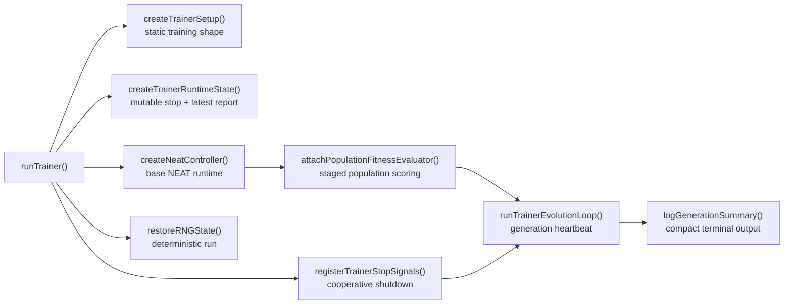
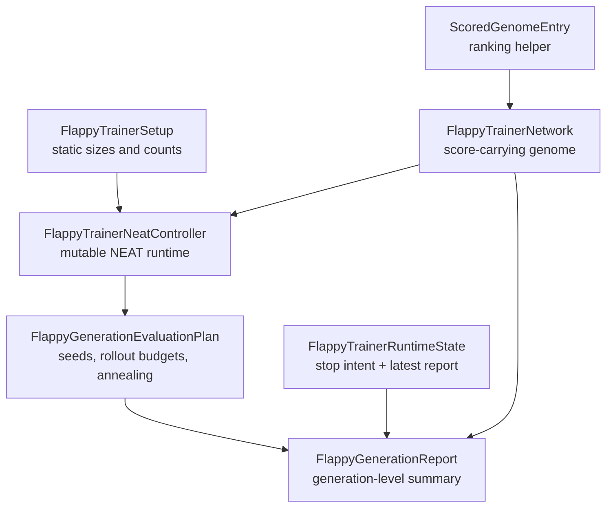
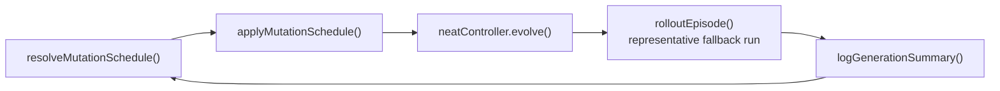
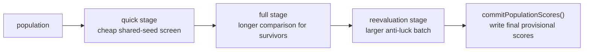
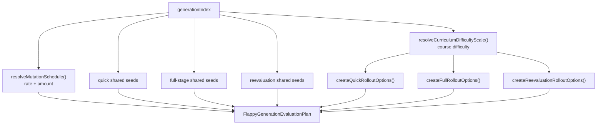

# trainer

Node-facing entry shelf for the Flappy Bird trainer.

This file is the chapter opening for the trainer as a whole. If you want the
fastest mental model for how the Flappy Bird training stack behaves, start
here before reading the narrower type, planning, fitness, or reporting
helpers.

The trainer exists to turn a generic NEAT controller into a fair,
repeatable, Flappy-specific training program. That means the entry boundary
has to do more than just call `evolve()`: it restores deterministic random
state, installs staged population scoring, keeps shutdown cooperative, and
hands each generation to a compact reporting pipeline that makes progress
easy to inspect from the terminal.

This file does not own the scoring math, report formatting, or rollout
mechanics directly. Its job is orchestration. Keeping that policy wiring in
one place makes the trainer easier to reason about because the reader can see
which responsibilities are static setup, which belong to the runtime loop,
and which are delegated to specialized helpers.

A practical reading order is:

1. read this file to understand the runtime spine,
2. continue with [trainer.types.ts](./trainer.types.ts) to learn the shared
   nouns,
3. move to [trainer.evaluation-plan.utils.ts](./trainer.evaluation-plan.utils.ts)
   for the staged curriculum and mutation schedule,
4. finish with [trainer.fitness.service.ts](./trainer.fitness.service.ts) and
   [trainer.loop.service.ts](./trainer.loop.service.ts) to see how each
   generation is actually evaluated and advanced.

Read the rest of the trainer folder as supporting shelves beneath this
entrypoint: types define the vocabulary, evaluation planning defines the
budget and curriculum, fitness helpers define how populations are scored, and
the loop turns all of that into a long-running evolutionary session.

Trainer startup map:


## trainer/trainer.types.ts

Public type map for the Flappy Bird trainer boundary.

The trainer coordinates several moving pieces at once: a generic NEAT
controller, staged rollout plans, compact longitudinal reporting, and a very
small amount of mutable runtime state. Keeping those contracts together makes
the trainer easier to read because the important nouns live in one place.

A useful reading order is:

1. `FlappyTrainerSetup` for static configuration.
2. `FlappyTrainerNeatController` for the runtime API shape.
3. `FlappyGenerationEvaluationPlan` for staged evaluation policy.
4. `FlappyGenerationReport` for what the loop emits back out.

Type relationship map:


### FlappyGenerationEvaluationPlan

Generation-level rollout plans for staged evaluation.

Each generation resolves one plan that answers three questions: how strong is
the current mutation schedule, which shared seeds belong to each stage, and
what rollout budget each stage is allowed to spend. This is the contract that
makes quick screening, full passes, and reevaluation feel like one coherent
policy instead of three unrelated helper calls.

### FlappyGenerationReport

Compact generation report used for training logs.

The report is shaped for longitudinal monitoring rather than raw storage. It
collects the distribution and best-run details needed to judge whether a
generation improved robustly instead of producing one lucky outlier.

### FlappyTrainerNeatController

Local typed view for population-level fitness mode used by this trainer.

This is intentionally narrower than the full `Neat` runtime API. The trainer
documents only the methods and mutable options it actually depends on, which
makes the orchestration code read more like policy and less like framework
plumbing.

### FlappyTrainerNetwork

Network shape expected by the Flappy trainer.

The trainer only needs the evaluation-facing subset of a full network plus an
optional score field used by staged ranking helpers. That narrow shape keeps
the trainer decoupled from most of the broader network implementation.

### FlappyTrainerRuntimeState

Trainer runtime state shared by orchestration helpers.

Only mutable cross-step values live here: stop intent and the most recent
generation report. That tiny scope is deliberate because it keeps the rest of
the trainer easy to reason about during long-running sessions.

### FlappyTrainerSetup

Immutable trainer setup values.

These values define the static training shape before runtime state and staged
evaluation are attached. Once created, the rest of the trainer can treat this
as a stable configuration shelf rather than scattered ad hoc constants.

### ScoredGenomeEntry

Score carrier used for deterministic ordering helpers.

Wrapping a genome together with its score makes ranking utilities easier to
write and keeps score extraction explicit at sort time instead of letting it
leak across multiple helpers.

## trainer/trainer.ts

### handleTrainerMainError

```ts
handleTrainerMainError(
  error: unknown,
): void
```

Handles fatal `main` rejection path.

The trainer keeps this boundary small so unexpected failures are formatted in
one consistent place before reaching the CLI. That keeps shutdown behavior
and terminal messaging consistent whether the failure came from setup,
evaluation, or the loop itself.

Parameters:
- `error` - - Unknown rejection reason from trainer execution.

Returns: Nothing.

### isDirectTrainerExecution

```ts
isDirectTrainerExecution(): boolean
```

Resolves whether this module is the direct Node entrypoint.

This lets the file behave as both a reusable module and a runnable script
without duplicating the startup boundary in a second wrapper file.

Returns: `true` when Node launched this file directly.

### runTrainer

```ts
runTrainer(): Promise<void>
```

Flappy Bird neuroevolution demo.

This script runs a small NEAT population where each genome controls a bird.
The network sees a temporal observation (38 floats) and outputs two competing
action scores (`no flap` vs `flap`).

The function is intentionally orchestration-first. It answers one practical
question: what has to be connected so a generic NEAT controller turns into a
fair, repeatable, Flappy-specific trainer?

Educational note:
The trainer is intentionally orchestration-first. It wires together setup,
staged population evaluation, the outer evolution loop, graceful shutdown,
and compact generation logging without burying those responsibilities inside a
single monolithic file.

The mutation schedule gradually cools over early generations. If you want a
conceptual parallel, the Wikipedia article on
[simulated annealing](https://en.wikipedia.org/wiki/Simulated_annealing) is
a useful mental model for why early exploration is broader and later updates
are more conservative.

Run (from repo root):
`npx ts-node test/examples/flappy_bird/trainFlappyBird.ts`

Example:

```ts
await runTrainer();
```

## trainer/trainer.errors.ts

Small CLI-facing error-rendering boundary for the trainer.

Keeping fatal-error formatting in one file prevents setup, evaluation, and
shutdown paths from inventing slightly different terminal messages. That is a
small detail, but it makes long-running scripts and quick debugging sessions
easier to scan.

### FLAPPY_TRAINER_UNEXPECTED_ERROR_PREFIX

Prefix used when rendering unexpected trainer failures to stderr.

### formatTrainerErrorMessage

```ts
formatTrainerErrorMessage(
  error: unknown,
): string
```

Formats unknown trainer failures into a stable human-readable message.

Errors can arrive here as real `Error` objects or as arbitrary rejected
values. Normalizing both cases into one predictable string keeps the CLI
surface boring in the good way.

Parameters:
- `error` - - Unknown rejection reason from trainer execution.

Returns: Formatted error string for CLI logging.

## trainer/trainer.constants.ts

Named knobs for trainer cadence, fairness, fallback behavior, and terminal
reporting.

This file exists so the trainer reads like policy instead of a wall of magic
numbers. When you want to tune how quickly evolution cools down, how much of
the population survives into deeper stages, or how progress is summarized in
logs, this is the first place to inspect.

Use the grouped reference below alongside the alphabetical symbol list that
follows in the generated README.

Available trainer constant groups:

| Group | What it controls | Representative constants |
| --- | --- | --- |
| Population shape | Demo-scale NEAT size and elitism | `FLAPPY_TRAINER_DEFAULT_POPULATION_SIZE`, `FLAPPY_TRAINER_DEFAULT_ELITISM_COUNT` |
| Mutation cooling | How aggressive structural search stays over time | `FLAPPY_TRAINER_MUTATION_RATE_START`, `FLAPPY_TRAINER_MUTATION_RATE_END` |
| Stage budgets | How much rollout work each evaluation phase spends | `FLAPPY_TRAINER_QUICK_ROLLOUT_MAX_FRAMES`, `FLAPPY_TRAINER_FULL_ROLLOUT_PIPE_PROGRESS_TARGET` |
| Ranking heuristics | How provisional and robust scores are composed | `FLAPPY_TRAINER_FRAME_PRIMARY_BASE_SCORE`, `FLAPPY_TRAINER_PIPE_FALLBACK_PIPE_WEIGHT` |
| Reporting and fallback | Log formatting and defensive dummy-network paths | `FLAPPY_TRAINER_LOG_PARTS_DELIMITER`, `FLAPPY_TRAINER_DUMMY_NETWORK_ID` |

Population and reproducibility:

| Constant | Why it matters |
| --- | --- |
| `FLAPPY_TRAINER_DEFAULT_POPULATION_SIZE` | Sets the demo-scale population size for each evolutionary round. |
| `FLAPPY_TRAINER_DEFAULT_ELITISM_COUNT` | Preserves a stable top slice of genomes between generations. |
| `FLAPPY_TRAINER_DEFAULT_RNG_SEED` | Makes local runs reproducible across tuning sessions. |

Mutation cooling:

| Constant | Why it matters |
| --- | --- |
| `FLAPPY_TRAINER_MUTATION_ANNEAL_GENERATIONS` | Defines how long the trainer keeps cooling mutation pressure. |
| `FLAPPY_TRAINER_MUTATION_RATE_START` | Starting probability of mutation while search is still broad. |
| `FLAPPY_TRAINER_MUTATION_RATE_END` | Late-stage mutation probability after the trainer settles down. |
| `FLAPPY_TRAINER_MUTATION_AMOUNT_START` | Starting mutation count budget for exploratory generations. |
| `FLAPPY_TRAINER_MUTATION_AMOUNT_END` | Smaller late-stage mutation count for refinement. |
| `FLAPPY_TRAINER_NEAT_INITIAL_MUTATION_RATE` | Bootstrap controller mutation rate before schedule updates take over. |
| `FLAPPY_TRAINER_NEAT_INITIAL_MUTATION_AMOUNT` | Bootstrap controller mutation amount before schedule updates take over. |

Stage budgets and selection depth:

| Constant | Why it matters |
| --- | --- |
| `FLAPPY_TRAINER_QUICK_ROLLOUT_MAX_FRAMES` | Caps the cheap first-pass screen. |
| `FLAPPY_TRAINER_QUICK_ROLLOUT_EARLY_TERMINATION_GRACE_FRAMES` | Delays quick-stage early termination until a short grace window passes. |
| `FLAPPY_TRAINER_QUICK_ROLLOUT_EARLY_TERMINATION_CONSECUTIVE_FRAMES` | Requires a streak of bad frames before a quick-stage rollout is cut short. |
| `FLAPPY_TRAINER_QUICK_ROLLOUT_PIPE_PROGRESS_TARGET` | Normalizes quick-stage progress against a modest target. |
| `FLAPPY_TRAINER_FULL_ROLLOUT_EARLY_TERMINATION_GRACE_FRAMES` | Gives stronger candidates more recovery time in the deeper stage. |
| `FLAPPY_TRAINER_FULL_ROLLOUT_EARLY_TERMINATION_CONSECUTIVE_FRAMES` | Uses a stricter streak threshold before full-stage early termination. |
| `FLAPPY_TRAINER_FULL_ROLLOUT_PIPE_PROGRESS_TARGET` | Normalizes deeper-stage progress against a tougher target. |
| `FLAPPY_TRAINER_FULL_PASS_ELITISM_MULTIPLIER` | Sizes the full-pass candidate pool relative to elitism. |
| `FLAPPY_TRAINER_FULL_PASS_POPULATION_FRACTION` | Sizes the full-pass candidate pool relative to total population. |
| `FLAPPY_TRAINER_REEVALUATION_MIN_CANDIDATE_COUNT` | Guarantees that anti-luck reevaluation still compares a useful set of genomes. |

Ranking, robustness, and fallback behavior:

| Constant | Why it matters |
| --- | --- |
| `FLAPPY_TRAINER_FRAME_STABILITY_STDDEV_WEIGHT` | Penalizes unstable shared-seed performance. |
| `FLAPPY_TRAINER_PIPE_FILTER_TOLERANCE` | Gates frame-primary scoring to genomes close enough in pipe progress. |
| `FLAPPY_TRAINER_FRAME_PRIMARY_BASE_SCORE` | Creates a large score offset once a genome passes the gate. |
| `FLAPPY_TRAINER_FRAME_PRIMARY_SURVIVAL_WEIGHT` | Rewards longer stable survival inside the gated branch. |
| `FLAPPY_TRAINER_FRAME_PRIMARY_PIPE_WEIGHT` | Keeps pipe progress visible inside the gated branch. |
| `FLAPPY_TRAINER_PIPE_FALLBACK_PIPE_WEIGHT` | Emphasizes pipe progress when the primary gate is not met. |
| `FLAPPY_TRAINER_DUMMY_NETWORK_ID` | Provides a stable fallback network identifier for defensive reporting paths. |
| `FLAPPY_TRAINER_DUMMY_NO_FLAP_OUTPUT` | Encodes the dummy network's preferred passive action score. |
| `FLAPPY_TRAINER_DUMMY_FLAP_OUTPUT` | Encodes the dummy network's lower flap score for deterministic fallback behavior. |

Reporting and terminal output:

| Constant | Why it matters |
| --- | --- |
| `FLAPPY_TRAINER_SCORE_MEDIAN_PERCENTILE` | Names the percentile used for the reported median. |
| `FLAPPY_TRAINER_SCORE_P90_PERCENTILE` | Names the percentile used for the reported upper-tail score. |
| `FLAPPY_TRAINER_LOG_PARTS_DELIMITER` | Keeps compact generation logs consistently tokenized. |
| `FLAPPY_TRAINER_STOPPED_MESSAGE` | Gives graceful shutdown a stable terminal message. |

### FLAPPY_TRAINER_DEFAULT_ELITISM_COUNT

Number of elite genomes preserved unchanged each generation.

Preserving a small elite keeps the trainer from discarding clearly strong
genomes while the rest of the population continues exploring.

### FLAPPY_TRAINER_DEFAULT_POPULATION_SIZE

Default population size used by the Flappy trainer NEAT run.

The demo keeps this large enough for staged selection to matter while still
remaining practical for local experimentation.

### FLAPPY_TRAINER_DEFAULT_RNG_SEED

Deterministic trainer RNG seed used for reproducible training runs.

Reusing the shared Flappy example seed makes trainer behavior easier to
compare across doc examples, tests, and manual tuning sessions.

### FLAPPY_TRAINER_DUMMY_FLAP_OUTPUT

Dummy output channel value for the "flap" action score.

Keeping the flap score lower than the no-flap score produces a predictable
never-flap dummy network for defensive report code paths.

### FLAPPY_TRAINER_DUMMY_NETWORK_ID

ID used by dummy fallback network for defensive reporting paths.

The report helpers occasionally need a safe stand-in network so logging can
stay total even when no real population data is available.

### FLAPPY_TRAINER_DUMMY_NO_FLAP_OUTPUT

Dummy output channel value for the "no flap" action score.

The dummy network intentionally prefers the passive action so fallback report
generation remains deterministic and simple.

### FLAPPY_TRAINER_FRAME_PRIMARY_BASE_SCORE

Base offset awarded to genomes that satisfy the mean-pipe progress filter.

The large offset makes it obvious that surviving the gate is more important
than tiny differences in the secondary frame-oriented terms.

### FLAPPY_TRAINER_FRAME_PRIMARY_PIPE_WEIGHT

Pipe-progress contribution weight for frame-primary scoring.

This keeps pipe progress visible even inside the gated scoring branch so the
ranking still prefers genuinely advancing policies.

### FLAPPY_TRAINER_FRAME_PRIMARY_SURVIVAL_WEIGHT

Survival contribution weight for frame-primary scoring.

Once a genome passes the pipe-progress gate, extra survival time still matters
because it often signals more stable control.

### FLAPPY_TRAINER_FRAME_STABILITY_STDDEV_WEIGHT

Penalty multiplier applied to fitness standard deviation in frame-primary scoring.

Higher instability lowers the provisional score so a lucky but erratic genome
is less likely to outrank a steadier competitor.

### FLAPPY_TRAINER_FULL_PASS_ELITISM_MULTIPLIER

Multiplier over elitism used to size full-pass candidate pool.

This ties the full-pass budget to a familiar population concept so the deeper
stage scales alongside the preserved elite.

### FLAPPY_TRAINER_FULL_PASS_POPULATION_FRACTION

Population fraction used to size full-pass candidate pool.

The full stage uses the larger of this fraction and the elitism-based floor so
promising mid-pack genomes are not excluded too aggressively.

### FLAPPY_TRAINER_FULL_ROLLOUT_EARLY_TERMINATION_CONSECUTIVE_FRAMES

Consecutive unrecoverable frames needed to stop full rollout early.

This longer streak makes the full stage less trigger-happy than the quick
screen while still avoiding wasted rollout budget.

### FLAPPY_TRAINER_FULL_ROLLOUT_EARLY_TERMINATION_GRACE_FRAMES

Early-termination grace frames used during full rollout stage.

The deeper stage allows more time before judging a trajectory unrecoverable
because the trainer is now evaluating stronger candidates more carefully.

### FLAPPY_TRAINER_FULL_ROLLOUT_PIPE_PROGRESS_TARGET

Pipe-progress target used to normalize full and reevaluation rollout fitness.

The deeper stages share a tougher target because they are used for robust
ranking rather than first-pass elimination.

### FLAPPY_TRAINER_LOG_PARTS_DELIMITER

Delimiter used when composing compact generation log lines.

A single-space delimiter keeps the log dense, stable, and easy to parse by eye
during long-running terminal sessions.

### FLAPPY_TRAINER_MUTATION_AMOUNT_END

Final mutation amount reached after annealing window completes.

Cooling the mutation amount along with the rate reduces late-generation noise
without fully freezing structural search.

### FLAPPY_TRAINER_MUTATION_AMOUNT_START

Initial mutation amount at generation `0` before annealing.

This controls how many mutation operations can be applied while the trainer
is still in its exploratory phase.

### FLAPPY_TRAINER_MUTATION_ANNEAL_GENERATIONS

Generation count used to fully anneal mutation schedule from start to end values.

Within this window the trainer gradually cools from more exploratory updates
toward smaller, steadier changes.

### FLAPPY_TRAINER_MUTATION_RATE_END

Final mutation rate reached after annealing window completes.

Lower late-stage mutation pressure helps good policies stabilize instead of
being reshuffled as aggressively as the opening generations.

### FLAPPY_TRAINER_MUTATION_RATE_START

Initial mutation rate at generation `0` before annealing.

The starting rate is intentionally aggressive so the early population can
discover useful topologies quickly.

### FLAPPY_TRAINER_NEAT_INITIAL_MUTATION_AMOUNT

Initial NEAT mutation amount before generation schedule annealing is applied.

Matching the controller bootstrap to the trainer policy avoids a confusing
mismatch between generation `0` and later loop behavior.

### FLAPPY_TRAINER_NEAT_INITIAL_MUTATION_RATE

Initial NEAT mutation rate before generation schedule annealing is applied.

This seeds the controller with a sensible baseline before the per-generation
planner starts taking over.

### FLAPPY_TRAINER_PIPE_FALLBACK_PIPE_WEIGHT

Pipe-progress contribution weight for fallback scoring path.

The fallback path leans heavily on pipe progress because it is the clearest
robust signal available before the primary gate is satisfied.

### FLAPPY_TRAINER_PIPE_FILTER_TOLERANCE

Allowed mean-pipes delta from the current best before frame-primary scoring applies.

This acts like a gating tolerance: only genomes close enough in pipe progress
get the more generous frame-primary score treatment.

### FLAPPY_TRAINER_QUICK_ROLLOUT_EARLY_TERMINATION_CONSECUTIVE_FRAMES

Consecutive unrecoverable frames needed to stop quick screening rollout early.

Requiring a streak prevents one noisy frame from ending the screen too early
while still saving time on clearly doomed trajectories.

### FLAPPY_TRAINER_QUICK_ROLLOUT_EARLY_TERMINATION_GRACE_FRAMES

Early-termination grace frames used during quick screening rollout stage.

This short grace period gives a policy a brief chance to stabilize before the
unrecoverable-flight heuristic is allowed to stop the rollout.

### FLAPPY_TRAINER_QUICK_ROLLOUT_MAX_FRAMES

Frame cap used during quick screening rollout stage.

The quick stage is supposed to eliminate obviously weak genomes cheaply, so
its horizon is intentionally shorter than the full evaluation horizon.

### FLAPPY_TRAINER_QUICK_ROLLOUT_PIPE_PROGRESS_TARGET

Pipe-progress target used to normalize quick screening rollout fitness.

The lower quick-stage target reflects the fact that this pass is a screen, not
the trainer's final statement of policy quality.

### FLAPPY_TRAINER_REEVALUATION_MIN_CANDIDATE_COUNT

Minimum candidate count for reevaluation stage, regardless of elitism.

This prevents small elite settings from starving the anti-luck pass of enough
genomes to produce a meaningful final comparison.

### FLAPPY_TRAINER_SCORE_MEDIAN_PERCENTILE

Percentile used when reporting median population score.

Keeping the percentile explicit makes the report math self-documenting even
for readers who skim the log formatter before the statistics helpers.

### FLAPPY_TRAINER_SCORE_P90_PERCENTILE

Percentile used when reporting high-end population score (P90).

The trainer uses `p90` as a quick "is the upper tail getting healthier?"
signal without over-focusing on only the single best genome.

### FLAPPY_TRAINER_STOPPED_MESSAGE

Log message emitted when trainer loop exits cleanly.

A dedicated constant keeps the shutdown path stable for humans and for any
scripts that watch trainer output.

## trainer/trainer.loop.service.ts

Outer generation heartbeat for the Flappy trainer.

This file owns the cadence of one generation after another. It deliberately
avoids score math and rollout-planning detail so the top-level loop stays
readable as: resolve schedule, evolve once, run a representative rollout, and
emit a summary.

Loop sketch:


### applyMutationSchedule

```ts
applyMutationSchedule(
  neatController: FlappyTrainerNeatController,
  mutationSchedule: FlappyMutationSchedule,
): void
```

Applies mutation schedule values to the NEAT controller options.

The schedule is resolved outside this helper so the loop can read as a clean
"resolve -> apply -> evolve -> report" flow. That separation also makes it
easier to inspect the active schedule in logs or tests.

Parameters:
- `neatController` - - Trainer NEAT controller.
- `mutationSchedule` - - Mutation schedule for current generation.

Returns: Nothing.

### LogGenerationSummaryCallback

```ts
LogGenerationSummaryCallback(
  generationLabel: number,
  mutationSchedule: FlappyMutationSchedule,
  report: FlappyGenerationReport | undefined,
  fittestGenome: FlappyTrainerNetwork,
  fallbackEpisode: FlappyEpisodeResult,
): void
```

Callback signature for one-line generation logging.

The loop owns evolution cadence, while the callback owns presentation.
Keeping those concerns separate makes it easy to reuse the loop with richer
reporting later.

### runTrainerEvolutionLoop

```ts
runTrainerEvolutionLoop(
  neatController: FlappyTrainerNeatController,
  trainerRuntimeState: FlappyTrainerRuntimeState,
  logGenerationSummary: LogGenerationSummaryCallback,
): Promise<void>
```

Runs the outer evolution loop until runtime stop is requested.

Educational note:
This is the trainer's main heartbeat: resolve the current mutation schedule,
evolve one generation, run a representative fallback rollout for logging, and
emit a compact summary.

Parameters:
- `neatController` - - Trainer NEAT controller.
- `trainerRuntimeState` - - Mutable trainer runtime state.
- `logGenerationSummary` - - Callback that emits compact generation logs.

Returns: Promise resolved when the trainer has been stopped.

## trainer/trainer.setup.service.ts

Bootstrap helpers for the trainer's static shape and initial NEAT runtime.

The trainer keeps setup separate from the main entry file so configuration and
controller construction can be read, tested, and tuned without also reading
the outer loop. This boundary answers a simple question: what does the demo
need before the first generation can run?

### createNeatController

```ts
createNeatController(
  trainerSetup: FlappyTrainerSetup,
): FlappyTrainerNeatController
```

Builds the NEAT controller with baseline options.

Educational note:
The trainer enables population-level fitness mode because the quality of a
Flappy policy depends on fair comparison across shared seed batches, not on a
one-network-at-a-time scoring callback.

Parameters:
- `trainerSetup` - - Immutable trainer setup values.

Returns: Typed NEAT controller used by the trainer loop.

Example:

```ts
const trainerSetup = createTrainerSetup();
const neatController = createNeatController(trainerSetup);
```

### createTrainerRuntimeState

```ts
createTrainerRuntimeState(): FlappyTrainerRuntimeState
```

Creates mutable runtime state container.

The runtime state is intentionally tiny. It only tracks stop intent and the
latest report so the outer loop can remain easy to reason about.

Returns: Fresh runtime state used by loop orchestration.

### createTrainerSetup

```ts
createTrainerSetup(): FlappyTrainerSetup
```

Creates immutable setup values for the trainer.

Educational note:
The setup object freezes the core training shape up front: input width,
output width, population size, and elitism count. Centralizing those values
makes the rest of the trainer read as policy rather than configuration noise.

Returns: Default trainer setup values used for NEAT configuration.

### resolveNoopFitness

```ts
resolveNoopFitness(): number
```

Trivial baseline fitness used before attaching population evaluator.

This placeholder keeps controller construction simple. The real staged
evaluator is attached immediately afterward by the fitness service, so this
function exists only to satisfy the generic controller's constructor contract.

Returns: Constant zero fitness.

## trainer/trainer.report.service.ts

Generation-reporting facade for the Flappy trainer.

The trainer deliberately logs more than one champion score. This file turns a
finished generation into a compact distribution summary so humans can tell the
difference between broad improvement and a single lucky genome.

### buildGenerationReport

```ts
buildGenerationReport(
  population: readonly FlappyTrainerNetwork[],
  aggregateByGenome: ReadonlyMap<FlappyTrainerNetwork, FlappySeedBatchEvaluation>,
  generationEvaluationPlan: FlappyGenerationEvaluationPlan,
): FlappyGenerationReport
```

Builds a compact report for the current generation.

Educational note:
The trainer logs more than a single best score because single-number progress
can hide instability. Mean, median, $p90$, and standard deviation reveal
whether a generation is broadly improving or whether one lucky genome is
masking a weak population.

Parameters:
- `population` - - Current population.
- `aggregateByGenome` - - Aggregate evaluation results keyed by genome.
- `generationEvaluationPlan` - - Per-generation staged evaluation plan.

Returns: Aggregated generation report.

### logGenerationSummary

```ts
logGenerationSummary(
  generationLabel: number,
  mutationSchedule: FlappyMutationSchedule,
  report: FlappyGenerationReport | undefined,
  fittestGenome: FlappyTrainerNetwork,
  fallbackEpisode: FlappyEpisodeResult,
): void
```

Emits one compact generation log line.

The emitted line is designed for long-running terminal sessions: dense enough
to be useful, but stable enough that humans can visually scan progress over
hundreds of generations. The goal is not pretty output. The goal is a line
that lets you spot drift, plateaus, and sudden regressions at a glance.

Parameters:
- `generationLabel` - - Current generation label.
- `mutationSchedule` - - Active mutation schedule.
- `report` - - Optional aggregated generation report.
- `fittestGenome` - - Fittest genome returned by the NEAT controller.
- `fallbackEpisode` - - Fallback representative rollout episode.

Returns: Nothing.

## trainer/trainer.fitness.service.ts

Adapter layer that teaches a generic NEAT controller how to score an entire
Flappy population fairly.

A plain controller only knows that it needs a fitness callback. This service
turns that loose contract into the trainer's staged policy: screen everybody
cheaply, spend more budget on the survivors, then reevaluate the finalists so
ranking is less sensitive to luck.

Fitness orchestration map:

```mermaid
flowchart LR
    Population["population"] --> Plan["resolveGenerationEvaluationPlan()"]
    Plan --> Quick["evaluatePopulationQuickStage()"]
    Quick --> Full["evaluatePopulationFullStage()"]
    Full --> Reeval["evaluatePopulationReevaluationStage()"]
    Reeval --> Commit["commitPopulationScores()"]
    Commit --> Report["buildGenerationReport()"]
```


### attachPopulationFitnessEvaluator

```ts
attachPopulationFitnessEvaluator(
  neatController: FlappyTrainerNeatController,
  trainerRuntimeState: FlappyTrainerRuntimeState,
  elitismCount: number,
  dependencies: TrainerFitnessServiceDependencies,
): void
```

Attaches population-level staged evaluator to the NEAT controller.

This is the moment where the generic NEAT controller becomes a
Flappy-specific trainer: a plain controller receives the staged population
evaluator that understands shared-seed screening, full-pass scoring, and
reevaluation.

Parameters:
- `neatController` - - Trainer NEAT controller.
- `trainerRuntimeState` - - Mutable trainer runtime state.
- `elitismCount` - - Number of elite genomes preserved each generation.
- `dependencies` - - Pure/impure helper callbacks used by the evaluator.

Returns: Nothing.

### createPopulationFitnessEvaluator

```ts
createPopulationFitnessEvaluator(
  neatController: FlappyTrainerNeatController,
  trainerRuntimeState: FlappyTrainerRuntimeState,
  elitismCount: number,
  dependencies: TrainerFitnessServiceDependencies,
): (population: FlappyTrainerNetwork[]) => Promise<void>
```

Creates the asynchronous population fitness evaluator.

Educational note:
The trainer uses staged evaluation to reduce luck. Genomes are first screened
quickly, then the most promising ones receive more expensive evaluation, and
the best candidates are reevaluated again for robustness.

That strategy is closer to tournament design than to naive one-shot scoring:
the same generation budget is spent unevenly so weak genomes are filtered out
early and strong genomes are compared more carefully.

Parameters:
- `neatController` - - Trainer NEAT controller.
- `trainerRuntimeState` - - Mutable trainer runtime state.
- `elitismCount` - - Number of elite genomes preserved each generation.
- `dependencies` - - Pure/impure helper callbacks used by the evaluator.

Returns: Evaluator callback assigned to `neatController.fitness`.

### TrainerFitnessServiceDependencies

Callback dependencies required by the trainer fitness orchestration service.

Educational note:
The trainer evaluates whole populations in staged passes. This dependency bag
keeps the top-level service declarative and makes each stage independently
replaceable without rewriting the orchestration logic.

## trainer/trainer.signals.service.ts

Process-signal bridge for cooperative trainer shutdown.

The trainer should stop between generations, not by tearing the process down
in the middle of evaluation. This file converts OS-level stop signals into one
shared runtime intent flag that the main loop can observe safely.

### handleTrainerStopSignal

```ts
handleTrainerStopSignal(
  trainerRuntimeState: FlappyTrainerRuntimeState,
): void
```

Handles one stop signal update.

The handler does the minimum possible work because signal paths should stay
predictable and side-effect light.

Parameters:
- `trainerRuntimeState` - - Mutable trainer runtime state.

Returns: Nothing.

### registerTrainerStopSignals

```ts
registerTrainerStopSignals(
  trainerRuntimeState: FlappyTrainerRuntimeState,
): void
```

Registers graceful stop signal handlers.

Educational note:
Long-running evolutionary runs should stop cleanly when the user presses
`Ctrl+C`. This service flips runtime intent instead of abruptly tearing down
the process mid-generation.

Parameters:
- `trainerRuntimeState` - - Mutable trainer runtime state.

Returns: Nothing.

## trainer/trainer.evaluation.service.ts

Trainer evaluation compatibility facade.

The staged population-evaluation implementation now lives in the dedicated
`trainer/evaluation/` submodule so orchestration, scoring helpers, internal
contracts, and sub-services can evolve behind a focused boundary.

Use this file when you want the public trainer-level shelf for staged
evaluation without learning the internal subfolder layout first.

Staged evaluation ladder:


### commitPopulationScores

```ts
commitPopulationScores(
  population: readonly FlappyTrainerNetwork[],
  provisionalScoresByGenome: ReadonlyMap<FlappyTrainerNetwork, number>,
): void
```

Commits provisional scores to genome score fields.

Provisional scores are kept in a map during staging so each phase can refresh
them without mutating the genomes too early. This helper performs the final
write-back once staged evaluation is complete.

Parameters:
- `population` - - Current population.
- `provisionalScoresByGenome` - - Final provisional score map.

Returns: Nothing.

### evaluatePopulationFullStage

```ts
evaluatePopulationFullStage(
  population: readonly FlappyTrainerNetwork[],
  generationEvaluationPlan: FlappyGenerationEvaluationPlan,
  aggregateByGenome: Map<FlappyTrainerNetwork, FlappySeedBatchEvaluation>,
  provisionalScoresByGenome: Map<FlappyTrainerNetwork, number>,
  elitismCount: number,
): void
```

Executes the full evaluation stage over the top provisional candidates.

This is the middle-cost stage in the ranking ladder: not every genome
survives into it, but the survivors receive a more trustworthy estimate than
the quick screen alone can provide.

Parameters:
- `population` - - Current population.
- `generationEvaluationPlan` - - Per-generation staged evaluation plan.
- `aggregateByGenome` - - Mutable aggregate cache keyed by genome.
- `provisionalScoresByGenome` - - Mutable provisional score map.
- `elitismCount` - - Configured elitism count.

Returns: Nothing.

### evaluatePopulationQuickStage

```ts
evaluatePopulationQuickStage(
  population: readonly FlappyTrainerNetwork[],
  generationEvaluationPlan: FlappyGenerationEvaluationPlan,
  aggregateByGenome: Map<FlappyTrainerNetwork, FlappySeedBatchEvaluation>,
  provisionalScoresByGenome: Map<FlappyTrainerNetwork, number>,
): void
```

Executes the quick evaluation stage over the full population.

Educational note:
The quick stage is a cheap screening pass. Every genome is tested on the same
small shared seed batch so the trainer can discard obviously weak candidates
before spending more rollout budget on them.

Parameters:
- `population` - - Current population.
- `generationEvaluationPlan` - - Per-generation staged evaluation plan.
- `aggregateByGenome` - - Mutable aggregate cache keyed by genome.
- `provisionalScoresByGenome` - - Mutable provisional score map.

Returns: Nothing.

Example:

```ts
evaluatePopulationQuickStage(
  population,
  generationEvaluationPlan,
  aggregateByGenome,
  provisionalScoresByGenome,
);
```

### evaluatePopulationReevaluationStage

```ts
evaluatePopulationReevaluationStage(
  population: readonly FlappyTrainerNetwork[],
  generationEvaluationPlan: FlappyGenerationEvaluationPlan,
  aggregateByGenome: Map<FlappyTrainerNetwork, FlappySeedBatchEvaluation>,
  provisionalScoresByGenome: Map<FlappyTrainerNetwork, number>,
  elitismCount: number,
): void
```

Executes the large-seed reevaluation stage over top candidates.

Educational note:
Reevaluation is the trainer's anti-luck pass. The best provisional genomes
are tested again on a larger shared seed batch so leaderboard positions are
less sensitive to a fortunate early sample.

Parameters:
- `population` - - Current population.
- `generationEvaluationPlan` - - Per-generation staged evaluation plan.
- `aggregateByGenome` - - Mutable aggregate cache keyed by genome.
- `provisionalScoresByGenome` - - Mutable provisional score map.
- `elitismCount` - - Configured elitism count.

Returns: Nothing.

## trainer/trainer.report.service.services.ts

Small report-side helpers that keep the report facade orchestration-first.

These helpers do the awkward work that a summary builder should not have to
read inline: filtering non-finite scores, reusing cached aggregates when they
exist, and falling back to a deterministic dummy network when a report still
needs to be total in edge cases.

### collectFiniteGenomeScores

```ts
collectFiniteGenomeScores(
  population: readonly FlappyTrainerNetwork[],
): number[]
```

Collects only finite scores from the current population.

Unevaluated or invalid scores are intentionally skipped so percentile and
standard deviation calculations operate on stable numeric inputs only.

Parameters:
- `population` - - Current population.

Returns: Finite scores in population order.

Example:

```ts
const scores = collectFiniteGenomeScores(population);
```

### resolveBestGenerationDetails

```ts
resolveBestGenerationDetails(
  population: readonly FlappyTrainerNetwork[],
  bestGenome: FlappyTrainerNetwork | undefined,
  aggregateByGenome: ReadonlyMap<FlappyTrainerNetwork, FlappySeedBatchEvaluation>,
  fallbackSeeds: readonly number[],
  fallbackRolloutOptions: FlappyRolloutOptions,
): ResolvedBestGenerationDetails
```

Resolves cached or fallback best-of-generation details for reporting.

The report layer needs both aggregate seed statistics and one representative
episode. This helper centralizes the fallback rules so the service facade can
remain a thin orchestration layer.

Parameters:
- `population` - - Current population.
- `bestGenome` - - Genome selected as generation best.
- `aggregateByGenome` - - Cached aggregate evaluations keyed by genome.
- `fallbackSeeds` - - Seeds used when the aggregate must be recomputed.
- `fallbackRolloutOptions` - - Rollout options for fallback evaluation.

Returns: Aggregate metrics and a representative best-genome episode.

Example:

```ts
const { bestAggregate, bestEpisode } = resolveBestGenerationDetails(
  population,
  bestGenome,
  aggregateByGenome,
  reevaluationSeeds,
  reevaluationRolloutOptions,
);
```

### ResolvedBestGenerationDetails

Aggregate and representative rollout resolved for the best genome.

Keeping these values together lets the report facade stay focused on
orchestration while this helper module owns cache fallback behavior and the
"best summary plus one representative episode" pairing.

## trainer/trainer.reporting.utils.ts

Formatting helpers for compact generation-log output.

The trainer's console line is intentionally tokenized rather than narrated.
This file keeps that token order stable so humans can build scanning habits
across long runs and tools can parse the same line shape later if needed.

### buildGenerationLogParts

```ts
buildGenerationLogParts(
  generationLabel: number,
  bestFitness: number,
  bestPipesPassed: number,
  bestFramesSurvived: number,
  report: FlappyGenerationReport | undefined,
  mutationSchedule: FlappyMutationSchedule,
): string[]
```

Builds one-line generation log tokens.

The chosen order moves from identity (`gen`) to quality (`best`, `mean`,
`median`, `p90`, `std`) and then into operational context (`difficulty`,
mutation, seed counts).

Parameters:
- `generationLabel` - - Generation label shown in logs.
- `bestFitness` - - Best resolved fitness value for this generation.
- `bestPipesPassed` - - Best resolved pipes passed value.
- `bestFramesSurvived` - - Best resolved frames survived value.
- `report` - - Optional aggregated generation report.
- `mutationSchedule` - - Active mutation schedule for this generation.

Returns: Ordered log tokens for compact console output.

## trainer/trainer.selection.utils.ts

Deterministic ranking helpers for trainer populations.

These utilities keep score extraction and descending-order selection in one
place so the staged evaluation services do not each reinvent the same sorting
logic with slightly different fallback rules.

### resolveBestGenomeByScore

```ts
resolveBestGenomeByScore(
  population: readonly FlappyTrainerNetwork[],
): FlappyTrainerNetwork | undefined
```

Resolves the best genome by current score.

This helper is intentionally tiny, but it gives the rest of the trainer a
single vocabulary term for "the current best genome under whatever score shelf
is currently populated."

Parameters:
- `population` - - Current trainer population.

Returns: Highest-scoring genome or `undefined` when population is empty.

### selectTopGenomesByScore

```ts
selectTopGenomesByScore(
  population: readonly FlappyTrainerNetwork[],
  provisionalScoresByGenome: ReadonlyMap<FlappyTrainerNetwork, number>,
  targetCount: number,
): FlappyTrainerNetwork[]
```

Returns top genomes ordered by current provisional score.

Parameters:
- `population` - - Current trainer population.
- `provisionalScoresByGenome` - - Optional map of staged provisional scores.
- `targetCount` - - Maximum number of genomes to return.

Returns: Highest-scoring genomes in descending score order.

## trainer/trainer.evaluation-plan.utils.ts

Generation-planning helpers for staged evaluation, curriculum difficulty, and
mutation cooling.

The trainer does not decide stage budgets ad hoc inside the evolution loop.
Instead, each generation resolves one explicit plan that says which shared
seeds to use, how hard the environment should currently be, and how much
mutation pressure should remain.

Generation planning map:


### buildSharedSeedBatch

```ts
buildSharedSeedBatch(
  generationIndex: number,
  stageSalt: number,
  seedCount: number,
): number[]
```

Build deterministic shared seeds for one generation stage.

Shared seeds are what make same-generation comparisons fair: genomes face the
same sampled worlds instead of winning because they happened to get a kinder
random rollout.

Parameters:
- `generationIndex` - - Zero-based generation index.
- `stageSalt` - - Constant stage-specific salt.
- `seedCount` - - Number of seeds to produce.

Returns: Deterministic shared seed list.

### createFullRolloutOptions

```ts
createFullRolloutOptions(
  difficultyScale: number,
): FlappyRolloutOptions
```

Builds full-stage rollout options.

This stage gives stronger candidates a longer, stricter test so the trainer
can refine the leaderboard before committing to expensive reevaluation.

Parameters:
- `difficultyScale` - - Difficulty scale for this generation.

Returns: Full stage rollout options.

### createQuickRolloutOptions

```ts
createQuickRolloutOptions(
  difficultyScale: number,
): FlappyRolloutOptions
```

Builds quick-screen rollout options.

The quick stage is a cheap gate. It favors speed and comparability over fully
trusted estimates because weak genomes only need enough evidence to be ruled
out early.

Parameters:
- `difficultyScale` - - Difficulty scale for this generation.

Returns: Quick stage rollout options.

### createReevaluationRolloutOptions

```ts
createReevaluationRolloutOptions(
  difficultyScale: number,
): FlappyRolloutOptions
```

Builds high-confidence reevaluation rollout options.

Reevaluation deliberately disables early termination so the strongest
candidates are judged on a more faithful, less shortcut-heavy comparison.

Parameters:
- `difficultyScale` - - Difficulty scale for this generation.

Returns: Reevaluation stage rollout options.

### FlappyMutationSchedule

Mutation schedule used by generation planning and outer loop logging.

These two numbers are treated as a single policy decision because the trainer
cools both the frequency and the size of mutations together.

### mixSeed

```ts
mixSeed(
  generationIndex: number,
  stageSalt: number,
): number
```

Mixes generation and stage salts into a deterministic uint32 RNG seed.

The small mixing pipeline spreads nearby generation numbers apart so adjacent
stages and generations do not accidentally reuse overly correlated seed sets.

Parameters:
- `generationIndex` - - Current generation index.
- `stageSalt` - - Stage-specific salt.

Returns: Mixed uint32 seed.

### resolveCurriculumDifficultyScale

```ts
resolveCurriculumDifficultyScale(
  generationIndex: number,
): number
```

Resolve curriculum difficulty scale for the current generation.

The course starts gentle, ramps through the middle generations, and then caps
at full difficulty once the population has had time to discover viable flight.

Parameters:
- `generationIndex` - - Zero-based generation index.

Returns: Difficulty scale in [0, 1].

### resolveGenerationEvaluationPlan

```ts
resolveGenerationEvaluationPlan(
  generationIndex: number,
): FlappyGenerationEvaluationPlan
```

Resolves all per-generation evaluation controls.

Think of this as the trainer's "generation contract": the rest of the system
can ask for one object and receive a fully prepared set of seeds, rollout
options, and annealed mutation values.

Parameters:
- `generationIndex` - - Zero-based generation index.

Returns: Full staged evaluation plan for the generation.

### resolveMutationSchedule

```ts
resolveMutationSchedule(
  generationIndex: number,
): FlappyMutationSchedule
```

Resolve a smooth mutation annealing schedule.

Early generations mutate more aggressively so the population can search the
space broadly. Later generations cool down so the trainer can refine useful
structures rather than constantly replacing them.

Parameters:
- `generationIndex` - - Zero-based generation index.

Returns: Mutation rate and mutation amount for this generation.
